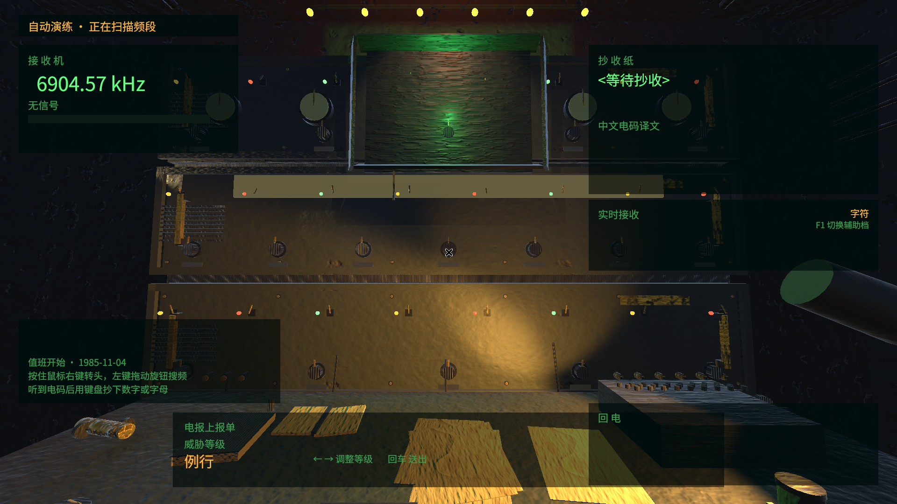

# decoder

一个面向 Steam 发行的 Windows 单机游戏项目，当前处于**立项选型阶段**。

引擎 Unity 6000.0.81f1 LTS，目标平台 Windows x64。

---

## 当前状态

已选定方案 A「深夜监听站」：冷战末期边境监听站的夜班译电员，用桌上的设备把加密信号翻译成情报，上报的每一个字都在改变别人的命运。

第一个班次已经可以完整走通：搜频、收到信号、抄下电码、查表出译文、上报、拿到判定与后果。

| 阶段 | 状态 |
|---|---|
| Steam 市场调研 | 完成，基于 2026-08-13 抓取的一手数据 |
| 游戏方案设计 | 完成，已选定方案 A |
| 云端 Unity 环境 | 完成并验证 |
| 构建、截图、自检管线 | 完成并跑通 |
| 美术方向验证 | 完成，画面方向成立，细节密度仍是缺口 |
| 信号编解码内核 | 完成，124 个测试，11 个变异全部被杀死 |
| 第一班可玩切片 | 完成，自动演练端到端跑通 |
| 第 2 至 16 班内容 | 未开始 |
| 音频素材与配音 | 未开始 |
| Steamworks 集成 | 未开始，需要 App ID |



---

## 文档

| 文档 | 内容 |
|---|---|
| [`docs/research/00-steam-market-research.md`](docs/research/00-steam-market-research.md) | Steam 市场调研报告。从榜单一手数据中识别出三条可执行的品类信号，含关键市场参数与来源 |
| [`docs/concepts/01-game-concepts.md`](docs/concepts/01-game-concepts.md) | 5 个完整游戏方案。每个含定位、核心循环、画面视角对标、美术方向、技术负担、定价、风险，文末有横向对比矩阵与推荐 |
| [`docs/tech/02-pipeline-and-shipping.md`](docs/tech/02-pipeline-and-shipping.md) | 技术管线与 Steam 发行方案。含环境条件、管线用法、发行清单、已验证项与已知缺口 |

原始调研数据在 `docs/research/data/`，参考截图在 `docs/research/refshots/`。

---

## 目录结构

```
docs/
  research/     市场调研报告、原始抓取数据、参考截图
  concepts/     游戏方案
  tech/         技术管线与发行方案
tools/          自动化脚本
unity/Decoder/  Unity 工程
artifacts/      构建产物、截图、自检报告、配平记录（构建产物不入库）
```

---

## 环境准备

云端环境已经装好，本节供在新机器上复现。

**依赖**：Ubuntu 24.04、Xvfb、Mesa（软件渲染）、Python 3 与 PIL/numpy、7z、cpio。

**Unity**：
- 编辑器 `6000.0.81f1`，安装到 `/opt/unity/6000.0.81f1`
- Windows Build Support (Mono) 模块，解包到 `Editor/Data/PlaybackEngines/WindowsStandaloneSupport`
- 许可证激活：`Unity -batchmode -nographics -quit -username <邮箱> -password <密码>`
- 验证：`Editor/Data/Resources/Licensing/Client/Unity.Licensing.Client --showEntitlements` 应输出 `Unity Personal`

路径可通过 `UNITY_ROOT` 环境变量覆盖，见 `tools/unity-env.sh`。

---

## 常用命令

```bash
# 运行单元测试（约 6 秒）
./tools/run-tests.sh EditMode

# 变异验证：故意把实现改坏，确认测试真的会红（约 2 分钟）
./tools/mutation-check.sh

# 构建 Linux 版并真实运行，自动演练走完一个班次并抓帧（约 30 秒）
./tools/playtest-capture.sh

# 交叉构建 Windows x64 可执行文件（约 11 秒）
./tools/build-windows.sh

# 生成可玩场景（约 6 秒）
./tools/build-station-scene.sh

# 程序化重建美术探针场景（约 6 秒）
./tools/build-probe-scene.sh

# 无头渲染场景中所有机位到 artifacts/screenshots/（约 6 秒，5 个 1920x1080 机位）
./tools/capture.sh

# 画面自检：构图对标参考截图，配色对标项目档案
python3 tools/compare_frames.py \
  --shot artifacts/screenshots/probe_front.png \
  --reference docs/research/refshots/iron_nest_heavy_turret_simulator_0.jpg \
  --profile night-watch

# 列出内置配色档案
python3 tools/compare_frames.py --list-profiles

# 光照自动配平：按自检结果迭代调参，把最优解写回配置
python3 tools/auto_tune_lighting.py --iterations 10 \
  --reference docs/research/refshots/iron_nest_heavy_turret_simulator_0.jpg \
  --profile night-watch
```

---

## 几个必须知道的限制

**云端没有 GPU。** 截图走 Xvfb + Mesa llvmpipe 软件渲染。当前场景规模下渲染 1920×1080 约 1 秒一张，够用；场景复杂度上去之后会明显变慢。

**云端没有音频设备。** 播放器日志里的 `FMOD failed to initialize the output device` 是环境所致，不是缺陷。接收状态的计算已经与音频渲染解耦，所以静音环境下仪表、调谐指示和玩法判定照常工作。

**Windows 构建只能用 Mono 后端。** Unity 不提供 Linux 版的 Windows IL2CPP 模块。Mono 后端可以正常发行到 Steam，但正式发行版建议在 Windows 机器上用 IL2CPP 重新构建。

**编辑器截图看不到运行时逻辑。** 界面是 `Awake` 里生成的，接收机状态是逐帧更新的，这些在编辑器截图里全都不存在。要验证"确实能玩"只能用 `tools/playtest-capture.sh` 把游戏真跑起来抓帧。

---

## 玩法内核的三个技术要点

**中文电码是真的。** 四位十进制数字对应一个汉字，1871 年启用的历史系统。码表由 `tools/build_telegraph_table.py` 从 Unicode Unihan 数据库的 `kMainlandTelegraph` 字段生成，共 7078 条，不是编出来的。抽查：中=0022、文=2429、电=7193、码=4316。

**摩尔斯时长遵循 ITU-R M.1677。** 点 1 单位、划 3 单位、符号内间隔 1 单位、字符间隔 3 单位、词间隔 7 单位；单位时长按 PARIS 法从每分钟字数换算。这些比例有测试逐条守着，改错任何一个都会红。

**接收机保留三个决定手感的真实特性。** 差频音调让玩家能靠听音高判断该往哪边转；带通响应让信号随失配平滑衰减而不是突然出现；键控软化消除硬开关的爆音。三者都有测试对采样数据下断言，不依赖人耳。
