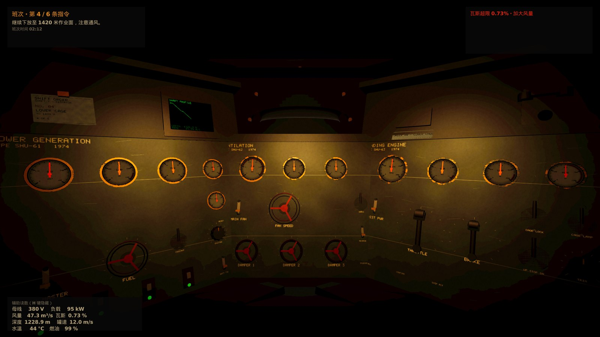

# MANER

面向 Steam 发行的 Windows 3D 游戏项目，代号 **maner**。引擎为 Unity 6.3 LTS，渲染管线为 URP。

## 当前状态

**垂直切片开发中。** 已选定方案 A《深井调度站》：第一人称单场景机械操作模拟，
玩家是一座三千米深井唯一的地面调度员，整局游戏待在一间控制舱里，
靠一整面控制台把井下的人活着送上来。



| 交付物 | 位置 | 状态 |
| --- | --- | --- |
| Steam 市场调研报告 | [`docs/research/steam-market-research-2026.md`](docs/research/steam-market-research-2026.md) | 完成 |
| 五个候选方案与决策 | [`docs/concepts/maner-game-proposals.md`](docs/concepts/maner-game-proposals.md) | 完成，已选定方案 A |
| 确定性仿真核心 | `game/Assets/Scripts/Sim/` | 卷扬机、通风、供电三套耦合子系统 |
| 控制台与控件 | `game/Assets/Scripts/Controls/` | 8 种原型、28 个可交互控件、12 块表盘 |
| 程序化控制舱 | `game/Assets/Scripts/Cabin/` | 几何、丝印、表盘、光照、音效全部由代码生成 |
| 班次与叙事 | `game/Assets/Scripts/Shift/` | 班次导演、故障系统、电话分支、存档 |
| Windows 构建 | [`tools/build.sh`](tools/build.sh) | PE32+ 可执行文件，92.8 MB |
| 无人值守自检 | [`tools/selfcheck.sh`](tools/selfcheck.sh) | 1920×1080 截图与帧统计 |
| 画面差距量化 | [`tools/compare.py`](tools/compare.py) | 影调对齐概念图，误差在 8% 以内 |
| 照明自动标定 | [`tools/calibrate_lighting.py`](tools/calibrate_lighting.py) | 参数扫描与影调距离排序 |
| 自动化测试 | `game/Assets/Tests/` | 58 项全通过 |

工程内**没有任何建模、贴图或录音资产**：房间、面板、控件、仪表刻度、面板丝印、
控件音效与环境声全部在运行时由代码生成，电话语音由 espeak-ng 合成后经无线电链路处理。

## 目录结构

```
docs/
  research/     市场调研
  concepts/     游戏方案与概念图
  dev-environment.md   开发环境搭建说明
  asset-licenses.md    第三方资产来源与许可登记
game/           Unity 工程
  Assets/Editor/       批处理构建与工程初始化脚本
  Assets/Scripts/      运行时代码
  Assets/Scenes/       场景
tools/          构建、自检、对比脚本
build/          构建产物（不入库）
screenshots/    自检截图（不入库）
artifacts/      日志与对比图（不入库）
```

## 快速开始

环境搭建见 [`docs/dev-environment.md`](docs/dev-environment.md)。环境就绪后：

```bash
# 构建（windows / linux / all）
tools/build.sh all

# 在虚拟显示环境中运行 Linux 构建，自动截图并输出帧时间统计
tools/selfcheck.sh 1.0,2.5,4.0

# 量化实机画面与目标概念图的差距
python3 tools/compare.py \
  --target docs/concepts/images/maner-concept-A-control-cabin.jpg \
  --actual screenshots/shot_00_t1.00s.png \
  --out artifacts/compare/latest.png
```

## 构建后端说明

开发期使用 **Mono** 脚本后端，因为它支持从 Linux 交叉构建 Windows 可执行文件。
IL2CPP 的 Windows 目标无法在 Linux 上交叉编译，**发行版本必须在一台 Windows 机器上完成最终构建**。
这是发行前的明确前置条件，已记录在方案文档的发行清单中。
