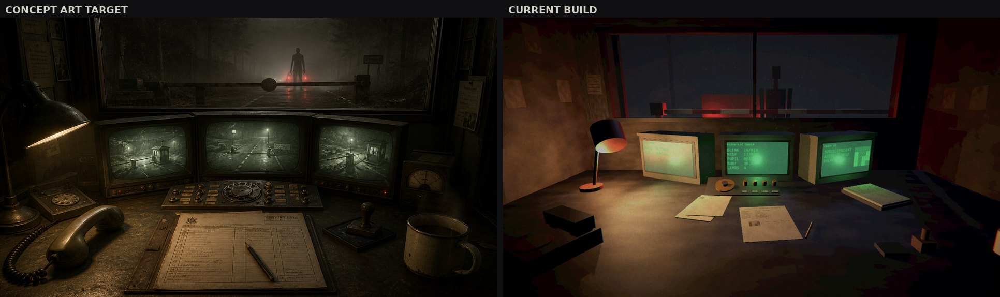
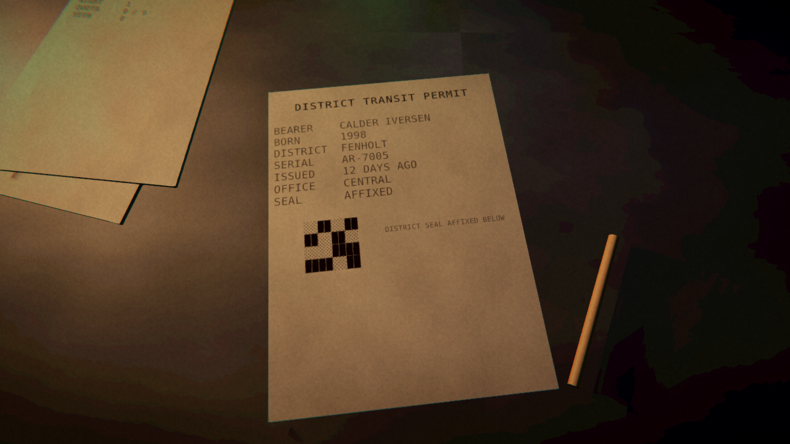

# Project MONSTER

A from-scratch 3D game for Windows, built in Unity, intended for commercial release on Steam.

This repository starts from nothing: no code, no assets and no design were carried over from
any other project.

---

## Current state

| | |
| --- | --- |
| Phase | Awaiting a concept decision; the technical foundation is built and proven |
| Market research | ✅ complete — [`docs/research/steam-market-2026.md`](docs/research/steam-market-2026.md) |
| Game concepts | ✅ five written — [`docs/concepts/`](docs/concepts/) |
| Concept art | ✅ five targets — [`docs/concepts/art/`](docs/concepts/art/) |
| Unity toolchain | ✅ installed, licensed, verified |
| Unity project | ✅ created, builds a Windows `.exe` from Linux |
| Build pipeline | ✅ running — [`docs/tech/build-pipeline.md`](docs/tech/build-pipeline.md) |
| Screenshot self-check | ✅ running, bit-exact, mutation-tested |
| Playable game logic | ✅ a full night runs end to end — [`docs/progress/m2/`](docs/progress/m2/) |
| Test suite | ✅ 48 edit-mode tests, mutation-tested |
| Audio | ⚠️ synthesised and tested, but never heard — this machine has no audio device |

## Start here

1. [`docs/concepts/README.md`](docs/concepts/README.md) — the five concepts compared, and the recommendation.
2. [`docs/progress/`](docs/progress/) — screenshots of the current build beside the concept art, with the measured gap between them.
3. [`docs/research/steam-market-2026.md`](docs/research/steam-market-2026.md) — the market data the concepts are derived from, with sources and raw captures.
4. [`docs/tech/build-pipeline.md`](docs/tech/build-pipeline.md) — how this gets built and self-checked on a headless, GPU-less machine.

## Where the build is right now

The Concept E checkpoint booth, rendered by the game itself and captured automatically.
Left is the concept art target, right is the current build.



A night at the checkpoint runs end to end. Fifteen vehicles arrive, each one's permit and
monitor readouts describe it, the manual's rules decide what the correct verdict is, four
brass switches record the player's answer, and the morning report prints the wage.



The whole cycle — regenerate the scene from code, cross-compile to a Windows executable
from Linux, render headless without a GPU, capture, and measure against the concept art —
is one command and about 25 seconds:

```bash
tools/build/iterate.sh   # rebuild and photograph
tools/build/test.sh      # 48 edit-mode tests
```

## The recommendation, in one paragraph

Build **Concept A — MONSTER: Containment**, a first-person four-player co-op game about
removing monsters from buildings *alive and undamaged*, and build **Concept E — MONSTER:
Night Shift** first as the vertical slice that proves the engine, the Windows build pipeline
and the automated screenshot self-check. Concept A has the highest commercial ceiling of the
five and is the shape that small teams have repeatedly broken out with in 2026; Concept E has
the highest probability of being finished, is independently shippable, and is the only
concept the GPU-less build machine can fully evaluate. The full reasoning, including why
Concept D is argued against rather than merely ranked last, is in
[`docs/concepts/README.md`](docs/concepts/README.md).

## Layout

```
docs/      research, concepts, concept art, technical plans, progress reports
tools/     environment setup, Steam research probes, build and self-check scripts
game/      the Unity project
```

Scenes, materials, textures and the render pipeline assets are **generated from code** by
`game/Assets/Editor/NightShiftSceneBuilder.cs` and `MonsterSetup.cs`, and are deliberately
not committed. Committing them meant every regeneration rewrote thousands of fileIDs and
buried real changes; the build regenerates them when they are absent.

## Build machine

Ubuntu 24.04, 4 cores, 15 GB RAM, **no GPU**. Unity 6000.5.8f1 with Windows Build Support
(Mono), cross-building a Windows player from Linux, rendering through Mesa llvmpipe under
Xvfb for automated screenshots. The lack of a GPU is a real constraint on art direction and
on final visual sign-off; it is documented rather than worked around in
[`docs/tech/build-pipeline.md`](docs/tech/build-pipeline.md).
