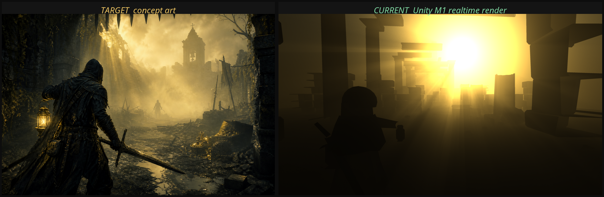

# 项目 Hunter

一款面向 Steam 发行的 Windows 平台 3D 游戏，使用 Unity 6 LTS 开发。

## 当前阶段

**已选定方案 A《金雾猎场》**，M1 渲染管线与画面基线完成，进入玩法开发（M2）。

黑暗奇幻的单人 PvE 搜打撤动作 RPG：带着可能永久失去的装备进入金雾笼罩的遗迹，与同样在搜刮的 AI 猎金人竞速抢夺，在雾中主宰追上你之前摇铃撤离。



左为概念图目标，右为 Unity 实时渲染。场景内所有几何、纹理、光照均由代码生成，无外部美术资产。

## 文档

| 文档 | 内容 |
| --- | --- |
| [`docs/00-market-research.md`](docs/00-market-research.md) | Steam 市场调研：周销榜实况、标签收入中位数、类型饱和度、五款可对标竞品的逐项拆解 |
| [`docs/01-game-concepts.md`](docs/01-game-concepts.md) | 五个游戏方案，含视角相机参数、Steam 画面参考、美术方向、商业定位、技术路径、可行性评估 |
| [`docs/02-technical-constraints.md`](docs/02-technical-constraints.md) | 开发环境实况、Unity 配置、Windows 构建链路、自检与截图方案 |
| [`docs/03-milestone-M0.md`](docs/03-milestone-M0.md) | 开发链路验证实录：Windows 构建产物校验、三轮自检截图迭代、与概念图的差距清单 |
| [`docs/04-milestone-M1.md`](docs/04-milestone-M1.md) | 渲染管线与画面基线：自研体积光、程序化几何与材质、26 轮画面迭代、三个根因级问题的排查过程 |

## 五个候选方案速览

| 方案 | 类型 | 视角 | 推荐度 |
| --- | --- | --- | --- |
| A《金雾猎场》 | PvE 搜打撤动作 RPG | 第三人称越肩 | ★★★★★ |
| B《巨兽契约》 | co-op 巨兽狩猎 | 第一人称 | ★★★★☆ |
| C《兽径》 | PS1 复古氛围恐怖 | 第一人称 | ★★★★☆ |
| D《赏金回路》 | 动作 roguelite | 第三人称拉远 | ★★★☆☆ |
| E《荒野猎屋》 | 狩猎模拟 + 经营 | 第一人称 / 第三人称 | ★★★☆☆ |

概念图见 [`concepts/`](concepts/)。

## 目录结构

```
docs/          设计文档与调研
concepts/      概念图（作为画面目标基准）
screenshots/   各里程碑实机截图（与概念图对比用）
tools/         环境安装与构建脚本
```

## 环境（已验证可用）

- 引擎：Unity 6000.0.81f1（Unity 6.0 LTS），已安装并激活许可证
- 目标平台：Windows x64。已实测从这台 Linux 机器构建出 `PE32+ executable (GUI) x86-64, for MS Windows`
- 开发机：Linux，无 GPU，通过 Xvfb + Mesa 软件渲染做无头运行与截图。单次「改场景 → 截图」循环约 15 秒，Windows 完整构建 33 秒

```bash
tools/install_unity.sh          # 安装 Unity 编辑器与 Windows 构建模块
tools/probe/run_probe.sh        # 验证完整链路：URP 场景 → 无头截图 → Windows 构建
tools/forge_and_shoot.sh v1     # 重建场景并渲染三个固定机位
```

## 工程

```
HunterGame/Assets/Scripts/Rendering/   自研体积光 Renderer Feature 与 shader
HunterGame/Assets/Scripts/Worldgen/    程序化网格、程序化贴图、废墟场景生成器
HunterGame/Assets/Editor/              渲染管线装配、固定机位截图、场景诊断
```
