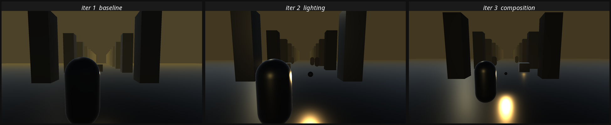
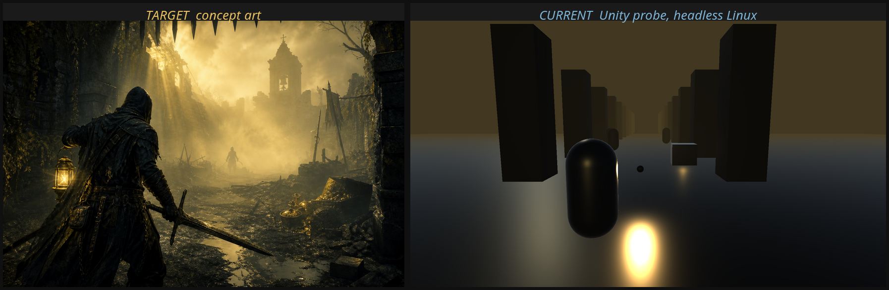

# 里程碑 M0：开发链路验证

日期：2026-08-13
目的：在写任何游戏代码之前，先证明这台无 GPU 的 Linux 机器**确实能产出 Steam 可发行的 Windows 构建**，并且**确实能自己截图看画面**。如果这两件事不成立，后面所有方案都是空谈。

---

## 一、验证结果汇总

| 验证项 | 结果 | 证据 |
| --- | --- | --- |
| Unity 6.0 LTS 编辑器安装 | 通过 | `/opt/unity/6000.0.81f1/Editor/Unity`，7.9 GB |
| Unity 许可证激活 | 通过 | 日志 `[Licensing::Client] Successfully resolved entitlement details`；`~/.config/unity3d/Unity/licenses/UnityEntitlementLicense.xml` 已生成 |
| Windows 构建模块安装 | 通过 | `PlaybackEngines/WindowsStandaloneSupport/Variations/win64_player_nondevelopment_mono` 存在，811 MB |
| URP 渲染管线可用 | 通过 | `PROBE_SETUP_OK`，URP 17.0.4 导入成功并生效 |
| **无头截图** | **通过** | `PROBE_CAPTURE_OK path=/tmp/probe-out/iter3-composition.png bytes=355515 litRatio=0.9067` |
| **Windows x64 构建** | **通过** | `PROBE_BUILD result=Succeeded size=92223600 errors=0 time=00:00:33.2` |
| 构建产物是真正的 Windows 可执行文件 | 通过 | `HunterProbe.exe: PE32+ executable (GUI) x86-64, for MS Windows` |

## 二、几个需要说明的技术细节

### 2.1 Unity Hub 官方下载地址已失效

`https://public-cdn.cloud.unity3d.com/hub/prod/UnityHub.AppImage` 返回 404，`releases-linux.json` 同样 404。绕过方式是直接从 Unity Release API 查到编辑器压缩包地址并解压，不经过 Hub。脚本见 `tools/install_unity.sh`。

### 2.2 Windows 构建模块的 Linux 版地址也不存在

Unity Release API 对 `windows-mono` 模块给出的地址指向 Mac 的 `.pkg`：

```
LinuxEditorTargetInstaller/UnitySetup-Windows-Mono-Support-for-Editor-6000.0.81f1.tar.xz  → 404
MacEditorTargetInstaller/UnitySetup-Windows-Mono-Support-for-Editor-6000.0.81f1.pkg       → 200
```

PlaybackEngine 的内容（Windows 播放器二进制 + Mono 运行时）与宿主平台无关，所以从 Mac 的 pkg 里提取后放进 Linux 编辑器可以正常工作。提取路径：pkg 是 xar 归档，用 7z 解出 `Payload~`（cpio 格式），再用 cpio 解开，得到与 `LinuxStandaloneSupport` 完全对应的目录结构，整体复制到 `PlaybackEngines/WindowsStandaloneSupport` 即可。

这条路径已经实测跑通并成功构建出 PE32+ 可执行文件，不是理论推断。

### 2.3 无头截图的实现方式与防误报

截图不走 `ScreenCapture.CaptureScreenshot`（那个需要播放模式），而是在编辑器批处理模式下直接把相机渲染到 `RenderTexture`，再 `ReadPixels` 编码成 PNG。需要 Xvfb 提供图形设备，因此运行 Unity 时**不能加 `-nographics`**。

这里有个容易踩的坑：软件渲染下截图可能"成功"但输出全黑帧。为此在截图代码里加了非黑像素占比检查，低于 5% 直接判失败退出：

```
Debug.Log($"PROBE_CAPTURE_OK path={path} bytes={...} litRatio={ratio:F4}");
if (ratio < 0.05f) { Debug.LogError($"PROBE_CAPTURE_BLANK litRatio={ratio:F4}"); EditorApplication.Exit(2); }
```

三次迭代实测的 litRatio 分别是 0.8008、0.9237、0.9067，都远高于阈值。

### 2.4 性能数据参考

在 4 核无 GPU 的软件渲染环境下：

| 操作 | 耗时 |
| --- | --- |
| 首次导入 URP 包并生成场景 | 43 秒 |
| 单次场景重建 + 1920×1080 截图 | 13–15 秒 |
| Windows x64 完整构建 | 33 秒（产物 92 MB） |

这个速度完全可以支撑「改一版、截一次图、看差距」的高频迭代循环。

---

## 三、自检迭代实录：三轮截图与差距修正

这一节演示的是用户要求的核心能力——**自己截图、自己对比概念图、自己找差距、自己改**。



### 第一轮（基线）

按 `docs/01-game-concepts.md` 里方案 A 记录的相机参数（后方 2.8 米、胸口上方 0.4 米、右肩偏移 0.55 米、FOV 60°）搭建的第一版。

自检发现的问题：
1. 提灯光源不可见，画面没有可辨认的光源
2. 金色战利品被角色完全遮挡
3. 环境整体过暗，地面几乎纯黑，没有可读细节
4. 缺少中景元素，画面只有「近处角色」和「远处柱子」两层

### 第二轮（光照修正）

改动：环境光从单色改为三色梯度并提亮；提灯强度 6 → 22、范围 18 → 30 并加可见灯球；地面光滑度提到 0.55 让提灯在地面留下高光；加入三个雾中剪影作为中景；加一盏逆光方向光做边缘分离。

结果：提灯生效了，地面反射出现了，中景剪影可辨认。但暴露出新问题——角色占据画面近四分之一挡住视野，战利品位置依然被遮挡。

### 第三轮（构图修正）

改动：相机后移到 3.9 米、抬高到 2.25 米；角色左移；战利品移到画面右侧 (2.6, 0.6, 9.5) 的开阔位置；提灯移到角色前方手部高度使光池读起来像是被携带的。

结果如下，与概念图并排对比：



## 四、当前与目标的差距清单

这是从上面那张对比图逐项读出来的差距。每一条都写成可执行的改动，而不是「感觉不够好」。

| # | 差距 | 现状 | 目标 | 具体改动 |
| --- | --- | --- | --- | --- |
| 1 | **前景缺失** | 画面从中景直接开始，没有景深层次 | 概念图有拱门与岩石构成的前景框 | 在相机前 1.5–3 米处加入暗部前景元素（断墙、垂落的藤蔓、破碎拱券），作为构图框 |
| 2 | **体积光缺失** | 只有点光源的地面高光 | 概念图有多道穿透雾气的体积光柱 | 启用 URP 的体积光/光轴效果，或用半透明锥体网格 + 顶点动画模拟；需实测软件渲染下的开销 |
| 3 | **金色占比不足** | 金色只在两处小光斑，环境整体灰黄 | 概念图中金色雾气占画面约四成 | 提高雾色饱和度与亮度，让雾本身成为主要光源；加入远处的金色雾核 |
| 4 | **角色无边缘光** | 角色是纯黑剪影，与背景粘连 | 概念图角色有清晰的暖色轮廓光 | 在角色专用的光照层加一盏跟随式边缘光，或写一个 rim light 的着色器变体 |
| 5 | **细节密度为零** | 地面完全空白 | 概念图有大量废墟碎块、旗帜、水洼、杂物 | 需要实际的场景资产。这一项无法靠调参解决，是选定方案后的美术工作 |
| 6 | **大气分层不足** | 只有近、中、远三层 | 概念图有四到五层可辨的雾深度 | 调整雾的密度曲线为分段式；在 15/25/35 米各布置一组低对比中景元素 |
| 7 | **提灯过曝** | 光斑中心过曝成纯白圆形 | 概念图提灯是小而集中的暖光，有清晰的灯体 | 强度从 26 降到 12–15，缩小范围，加入自定义衰减曲线；灯球缩小并提高自发光 |
| 8 | **占位几何体** | 角色是胶囊体，建筑是立方体 | 概念图有完整的角色与建筑造型 | 选定方案后进入正式资产制作 |

其中第 1、2、3、4、6、7 项都是**纯参数与着色器工作，可以在当前环境内完成**。第 5、8 项需要实际资产，属于选型之后的工作。

## 五、复现方式

```bash
tools/probe/run_probe.sh
```

脚本会自动启动 Xvfb、创建工程（若不存在）、导入 URP、生成场景、截图、构建 Windows 播放器，并打印所有产物路径与 `file` 校验结果。

---

## 六、结论

用户提出的两项核心能力要求都已验证可行：

1. **「Windows 版本、Unity 引擎、Steam 可发行」** —— 已在这台 Linux 机器上构建出 PE32+ Windows x64 可执行文件。发行时若需要 IL2CPP 后端（更好的性能与代码保护），需要在 Windows 主机上重新构建，方式见 `docs/02-technical-constraints.md` 第 3.3 节。
2. **「边运行边自检优化，截图看自己和目标的差距」** —— 已跑通三轮完整迭代，每轮都是「生成场景 → 无头渲染截图 → 与概念图并排对比 → 列出具体差距 → 改参数 → 重新截图」。整个循环单次耗时约 15 秒。

下一步等待方案选型。选定之后进入 M1：搭建正式工程骨架与核心玩法循环。
