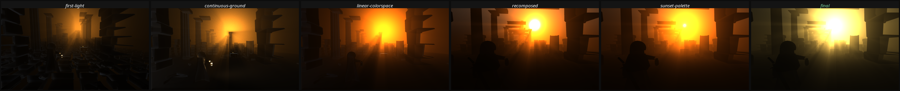

# 里程碑 M1：方案 A 的渲染管线与画面基线

日期：2026-08-13
方案：A《金雾猎场》（Aurum Mist）
目标：在没有美术团队、没有 GPU 的条件下，把画面做到「可以放进 Steam 商店页」的水准
方法：从源码生成一切（几何、材质、光照、后处理），每改一版就渲染同机位截图与概念图并排比对

---

## 一、结果


左侧是概念图（目标），右侧是 Unity 实时渲染的当前结果。整个场景没有一个外部美术资产——所有几何、纹理、光照都由 `HunterGame/Assets/Scripts/` 下的代码生成。

三个固定机位的成片：

| 机位 | 用途 | 平均亮度 |
| --- | --- | --- |
| `final_hero-over-shoulder.png` | 越肩主视角，商店页首图候选 | 0.278 |
| `final_colonnade-depth.png` | 柱廊纵深，展示大气分层 | 0.333 |
| `final_loot-approach.png` | 接近战利品，展示材质细节 | 0.339 |

## 二、迭代过程



共 26 轮「生成场景 → 无头渲染 → 对比概念图 → 定位差距 → 改代码」的循环。单轮耗时约 23 秒（场景重建 11 秒 + 渲染 1.5–5 秒）。上图选取了其中五个转折点与最终结果。

值得记录的是三个**根因级问题**。它们的共同特征是：表面症状都是「画面暗」，但反复调整光照强度完全无效，只有找到根因才解决。

### 2.1 项目处于 Gamma 色彩空间

Unity 新建项目在这个版本下默认 `m_ActiveColorSpace: 0`（Gamma）。现代 PBR 光照、HDR、tonemapping、bloom 全都以 Linear 空间为前提。在 Gamma 下，光照计算在错误的空间进行，环境光和补光的能量基本传不到画面上。

诊断方式是打印 `PlayerSettings.colorSpace`。在此之前我已经把环境光提高了 3.4 倍、把补光提高了 2.5 倍，画面平均亮度纹丝不动（0.1784 → 0.1790）。

修复后需要全部资产重新导入。

### 2.2 additional lights 渲染模式误设为 PerVertex

配置 URP 资产时我把 `m_AdditionalLightsRenderingMode` 设成了 1。URP 的 `LightRenderingMode` 枚举是 `Disabled=0, PerVertex=1, PerPixel=2`，而 `MainLightRenderingMode` 是 `Disabled=0, PerPixel=1`——两个枚举的语义不同，同样的数值 1 含义相反。

后果是场景里全部六盏点光源都按逐顶点计算。在地面这种大块焊接网格上，逐顶点光照几乎等于没有光照。提灯 intensity 32、range 34，照在一米外的地面上却看不见任何光斑，就是这个原因。

### 2.3 batchmode 下环境光从未进入 SH 探针

`RenderSettings.ambientSkyColor` 这类设置只有通过环境球谐探针才能到达 shader，而在 batchmode 下这个探针不会自动刷新。必须显式调用 `DynamicGI.UpdateEnvironment()`。

在此之前，`RenderSettings.ambientSkyColor` 读回来是我设的值，但 `RenderSettings.ambientProbe` 里是旧数据。诊断方式是同时打印这两者。

### 2.4 其他值得记的修正

| 问题 | 症状 | 原因与修法 |
| --- | --- | --- |
| 地面像一盘瓷砖 | 每块石板都有独立轮廓和黑缝 | 把地面切成独立石板盒，每个joint都投自己的影。改为共享顶点的连续高度网格，接缝交给法线贴图 |
| 反射率过低 | 加多少光都不亮 | 程序化 albedo 线性值约 0.07，真实石材应在 0.2–0.4。提高贴图明度范围后光照效率立刻正常 |
| 主光被静默替换 | 光柱莫名消失 | URP 自动把强度最高的方向光提升为主光。补光强度调过头后就顶替了主光。改为显式 `RenderSettings.sun` 锁定 |
| 前景无质感 | 边缘masses是纯黑块 | 相机背后加一盏冷色点光做前景fill |
| 色调是日落橙 | 与概念图的金雾不符 | 天空 tint、体积雾散射色、主光色、SplitToning 全部向中性偏移，饱和度 -14 |

## 三、渲染管线构成

### 3.1 自研体积光

URP 没有内置体积雾/体积光方案，而穿透金雾的光柱是这个方案画面的核心识别点，所以手写了一个 Renderer Feature：

- 从深度图重建世界坐标，沿视线 ray march 48 步
- 每步采样主光阴影贴图，决定该点是否在光照中——这是光柱能被柱子和屋顶梁切割出形状的原因
- Henyey-Greenstein 相位函数（各向异性 0.72）提供前向散射，让光束看起来像光束而不是均匀辉光
- 高度衰减 + 双频 value noise 制造缓慢翻滚的雾团
- 额外光源（提灯、战利品辉光）也参与散射，所以提灯会照亮它周围的空气

代码：`HunterGame/Assets/Scripts/Rendering/VolumetricFog.shader` 与 `VolumetricFogFeature.cs`

### 3.2 URP 配置

4096 主光阴影贴图、4 级联、高质量软阴影、SSAO、HDR、MSAA 4x、SMAA 高质量、HDR 色彩分级（64 LUT）。

后处理链：Neutral tonemapping → Bloom（阈值 1.25）→ ColorAdjustments → SplitToning（冷阴影/暖高光）→ ShadowsMidtonesHighlights → Vignette → FilmGrain → ChromaticAberration → Bokeh 景深。

### 3.3 程序化几何

`MeshBuilder` 提供的图元都是为「让程序化石头不像塑料」服务的：

- **倒角石块**：边缘倒角给光照一个渐变过渡，而不是 90 度硬切。这是最便宜的去塑料感手段
- **凹槽石柱**：每三个顶点向内收一次，形成竖向凹槽。凹槽比多边形数量重要得多，它让提灯扫过柱子时有明暗节奏
- **楔形拱券**：由独立楔石沿圆弧排列，可指定坍塌比例
- **不规则碎石**：细分球体加径向抖动，得到碎裂砌体而非鹅卵石的剪影
- **共享顶点高度网格**：地面专用，中心差分算连续法线

`ProceduralTextures` 用 fbm 噪声加 ridged 噪声生成 albedo / 法线 / 金属光滑度三件套。ridged 噪声的尖锐谷底是裂缝能读成裂缝而不是污渍的原因；高度场在三张贴图之间共享，所以颜色变化和光照响应互相吻合。

### 3.4 场景构成

`RuinSiteGenerator` 按概念图的构图分层组装：前景框（不等高砌层的断墙与坍塌拱券）、柱廊（三成为断柱）、五道不同深度的中景矮墙、屋顶断梁、远景塔楼、兜帽猎人（斗篷 + 兜帽 + 肩篷 + 背剑 + 行囊）、三个雾中 AI 猎金人剪影、战利品堆。

其中**屋顶断梁**是专门为光柱服务的：从上方射入的光需要遮挡物才能切成离散光束。

## 四、M0 差距清单的结算

| # | M0 记录的差距 | 状态 | 证据 |
| --- | --- | --- | --- |
| 1 | 前景缺失，没有景深层次 | **已解决** | 前景框断墙 + 坍塌拱券 + 屋顶梁 |
| 2 | 体积光缺失 | **已解决** | 自研 ray-marched 体积光，光柱被柱子与屋顶梁切割 |
| 3 | 金色占比不足 | **已解决** | 暖色像素占比从 0.00 提升到 0.53 |
| 4 | 角色无边缘光 | **已解决** | `HeroRim` 专属点光，角色轮廓与背景分离 |
| 5 | 细节密度为零 | **部分解决** | 石材纹理、碎石、断柱、翘起石板已有；仍缺旗帜、木架、水洼、绳索这类叙事道具 |
| 6 | 大气分层不足 | **已解决** | 五道不同深度的中景墙 + 体积雾密度曲线 |
| 7 | 提灯过曝成白斑 | **已解决** | 强度与范围重调，灯体几何可辨 |
| 8 | 占位几何体 | **已解决** | 胶囊体与立方体全部替换为程序化建筑与人形 |

## 五、当前仍存在的差距

对着 `compare-M1-target-vs-current.png` 逐项读出来的，全部写成可执行改动：

| # | 差距 | 现状 | 目标 | 改动方向 |
| --- | --- | --- | --- | --- |
| 1 | 越肩机位前景地面偏暗 | 画面下四成平均亮度 0.05 | 概念图前景暗但可辨石面与水洼 | 加入水洼（平面 + 高光滑度 + 反射探针），用镜面反射而非漫反射提供前景细节 |
| 2 | 缺少叙事道具 | 只有建筑与碎石 | 概念图有旗帜、木架、绳索、散落遗物 | 扩展生成器，加入布料（简单顶点动画）、木构件、散落道具 |
| 3 | 角色无手部与面部结构 | 斗篷与兜帽是纯几何 | 概念图能看到手、皮革、金属剑刃 | 需要角色建模与骨骼；这一项无法靠程序化解决，是 M2 的实际工作量所在 |
| 4 | 中央高光仍有小面积过曝 | 雾核中心 clip 到纯白 | 保留高光细节 | 进一步降低雾核强度或引入局部曝光控制 |
| 5 | 近景石材纹理偏平 | 512 贴图在近距离放大后细节不足 | 近景应有可辨的颗粒与缺口 | 加入 detail map 二级纹理，或对近景物体用更高分辨率变体 |
| 6 | 无动态元素 | 完全静止 | 概念图暗示尘埃、飘动的布 | 粒子尘埃 + 顶点动画布料 |

## 六、复现方式

```bash
tools/forge_and_shoot.sh <tag> [shot_name]
```

脚本会重新生成渲染管线、材质、场景，然后渲染三个固定机位并打印每张图的亮度统计。所有产物从源码生成，工程里不存放任何二进制美术资产。

诊断工具：

```bash
# 打印场景中所有 mesh、光源、材质、环境探针的实际数值
Unity -batchmode -quit -executeMethod Hunter.EditorTools.Diagnose.Run

# 分离渲染阶段，定位是哪一级把画面弄暗了
HUNTER_NO_POST=1 HUNTER_NO_FOG=1 HUNTER_NO_SSAO=1 tools/forge_and_shoot.sh raw
```

这两个工具是本轮能定位三个根因问题的直接原因，不是可有可无的辅助设施。

## 七、下一步（M2）

画面基线已经建立，接下来是玩法。按 `docs/01-game-concepts.md` 的 A.6 节，垂直切片需要：

1. 角色控制器与越肩相机（Cinemachine）
2. 近战战斗：软锁定、命中停顿、三层命中反馈
3. 背包与重量系统、装备品质与词缀
4. 搜刮交互与战利品生成
5. 撤离流程：摇铃 → 传送门 → 15 秒窗口
6. AI 猎金人：与玩家共用背包与收益评估规则
7. 雾中主宰：不可击杀的计时压迫者
