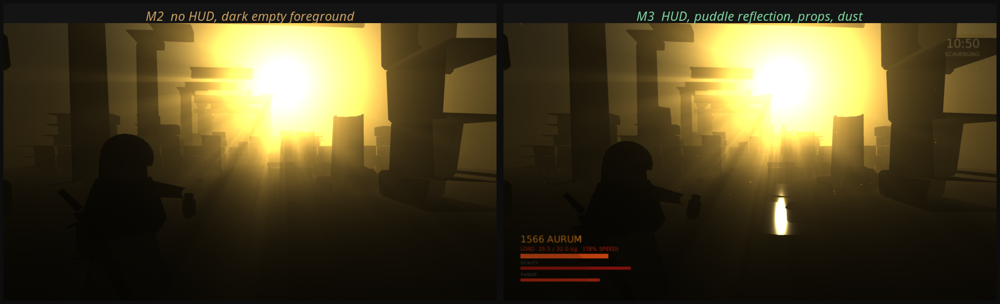
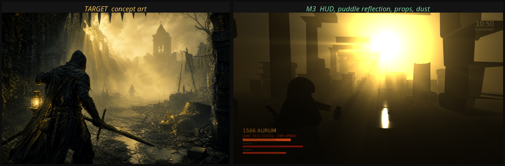

# 里程碑 M3：AI 行动、HUD、画面第二轮

日期：2026-08-13
方案：A《金雾猎场》
目标：让 AI 猎金人真的动手；让局内状态在屏幕上可见；补掉 M1 与 M2 记录的画面缺口

---

## 一、结果

| 项 | 数值 |
| --- | --- |
| EditMode 测试 | 63 项通过 |
| PlayMode 测试 | 19 项通过（新增 AI 拾取、HUD、动画、音频合成六项） |
| Windows 构建 | `PE32+ executable (GUI) x86-64`，0 错误 0 警告 |
| 越肩机位前景亮度 | 0.066 → 0.079 |





---

## 二、AI 猎金人开始动手

M2 的 AI 会思考但不会行动：决策层输出 Fight 或拾取判断，执行层只把它走到目标位置。这一轮把两端接上：

- 走到容器 1.9 米内就停下搜刮，1.3 秒后按共用的估值函数取走最优物品
- 进入 2.2 米内转向目标并挥砍，用的是和玩家完全相同的 `MeleeCombatant`
- 拿不动时 `Lootable.Restore` 把物品放回容器，不让它凭空消失

要强调的是执行层**不做任何判断**。它不决定值不值得打、该不该拿，那些全部来自 `RivalHunterBrain`，而 brain 又只调用 `LootValuation`。玩家和 AI 共用一个决策函数这条设计约束在这一轮没有被稀释。

有一条 PlayMode 测试直接守这个行为：把一个 AI 放到容器旁边，六秒内它的背包必须多出东西。

## 三、HUD

`RaidHud` 完全由代码构建，没有 prefab。它显示四个数字：携带价值、负重与降速百分比、生命、威胁，加上局内时钟与撤离倒计时。

这四项正是 `LootValuation` 的输入，所以 HUD 是决策函数的读数，而不是对它的另一种解释。负重条在超过软上限的那一刻从金色转向红色——颜色变化和移动开始变慢是同一个时刻，所以颜色是信息不是装饰。

两个实现细节值得记：

**Canvas 必须用 Screen Space - Camera。** Overlay 模式的 Canvas 会被 `Camera.Render()` 跳过，而这个项目的自检完全依赖截图。一个只在真机运行时可见的 HUD 是无法被审查的。

**`Image.Type.Filled` 在没有 sprite 时静默失效。** 三条状态栏一开始全是满的。改成用填充矩形的右锚点驱动宽度。

## 四、画面：前景问题的正确解法

M1 记录的第一号缺口是「越肩机位前景地面偏暗，画面下四成平均亮度 0.05」。M1 期间我反复加光——环境光提 3.4 倍、补光提 2.5 倍、点光源加到 32——全都无效。

原因在几何而不在能量：主光是低角度逆光，水平地面接不到多少漫反射。而概念图的前景之所以有细节，靠的是**湿地面对亮雾的镜面反射**，那是 specular 不是 diffuse。

所以这一轮加的是水洼：接近黑的 albedo、0.96 的光滑度，形状用噪声扰动的不规则多边形，只在地面高度场的凹陷处生成，另在越肩机位正前方强制布置五处——那正是最需要它的区域。

结果是前景亮度 0.066 → 0.079，更重要的是画面里出现了一片映着金雾的水光，而不是一块更亮的灰。

顺带补了 M1 的其余缺口：

- **叙事道具**：脚手架（立柱、横档、斜撑，外加滑落的木板）、悬挂的破旗、散落的绳索木料
- **尘埃粒子**：1400 个世界空间的悬浮微粒，带缓慢湍流。一道体积光里什么都没有会读作渐变，有东西穿过才读作光
- **战利品降饱和**：金色原本会在主光下过曝成一块橙色色块

## 五、程序化角色动画

角色没有骨骼也没有动画剪辑。静态网格在地上滑行是原型感最强的一处，而这恰恰是程序化生成在网格层面解决不了的。

能解决的是运动本身。走路周期的主要成分是竖直起伏、横向摇摆、前倾和摆臂，全都是速度与时间的廉价函数：

- 步频随速度变化，冲刺读作冲刺而不是快放的走路
- 每步两次起伏，躯干在落脚时抬起
- 提灯用临界阻尼弹簧滞后于躯干——让灯滞后是它看起来「被提着」的主要原因
- 攻击时起手向后拧、判定帧转过去、收招回落，配合前突

这不能替代正式发行需要的骨骼动画，但它去掉了「滑行的雕像」这个读感。

## 六、程序化音频

项目没有音频资产，也没有录音手段。在搜打撤里这不是装饰性的缺口：定位音是实打实的玩法信息——对手在哪个方向搜刮、铃是不是刚响、重的东西离得多近。全程静音等于砍掉一整条决策输入通道。

所以声音是合成的，首次使用时由振荡器和噪声生成：

| 音效 | 合成方式 |
| --- | --- |
| 挥砍 | 带通噪声，亮度先升后降。扫频是「挥过去」这个动势的来源 |
| 命中 | 低频冲击（150Hz 快速下滑到 48Hz）叠一层极短的高频噪声瞬态 |
| 铃 | 六个非谐波分音（1、2、2.4、3、4.16、5.43 倍），各自独立衰减，每个分音带微小失谐制造拍频。非谐波正是钟与管风琴音的区别 |
| 脚步 | 低通噪声加一点低频体感，四个变体轮换 |
| 风声 | 两层不同截止频率的噪声床，缓慢的阵风调制，首尾交叉淡化避免循环爆音 |
| 主宰低鸣 | 根音与其三全音，刻意不解决的不协和 |
| 拾取 | 三个谐波的金属叮声，纯正反馈 |

噪声用固定种子的线性同余发生器而不是 `UnityEngine.Random`，这样每次生成的波形逐字节一致，可以在测试里断言。

脚步节奏跟随实际地面速度，所以负重的猎人脚步会跟着变慢——包的重量变成了可以听见的东西。

CI 里没人能听这些声音，所以测试断言的是决定音效能否履职的波形属性：不是静音、不削波、击打类衰减（后三分之一的 RMS 必须低于前三分之一的一半）、铃的时长必须是脚步的八倍以上、环境床首尾样本接近零（否则每次循环都会咔哒一声）、脚步变体互不相同、合成结果可复现。

## 七、这一轮修掉的三个真 bug

都是「看起来做了但实际没生效」类型，只有截图和测试能抓到。

**水洼三角形绕序反了。** 法线朝下，被背面剔除，等于完全没渲染。诊断工具打印出 `Puddles avgNormal=(0.00, -1.00, 0.00)` 才发现。前一次测到的前景亮度提升其实来自别的改动。

**`Lootable` 和 `BellTower` 挂在没有碰撞体的锚点上。** 两者都靠 `Physics.OverlapSphere` 被发现，没有 collider 就永远找不到——玩家和 AI 都无法交互。补了 trigger 体积，并让所有交互查询带上 `QueryTriggerInteraction.Collide`。

**AI 搜刮时会走开。** `Think()` 每 0.35 秒把目的地重设为巡逻点，于是 AI 走到箱子前、开始搜、然后走掉。搜刮时需要显式把目的地钉在当前位置。

## 七、当前缺口

| # | 缺口 | 说明 |
| --- | --- | --- |
| 1 | 无骨骼动画 | 程序化动画去掉了滑行感，但角色仍没有腿部动作、手部结构、面部。发行前必须解决 |
| 2 | 局外营地不存在 | 撤离后的入库、设施升级、职业解锁 |
| 3 | 只有一张手工布局的地图 | 概念文档承诺的模块化程序化拼装 |
| 4 | 无存档 | |
| 5 | 尘埃粒子贴图 alpha 未生效 | 当前靠把粒子缩到极小规避，材质本身仍需修 |
| 6 | 近景石材纹理偏平 | 512 贴图放大后细节不足，需要 detail map |
| 7 | 中央雾核仍有小面积过曝 | |
| 8 | AI 之间不会互相打 | 只会打玩家 |
| 9 | 音效是合成的，不是录音 | 能传达方向、距离与事件类型，但质感与真实 foley 有差距，发行前应替换 |

## 八、复现

```bash
tools/forge_and_shoot.sh v1          # 重建场景并渲染三个固定机位
tools/mutation_check.sh              # 测试有效性验证
Unity -batchmode -runTests -testPlatform EditMode
Unity -batchmode -runTests -testPlatform PlayMode
Unity -batchmode -quit -executeMethod Hunter.EditorTools.GameBuild.BuildWindows
```
