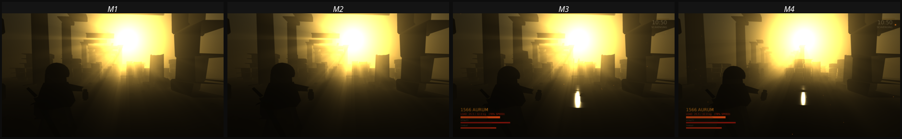
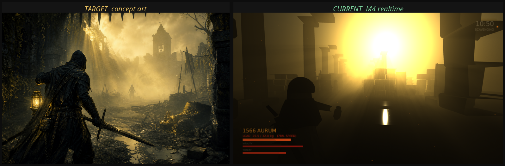

# 里程碑 M4：局外营地、存档、模块化程序化地图

日期：2026-08-13
方案：A《金雾猎场》

---

## 一、结果

| 项 | 数值 |
| --- | --- |
| EditMode 测试 | 88 项通过（新增营地 9、存档 5、布局 11） |
| PlayMode 测试 | 19 项通过 |
| Windows 构建 | `PE32+ executable (GUI) x86-64`，0 错误 0 警告 |

---

## 二、局外营地：让单局有意义

在这之前，撤离成功和死亡的区别只存在于一次 raid 内部。带出 1500 流金必须能换到什么，死掉必须要失去换它的机会，否则整个搜打撤循环没有赌注。

`CampState` 持有跨局进度：流金、五座设施的等级、生还与阵亡次数。五座设施分别对应玩家最想要的五种东西：

| 设施 | 效果 |
| --- | --- |
| 储物柜 | 每级 +4.5kg 负重、+2 格。最直接被感知的升级 |
| 锻造台 | 起始武器：锈蚀短剑 → 猎金弯刀 → 守望长戟 |
| 炼金台 | 起始消耗品数量 |
| 制图师 | 已知撤离点数量 |
| 神龛 | 生命上限 |

升级成本按 1.85 倍增长。这个曲线是刻意的：一次好的 raid 能买下一个早期升级，但永远买不下一个后期升级，所以循环不会因为一次爆收益而终止。

加成在**进入 raid 时**读取，所以上一局之后买的升级，这一局立刻能感觉到。

结算不走撤离调用而是挂在 `RunDirector.PhaseChanged` 上：撤离、死亡、超时，以及将来任何新增的结束路径，都不可能绕过入库或记账。

## 三、存档

`CampSave` 写临时文件再移动到位。原因很具体：raid 在玩家死亡的瞬间结束，而那正是一个人最可能愤而 alt-F4 的时刻。此时半写入的存档会让他损失几小时积累的全部进度——那比输掉一局严重得多。

损坏的存档不抛异常，只记警告并回到全新营地。丢进度很糟，但启动不了更糟。有测试专门写一段非法 JSON 进去验证这一点。

## 四、模块化程序化地图

概念文档 A.9 承诺的是「每张图有 2–3 个手工制作的地标房间，程序化部分只负责连接」，这一轮兑现。

`LayoutPlanner` 把一座废墟规划成沿主轴的段序列加侧向分支。七种段型：

| 段型 | 作用 |
| --- | --- |
| 入口 | 永远是第一段，开阔到足以辨明方向 |
| 柱廊 | 连接组织，视野长、有掩体。唯一允许连续出现的类型 |
| 窄廊 | 视野收窄，近战伏击地带 |
| 庭院 | 向天空开放，主光能落到地面，读作喘息 |
| 塌陷段 | 屋顶和地面都塌了，碎石掩体、移动受阻 |
| 钟室 | 放铃。每张图恰好一个 |
| 宝库 | 全图最好的战利品，放在最深处。每张图恰好一个 |

**宝库永远比铃更深**。这条规则是这个布局的核心张力：要拿最好的东西，你必须走过自己的退路。如果宝库比铃近，就没有决策了。有测试跨 120 个种子验证这一点。

其他被测试守住的规则：段与段无缝衔接不重叠；除柱廊外同类型不连续出现；同种子产出同一座废墟；不同种子产出不同废墟；每张图的容器数足以让人愿意进去；总长度足够填满一局 18 分钟。

几何生成器现在读这份计划：柱廊宽度跟随段宽（窄廊收紧、庭院张开）、屋顶梁只在屋顶未塌的段出现、容器按段的声明数量沿墙分布、铃放在钟室、远景塔楼移到最深段之后。当前种子产出 8 段、103.6 米、13 个容器，铃在 61.5 米，宝库在 96.5 米。

## 五、缺口

| # | 缺口 | 说明 |
| --- | --- | --- |
| 1 | 无骨骼动画 | 仍是最大的一项。程序化动画去掉了滑行感，但角色没有腿部动作、手部结构、面部 |
| 2 | 营地没有界面 | 数据层与存档完整，但玩家无法在屏幕上查看或购买升级 |
| 3 | 撤离后不会回到营地场景 | 结算发生了，但没有营地场景可回 |
| 4 | 音效是合成的 | 能传达方向、距离与事件类型，质感与真实 foley 有差距 |
| 5 | 侧向分支只影响容器位置 | 分支的几何（真正的侧室）尚未生成 |
| 6 | 尘埃粒子贴图 alpha 未生效 | 靠把粒子缩到极小规避 |
| 7 | 近景石材纹理偏平 | 需要 detail map |
| 8 | AI 之间不会互相打 | |
| 9 | 中央雾核仍有小面积过曝 | |
