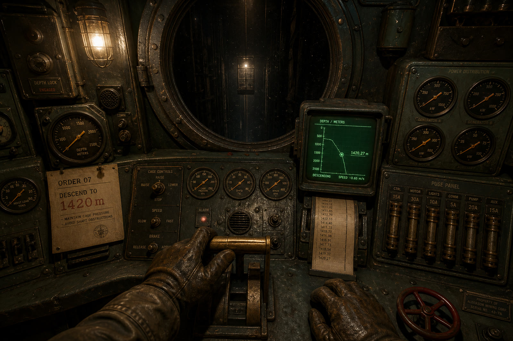
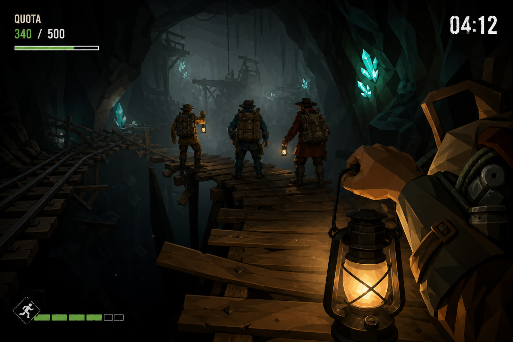
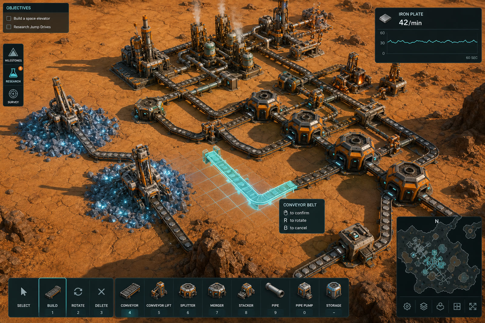
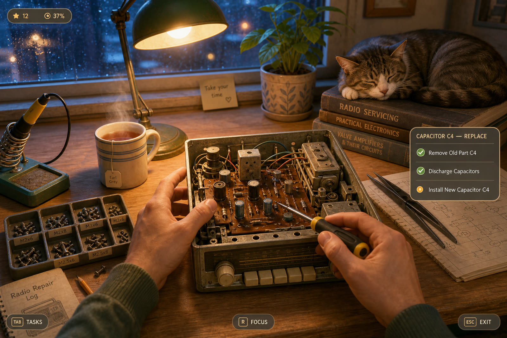
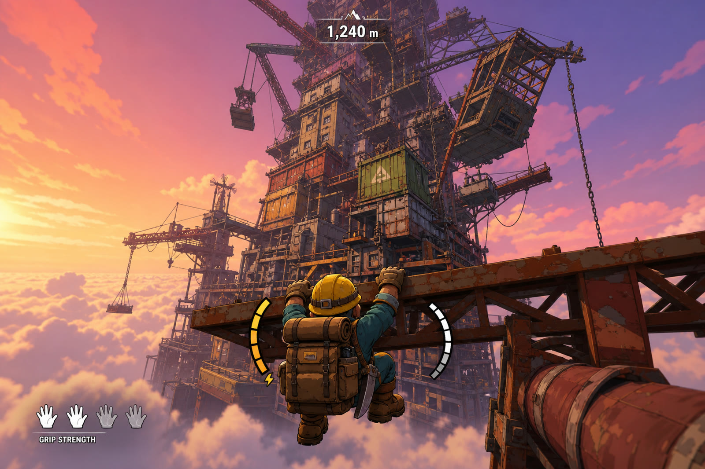

# 项目 maner — 游戏方案集（v1）

> 代号：**maner**
> 目标平台：Windows（Steam 发行），引擎 Unity 6.3 LTS（6000.3.22f1）
> 文档日期：2026-08-13
> 配套调研：[`docs/research/steam-market-research-2026.md`](../research/steam-market-research-2026.md)
> 本文档目的：给出 5 个可执行的候选方案，供决策选定其一进入垂直切片开发。每个方案都包含核心循环、**相机视角规格**、对标 Steam 游戏、美术与音频方向、技术架构、可自动化验证程度、MVP 验收标准、市场定位与致命风险。

---

## 0. 先说清楚：本项目的真实约束

在比较方案之前必须先明确开发环境的边界，因为这些边界会实质性改变方案的可行性排序，而不是只影响进度。

### 0.1 开发环境

| 项目 | 现状 |
| --- | --- |
| 开发机 | Ubuntu 24.04 云端虚拟机，4 核 CPU，15 GB 内存，235 GB 可用磁盘，无独立显卡 |
| 图形 | 通过 Xvfb 做虚拟显示；Unity 可在其中跑 Play Mode 与 Standalone Player，用软件光栅化路径 |
| 引擎 | Unity 6.3 LTS，安装 Windows Mono 构建模块，从 Linux 交叉构建 Windows 64 位可执行文件 |
| 构建后端 | **Mono**。IL2CPP 的 Windows 后端无法在 Linux 上交叉编译，因此正式发行版若要用 IL2CPP，需要在一台 Windows 机器上做最终构建 |
| 验证方式 | 无头运行 + 自动截图 + 图像对比 + 自动化测试（Unity Test Framework） |

### 0.2 能力边界（这一条决定方案排序）

**能自动完成的：**

- 全部 C# 逻辑、系统架构、状态机、存档、本地化、设置菜单、输入映射。
- 程序化生成的几何体（Mesh API 直接生成）、程序化材质与噪声、Shader。
- 程序化布局的 UI。
- 关卡的程序化生成与参数化。
- 性能剖析（帧时间、GC、Draw Call）。
- 截图并与参考图做构图/色调/对比度层面的比较。
- 功能正确性测试：能写「拉下 A 杆后 B 阀门应在 3 秒内到达 0.4 开度」这类断言并自动跑。

**不能自动完成的：**

- 手工建模、贴图绘制、角色骨骼动画、原画。所有美术资产只能来自「程序化生成」或「许可清晰的第三方资产」两条路。
- 作曲与拟音。音效只能来自程序化合成或 CC0 音库。
- **判断游戏好不好玩。** 手感、节奏、恐怖感、幽默感、社交乐趣，这些没有任何自动化手段可以替代真人试玩。
- 真人多客户端联机对战/合作的实际体验验证。

**结论：** 凡是「乐趣主要来自可自动验证的系统正确性与视觉呈现」的方案，本环境适配度高；凡是「乐趣主要来自手感微调、社交化学反应、美术资产质感」的方案，本环境适配度低，必须由人工试玩补齐闭环。这不是可以绕过的问题，只能通过选题降低暴露面，以及在关键节点强制人工试玩来管理。

### 0.3 因此，交付节奏必须包含人工回环

每个里程碑结束时，本项目会产出：概念图、当前实机截图、可运行的 Windows 构建包。**其中「实机截图 + 可运行构建」需要人工试玩并给出反馈**，尤其是手感与音效相关的判断。自动化只能保证「按规格实现了」，不能保证「规格本身是对的」。

---

## 1. 方案速览

| 编号 | 名称 | 类型 | 视角 | 单人/多人 | 定价锚点 | 程序化友好度 | 自动验证度 | 综合风险 |
| --- | --- | --- | --- | --- | --- | --- | --- | --- |
| **A** | 深井调度站 | 单场景机械操作模拟 | 第一人称，舱内小范围自由行走 | 单人 | 16.99 美元 | 高 | 高 | 中 |
| **B** | 井下配额 | 合作恐怖提取 | 第一人称，手持光源 | 1–4 人联机 | 8.99 美元 | 高 | **低** | 高 |
| **C** | 矿脉自动化 | 自动化建造模拟 | 第三人称自由轨道相机，可切第一人称 | 单人 | 19.99 美元 | **最高** | **最高** | 中（内容量大） |
| **D** | 修理铺 | Cozy 修理模拟 | 第一人称工作台 + 物件检视 | 单人 | 12.99 美元 | **低** | 中 | 高（美术依赖） |
| **E** | 攀塔 | 物理攀爬 roguelite | 第三人称跟随 | 单人 + 可选合作 | 7.99 美元 | 高 | **低** | 高（手感依赖） |

---

## 2. 方案 A — 《深井调度站》（推荐）



*概念图，非实机画面。用于确定视角、构图与色调基调。*

### 2.1 一句话定位

你是一座三千米深井唯一的地面调度员。整场游戏你只待在一间控制舱里，靠一整面钢铁控制台、一部电话和几块监视器，把井下的人活着送上来。

### 2.2 候选正式名

- 《MANER: Deep Shaft》 / 中文《深井》
- 《MANER: The Cage》（Cage 是矿井罐笼的行业术语，一语双关）
- 《SHAFT-7》

### 2.3 玩家幻想与情绪目标

玩家扮演的不是英雄，是一个**必须精确、且要为后果负责的操作员**。核心情绪有三层：

1. **胜任感**：一开始面对满墙控件完全看不懂，两小时后能闭着眼摸到排水泵的启动顺序。这是「掌握一台复杂机器」的快感，也是 IRON NEST 玩家评价里反复出现的「心流」。
2. **责任压力**：井下有具体的人，有名字，会打电话上来。你的一次误操作会让他们困在里面。
3. **不可名状的不安**（可选层，建议保留）：随着深度推进，你会在通话里听到不属于任何一个班组的声音，监视器上会出现不该出现的画面。这一层不需要任何怪物模型——**恐怖完全通过音频、仪表读数异常和监视器噪点实现，成本极低而效果极强。**

### 2.4 核心循环

**分钟级（操作循环）**

```
接收指令（电话 / 电报纸带 / 上级命令卡）
  → 在图纸上查证参数（井深、载重、通风分区）
  → 按正确顺序操作控件（供电 → 通风 → 解除罐笼锁 → 卷扬机降速曲线 → 到位制动）
  → 读仪表确认反馈（每一步都有对应的表针、灯、声音）
  → 处理突发（超载、瓦斯浓度上升、泵故障、断电、通讯中断）
```

**局级（一个班次，约 25–40 分钟）**

一个班次包含 6–10 个任务指令，中间穿插 1–3 次随机故障。班次结束时结算：完成率、事故数、井下人员伤亡、设备损耗。结算直接影响下一班次的设备状态（你今天烧了泵，明天就得带着一台坏泵干活）。

**长期（战役，12–16 个班次）**

深度逐级下探，每一层解锁新的子系统（第 1 层只有卷扬机和通风；第 4 层加入排水与瓦斯抽放；第 7 层加入应急自救系统）。控制台是**物理增建**的——新系统意味着控制舱里真的多出一块新面板，玩家的操作负担逐层累加。剧情通过电话、纸带、上级公文、以及井下人员的态度变化推进。

### 2.5 相机视角规格（重点）

| 参数 | 设定 |
| --- | --- |
| 视角类型 | 第一人称 |
| 移动自由度 | 舱内自由行走，可活动范围约 5m × 4m 的一间控制室；不能离开控制舱 |
| 相机高度 | 1.65 m 站立；可蹲下至 1.05 m（查看下层面板与线缆） |
| 默认 FOV | 70°（垂直 FOV 约 50°）；提供 60–100° 滑条 |
| 交互方式 | 准星射线检测 + 物理化控件：拨杆用鼠标拖拽出弧线，旋钮按住并画圆，阀轮需要连续转多圈，闸刀需要用力压下。**不用「按 E 交互」一键完成，操作本身就是玩法** |
| 检视模式 | 按住右键把手上的物件（图纸、照片、手册）举到眼前，可旋转 |
| 头部动效 | 轻微呼吸浮动 + 走动时的步频摆动；爆炸/震动事件时的相机冲击 |
| 后处理 | 体积光、胶片颗粒、CRT 屏幕辉光、镜头污渍（可关） |

**为什么是第一人称、且不能离开房间**：这个约束既是美术成本控制（只需要做好一个房间），也是叙事装置（你被困在这里，只能通过间接信息了解井下发生了什么，这正是恐惧的来源）。

### 2.6 对标 Steam 游戏（含视角对照）

| 对标游戏 | 视角 | 对标的是什么 | 不对标的是什么 |
| --- | --- | --- | --- |
| **IRON NEST: Heavy Turret Simulator**（2026） | 第一人称，机器内部 | 交互密度、机械反馈、任务指令结构、19.99 定价 | 军事/火力题材、弹道计算数学 |
| **Voices of the Void** | 第一人称，站内自由行走 | 孤独感、日常流程 + 异常事件的节奏、恐怖靠氛围而非怪物 | 开放场地、大量户外 |
| **Hardspace: Shipbreaker** | 第一人称，零重力自由移动 | 「按正确顺序拆解一台危险机器」的紧张感、班次与配额结算 | 零重力移动、工具切换 |
| **Papers, Please** | 2D 桌面 | 任务结构：规则手册 + 逐条核对 + 后果反馈（仅结构对标，不是视觉对标） | 全部视觉呈现 |
| **Barotrauma** | 2D 侧视 | 多子系统互相牵制、故障连锁（仅系统对标） | 视角、多人 |
| **Duskers** | 终端界面 | 「只能通过间接信息了解现场」的信息设计 | 全部视觉呈现 |

### 2.7 美术方向与资产清单

**风格定位：** 1970 年代东欧工业美学。灰绿色搪瓷漆面、黄铜、胶木旋钮、玻璃罩表盘、磨损的丝网印刷标签、荧光绿单色 CRT。整体色调低饱和，靠单一暖色钨丝灯与仪表指示灯打点。

**资产清单与获取方式：**

| 资产 | 数量级 | 获取方式 |
| --- | --- | --- |
| 控制台面板 | 6–9 块 | **程序化生成**：面板是参数化的矩形板 + 挤出边框 + 螺丝点阵，用配置文件定义每块板上的控件布局 |
| 交互控件 | 8 种原型（拨杆、旋钮、按钮、闸刀、阀轮、滑块、插线孔、表盘），实例 60–120 个 | **程序化生成**：每种控件是一个参数化 Mesh 生成器 + 一个交互脚本；实例通过布局配置摆放 |
| 仪表读数 | 全部 | **Shader 实时绘制**：表针、刻度、数字管、示波器波形都由 shader 或 UI 渲染到贴图，不需要美术资源 |
| CRT 监视器画面 | 4–6 路 | **RenderTexture + 后处理**：井下摄像头视图 = 一个简单的井下场景渲染到贴图，加扫描线与噪点 shader |
| 房间壳体 | 1 间 | **程序化生成**：墙、地、天花、管线走向由代码摆放 |
| 手持道具（图纸、照片、手册、电话） | 8–12 件 | 图纸与文件为**程序化生成的贴图**（这是优势：图纸内容需要随任务变化，本来就该动态生成）；电话听筒等实体件用简单几何 + 第三方 CC0 资产 |
| 井下场景（仅用于监视器画面） | 3–4 个片段 | **程序化生成**，且因为只在低分辨率带噪点的 CRT 上显示，品质要求极低 |
| 角色模型 | **0 个** | 全程不出现人物，只有声音。这是本方案最大的成本优势 |

**这份清单的关键结论：这个方案不需要任何一个手工建模的资产就能达到可发行品质。** 所有几何体都是工业硬表面的规则形状，正是程序化生成最擅长的类型；所有信息显示都是 shader 绘制；没有角色就没有骨骼、蒙皮、动画、面部这条最贵的管线。

### 2.8 音频方向

**音频在本方案里不是配角，是核心卖点的一半。** IRON NEST 的玩家评价明确指向这一点：「你能看见、听见、感受到机器随着你的每一个操作嘎吱作响」。

- 每个控件都要有独立的开始/持续/结束三段音：拨杆的金属咔哒、阀轮的连续吱呀 + 到底的闷响、闸刀合闸的电弧噼啪。
- 环境层：卷扬机运转的低频轰鸣（随速度变调）、通风的白噪、水泵的周期性搏动、远处井筒的风声。这些是**程序化合成的最佳场景**——低频噪声 + 滤波 + LFO 就能得到可信的机械环境声，并且能随游戏状态连续变化，这比录制素材更好。
- 电话人声：需要真人配音或 TTS。**这是本方案唯一必须外部输入的资产**，可以先用 TTS 占位，后期替换。
- 恐怖层：把正常环境声做微妙的畸变（多一个不该有的谐波、卷扬机声里混入一段不属于机器的节奏），几乎零成本。

### 2.9 技术架构

```
Systems/
  ShiftDirector      班次导演：任务队列、随机故障注入、节奏控制
  MachineSim         机械仿真：卷扬机、通风、排水、供电、瓦斯的耦合状态方程（固定步长，确定性）
  ControlBinding     控件 ↔ 仿真参数的绑定层（数据驱动，配置文件定义）
  FaultSystem        故障模型：部件磨损、失效模式、连锁反应
  CommsSystem        通讯：电话、电报纸带、上级命令卡的生成与投递
  ConsequenceLedger  后果账本：井下人员状态、设备损耗，跨班次持久化
Presentation/
  ProcGen            面板/控件/房间的程序化生成
  GaugeRenderer      仪表 shader 渲染
  CctvRig            监视器视图
  AudioDirector      程序化机械音合成与状态驱动混音
```

**核心设计决策：仿真层与表现层完全解耦。** 机械仿真是一个纯 C# 的、固定步长的、确定性的状态机，不依赖任何 Unity 场景对象。带来的好处：

1. 可以在没有渲染的情况下以数千倍速跑完整个班次，用于平衡性测试。
2. 可以写精确的单元测试：「初始水位 2.1 m，泵 A 失效，泵 B 全速，180 秒后水位应在 1.4–1.6 m 之间」。
3. 回放与存档只需要序列化仿真状态。

### 2.10 自动化验证方案

| 验证目标 | 方法 | 可行性 |
| --- | --- | --- |
| 仿真正确性 | 纯 C# 单元测试，无需渲染 | 完全可行 |
| 任务可完成性 | 脚本化「机器人操作员」按正确顺序执行，断言班次通过 | 完全可行 |
| 平衡性 | 加速跑 1000 个班次，统计通过率、事故率分布 | 完全可行 |
| 视觉呈现 | 固定机位截图，与概念图做构图/色调/明暗直方图对比，逐版本回归 | 可行 |
| 性能 | 无头 Player 跑固定路径，记录帧时间分布 | 可行 |
| **手感与音效** | **无法自动化**，需人工试玩 | **需人工** |

**暴露面评估：** 这个方案里只有「手感与音效」需要人工，而且它高度局部化（每个控件的反馈是独立的，可以逐个打磨、逐个反馈），不像「整体乐趣」那样弥散。这是它适配本项目环境的根本原因。

### 2.11 MVP（垂直切片）定义与验收标准

垂直切片 = **一个完整可玩的班次**，包含以下全部内容，每条都有可验证的判据：

1. 控制舱程序化生成完成，含 3 块面板、不少于 24 个可交互控件，每个控件有独立的物理化操作方式与三段音效。
   *验收：截图可见 3 块面板；自动化测试逐个触发 24 个控件并断言其绑定参数发生预期变化。*
2. 卷扬机、通风、供电三套子系统的耦合仿真可运行，固定步长确定性，相同输入产生相同输出。
   *验收：同一输入序列跑两次，仿真状态哈希一致。*
3. 一个 6 条指令的班次脚本可完整走通，含 1 次强制故障事件。
   *验收：机器人操作员脚本在无人干预下通过班次，日志输出 6/6 完成、1 次故障已处置。*
4. 电话系统可接听，至少 4 段语音（TTS 占位），玩家的应答选择会改变后续事件。
   *验收：两种应答分支各自触发不同的后续事件 ID。*
5. 结算界面展示完成率、事故数、设备损耗，并写入存档。
   *验收：结算数值与仿真日志一致；重启后读档状态相同。*
6. Windows 64 位构建包可在干净机器上双击运行，无缺失依赖。
   *验收：在未安装 Unity 的机器上运行成功并进入班次。*

### 2.12 市场定位

- **Steam 标签**（按优先级）：Simulation、First-Person、Immersive Sim、Atmospheric、Psychological Horror、Singleplayer、Mining、Retro、Story Rich、Difficult
- **定价**：16.99 美元（对标 IRON NEST 19.99；本作首作无口碑积累，略低定位）
- **发行策略**：先上「即将推出」页 + Demo 参加 Next Fest。IRON NEST 的玩家评价里明确提到「在 Next Fest 玩过，非常棒」——Demo 是这个品类的主要获客手段，因为它的卖点（操作手感）必须亲手摸才能理解。
- **差异化**：市面上的硬核操作模拟集中在军事、航天、载具题材；「深井调度」这个题材没有直接竞品，且天然带有人命压力与幽闭恐惧，比火炮题材更容易做出情绪。
- **可传播性**：单次操作失误导致的灾难性连锁（罐笼坠落、瓦斯爆燃）是天然的剪辑素材；「新手第一次面对满墙按钮」也是主播友好的开局。

### 2.13 风险与致命失败点

| 风险 | 等级 | 应对 |
| --- | --- | --- |
| 操作手感做不到位，控件感觉像「点了个按钮」而非「操作了一台机器」 | **致命** | 这是本方案的生死线。必须在垂直切片阶段就把单个控件的手感打磨到位，并由人工试玩确认后再扩展数量 |
| 学习曲线过陡，玩家在前 20 分钟劝退 | 高 | 第 1 层只开放 2 个子系统、8 个控件；教学融入剧情（老调度员在电话里带你） |
| 程序化生成的房间显得空洞、廉价 | 中 | 把渲染预算全部堆在这一个房间：高质量光照烘焙、体积光、大量小道具散布；固定机位截图逐版本对比概念图 |
| TTS 语音质感差，破坏沉浸 | 中 | 语音全部走无线电滤波处理（本来就该有噪声与失真），能显著掩盖 TTS 的不自然；后期替换真人配音 |
| 题材过于小众 | 中 | IRON NEST 已经验证了「极度小众的硬核操作题材」能进周销榜前五，说明这个受众存在且付费意愿强 |

---

## 3. 方案 B — 《井下配额》



*概念图，非实机画面。*

### 3.1 一句话定位

1 到 4 人下到程序化生成的废弃矿井里，在配额时限内挖够矿石并活着回到罐笼。井下有东西，而你们只有一盏灯和彼此的语音。

### 3.2 核心循环

```
接单（配额 + 时限）→ 罐笼下井 → 分头搜刮 / 挖掘（分头效率高，但落单会死）
  → 遭遇异常（灯灭、坍塌、追猎者）→ 抢在时限前回到罐笼 → 上交结算 → 升级装备 → 更深的一层
```

配额制度是 Lethal Company 已经验证过的结构：它把「贪心 vs 保命」的张力压缩进每一局，并且天然产生「最后 10 秒冲进罐笼」这样的名场面。

### 3.3 相机视角规格

| 参数 | 设定 |
| --- | --- |
| 视角类型 | 第一人称 |
| 默认 FOV | 66°（刻意偏低，制造幽闭与压迫感）；提供 60–95° 滑条 |
| 光照 | 手持矿灯或头灯，光锥有限；这是恐怖设计的核心工具，视野即资源 |
| 手部呈现 | 可见双手 + 手持物（灯、镐、扫描器、同伴的身体） |
| 移动 | WASD + 冲刺（消耗体力）+ 蹲行；负重影响移动速度 |
| 头部动效 | 明显的步频摆动与呼吸；受伤时视野边缘变暗、心跳音效 |
| 死亡视角 | 变为幽灵自由飞行观战（这一点很重要：死了的人还能看着朋友，社交乐趣不中断） |

### 3.4 对标 Steam 游戏（含视角对照）

| 对标游戏 | 视角 | 对标的是什么 |
| --- | --- | --- |
| **Lethal Company** | 第一人称 | 配额制、近距离语音、程序化设施、低价定位 |
| **PEAK** | 第一人称 | 极简机制 + 高社交产出、7.99 定价、快速迭代 |
| **R.E.P.O.** | 第一人称 | 搬运物理化带来的合作笑点 |
| **Content Warning** | 第一人称 | 「录像/记录」作为额外目标层 |
| **Mistfall Hunter**（2026） | 第一/第三人称 | 提取制结构、暗黑奇幻方向、24.99 定价 |
| **Deep Rock Galactic** | 第一人称 | 矿洞题材的挖掘与可破坏地形手感（品质标杆，不是可达目标） |

### 3.5 美术与技术

- 洞穴地形：**程序化生成**（3D 噪声 + Marching Cubes 或体素），这是程序化最擅长的领域，且可破坏地形本来就要求体素化表达。
- 光照：完全黑暗 + 少量动态光源，是**性能与美术双赢**的选择——看不见的地方不需要做好。
- 角色：需要 1 个可换色的玩家模型 + 基础动画（走、跑、蹲、举物、死亡）。**这是本方案第一个硬伤**：角色资产无法程序化生成，必须采购第三方资产或外包。
- 威胁体：3–5 种怪物，需要模型与动画。**第二个硬伤**。可以用「不可见的威胁」（只有声音与足迹）规避一部分，但不能全部规避。
- 网络：Unity Netcode for GameObjects 或 Steamworks P2P（Steam Relay）。近距离语音需要接 Steam Voice 或 Vivox。

### 3.6 自动化验证方案

| 验证目标 | 可行性 |
| --- | --- |
| 洞穴生成的连通性、可达性、无卡死几何 | 完全可行（图搜索断言） |
| 单机功能正确性 | 可行 |
| 网络同步正确性 | 部分可行（可在同一台机器上起 Host + 2 Client 无头实例做同步断言），但延迟、丢包、NAT 穿透等真实网络条件无法模拟 |
| **恐怖感、社交乐趣、语音体验** | **完全不可行** |

### 3.7 市场定位与风险

- **标签**：Co-op、Horror、Online Co-Op、Survival、First-Person、Mining、Multiplayer
- **定价**：8.99 美元
- **市场依据**：Co-op 标签中位拥有量全平台最高（约 55 万）；这条赛道有 PEAK、R.E.P.O. 两个千万级案例。

| 风险 | 等级 | 说明 |
| --- | --- | --- |
| **赛道极度拥挤** | **致命** | Lethal Company 之后涌入了大量同构产品，绝大多数无人问津。榜单上的成功案例是幸存者偏差 |
| **成功高度依赖发行时的社群基本盘** | **致命** | PEAK 的开发者自己承认，他们的爆发建立在两家工作室多年积累的社群之上。零社群启动的同类产品是另一个故事 |
| 角色与怪物资产无法程序化 | 高 | 必须采购或外包 |
| 联机体验无法在本环境验证 | 高 | 必须有真人多机测试 |
| 语音是核心乐趣但完全不可自动测试 | 高 | — |

**坦率评估：** 这个方案的市场天花板最高，但它对本项目环境的适配度最差，且它的成功要素中有一项（既有社群）我们完全不具备。把它作为主线方案是拿最不可控的变量去赌最高的回报。

---

## 4. 方案 C — 《矿脉自动化》



*概念图，非实机画面。*

### 4.1 一句话定位

在一颗只有岩石和矿脉的行星上，从一把手镐开始，铺出一整片自我运转的采矿与冶炼网络，直到你再也不需要亲手挖任何一块矿。

### 4.2 核心循环

```
勘探矿脉 → 手工采集启动资源 → 建造采掘机与传送带 → 产能瓶颈出现
  → 解锁新配方/新设备 → 重构产线 → 更高层级的产物 → 新的瓶颈
```

自动化品类的乐趣本质是**「解决工程问题的智力愉悦」+「看着自己造的东西运转的观赏愉悦」**。这两者都不依赖手感，也不依赖社交——**这正是本项目环境最擅长验证的类型**。

### 4.3 相机视角规格

| 参数 | 设定 |
| --- | --- |
| 主视角 | 第三人称自由轨道相机：围绕一个焦点旋转、缩放、平移 |
| 俯仰角 | 默认 45°，可在 20°–85° 之间调整（85° 接近正俯视，用于规划布局） |
| 缩放范围 | 焦点距离 8 m 至 200 m，缩放时自动调整近远裁剪面与 LOD |
| 投影 | 透视投影，但在高俯仰角 + 远距离时可选切换为正交投影（正交对建造网格的对齐判断更友好） |
| 副视角 | 可切换为第一人称地面视角（1.7 m 相机高度，FOV 75°），用于近距离观赏产线与手动采集 |
| 建造相机 | 进入建造模式时相机轻微抬高并淡出无关元素，网格线与吸附点高亮 |
| 默认 FOV | 60°（轨道相机）/ 75°（第一人称） |

**为什么给两套相机**：自动化品类的两种核心快感对应两种视角——规划时需要俯视全局（等距/轨道），欣赏时需要贴地看机器运转（第一人称）。Satisfactory 只给了第一人称，Factorio 只给了俯视；同时给两套是明确的差异化点，且实现成本很低（同一个场景，两个相机控制器）。

### 4.4 对标 Steam 游戏（含视角对照）

| 对标游戏 | 视角 | 对标的是什么 |
| --- | --- | --- |
| **Satisfactory** | 第一人称（3D） | 3D 空间中的传送带铺设、垂直分层建造 |
| **Dyson Sphere Program** | 第三人称跟随 + 可拉远至行星/星系尺度 | 相机的尺度跨越、星球曲面网格 |
| **Captain of Industry** | 等距/轨道俯视 | 地形改造 + 重工业产线的视觉密度 |
| **Shapez 2** | 3D 自由相机 | 抽象化的清爽视觉、纯逻辑向的建造 |
| **Factorio** | 2D 正俯视 | 系统深度与产线逻辑的黄金标准（仅系统对标） |
| **Techtonica** | 第一人称，地下 | 地下矿洞里的自动化，题材接近 |

### 4.5 美术方向

**风格定位：** 清晰可读优先于写实。有限调色板（赭石色岩体 + 橙色工业件 + 青色能量/全息），硬边卡通着色 + 柔和 AO。远看是一片有秩序的机械织物，近看每个模块都在动。

**资产全部模块化且程序化生成：** 传送带是沿样条挤出的网格 + 滚动 UV 材质；管道同理；机器是「基座 + 主体 + 附件」的组合式参数化模型；地形是噪声生成的岩体。**自动化品类天生就是模块化的，这与程序化生成是完美匹配。** 这个方案的美术资产可以做到 100% 由代码生成，且视觉效果不打折——因为品类审美本来就崇尚规整与秩序。

### 4.6 自动化验证方案（本方案的最强项）

| 验证目标 | 方法 |
| --- | --- |
| 物流仿真正确性 | 纯 C# 单元测试：「A 机每分钟产 30 个，传送带带宽 60/min，B 机每分钟耗 45 个，则 10 分钟后缓冲区应为 -150（即 B 机饥饿）」 |
| 配方树平衡性 | 无渲染跑完整科技树，输出每一级的耗时曲线，自动检测断崖与冗余 |
| 大规模性能 | 生成 10,000 个物流实体的压力场景，无头跑，记录帧时间与 GC |
| 建造规则正确性 | 穷举吸附与碰撞情形的组合测试 |
| 视觉回归 | 固定机位截图对比 |
| 存档兼容性 | 老存档读入新版本的自动化回归 |

**这个方案几乎可以完全由自动化驱动开发。** 它的核心质量（系统是否自洽、平衡是否合理、性能是否达标）全部是可测的客观属性。

### 4.7 市场定位与风险

- **标签**：Automation、Base Building、Factory、Simulation、Resource Management、Singleplayer、Colony Sim
- **定价**：19.99 美元，Early Access 起步
- **市场依据**：工厂/自动化是当前中位收入最高的独立品类（达 100+ 评价者典型 20–50 万美元）；玩家投入时长极高，评价率高，算法飞轮效应强。

| 风险 | 等级 | 说明 |
| --- | --- | --- |
| **内容量与平衡设计的绝对工作量最大** | **高** | 这个品类的玩家期待数百小时内容。半成品会被直接判定为「Factorio 的劣质仿制品」 |
| 品类玩家极度挑剔且懂行 | 高 | 他们会精确指出你的物流吞吐模型哪里不对 |
| 性能是硬门槛 | 中 | 后期地图上万个实体，必须做 DOTS/Job System 或自研批处理，架构必须一开始就为此设计 |
| 差异化困难 | 中 | 必须有一个明确的机制钩子。候选：**双视角**（轨道 + 第一人称）、**垂直井道**（在三维深度上而非平面上扩张，呼应 maner 的矿井主题）、**地质仿真**（矿脉会枯竭、塌陷，迫使产线迁移） |

**坦率评估：** 这个方案对本项目环境的适配度最高，市场中位收入也最高，但它是唯一一个「必须做够体量才有意义」的方案。前三个方案可以在小体量下依然完整，这个不行。

---

## 5. 方案 D — 《修理铺》



*概念图，非实机画面。*

### 5.1 一句话定位

一间下雨的小铺子，一盏台灯，一只趴在说明书上的猫。客人送来坏掉的老电器，你把它拆开、找出故障、修好、装回去。

### 5.2 核心循环

```
接收物件 + 客人的故障描述（描述往往不准确）→ 拆解（按正确顺序卸螺丝、断线）
  → 诊断（万用表测电压、目视找鼓包电容、听异响）→ 更换/清洁/焊接 → 组装 → 通电测试 → 交付
```

叙事层：每个物件背后有一个客人的故事，通过便签、机器里夹着的旧照片、修好后客人的回信来讲。这是 cozy 品类的情绪主轴。

### 5.3 相机视角规格

| 参数 | 设定 |
| --- | --- |
| 主视角 | 第一人称，固定在工作台前的坐姿位置，相机高度 1.15 m，俯视工作台约 35° |
| FOV | 55°（偏窄，让桌面物件占据画面主体，营造专注感） |
| 检视模式 | 拾起物件后进入自由旋转检视：物件居中，鼠标拖拽旋转，滚轮缩放，可切换 X 光/爆炸视图 |
| 精细操作 | 拧螺丝、焊接等操作会推进相机做局部特写，配浅景深 |
| 场景移动 | 可站起走到货架、零件柜、水槽（3–4 个固定站位之间切换，不做完全自由行走） |
| 后处理 | 暖色调分级、柔和景深、窗外雨滴与散景 |

### 5.4 对标 Steam 游戏（含视角对照）

| 对标游戏 | 视角 | 对标的是什么 |
| --- | --- | --- |
| **ReStory: Chill Electronics Repairs**（2026） | 第一人称桌面 | **直接竞品**，同题材同视角，2026-08 上线即进周销榜第 5 |
| **PowerWash Simulator** | 第一人称自由行走 | 「重复劳动的治愈感」这一核心情绪、进度可视化 |
| **Car Mechanic Simulator** | 第一人称 | 拆解-诊断-更换的流程结构、零件系统 |
| **House Flipper** | 第一人称 | 任务制 + 空间改造 |
| **Retro Gadgets** | 桌面 | 复古电子设备的审美 |
| **Unpacking** | 2D 侧视 | 通过物件讲故事（仅叙事结构对标） |

### 5.5 为什么这个方案风险最高

**这个品类的核心卖点就是物件本身的质感。** 玩家买的是「把一台漂亮的老收音机拆开」这件事，物件的建模精度、材质质感、拆解结构的真实感，就是产品本身。

而硬表面的**有机工业设计**（一台 1970 年代收音机的圆角、拉丝铝面板、织物网罩）恰恰是程序化生成最不擅长的类型——它不规则、依赖审美判断、每一件都不一样。这与方案 A 的工业控制台形成鲜明对比：控制台是规则的、可参数化的，收音机不是。

同时，直接竞品 ReStory 由 tinyBuild 发行，已经占据了「chill 电子修理」这个精确的生态位，并且正在榜上。

**结论：除非愿意为美术资产付费外包，否则不建议选择此方案。** 它是这五个方案里唯一一个「本项目的能力短板正好打在它的核心卖点上」的。

### 5.6 若仍要做，可行的降低风险路径

改做**规则形状的物件**：老式机械钟、机械打字机、齿轮传动装置、机械计算器。这些物件由规则几何（齿轮、轴、杠杆、弹簧）构成，程序化生成可以胜任，且拆解结构天然清晰。定位从「电子修理」转为「精密机械修理」，同时避开 ReStory 的正面竞争。

---

## 6. 方案 E — 《攀塔》



*概念图，非实机画面。*

### 6.1 一句话定位

一座程序化拼装的无尽工业塔，双手独立控制的物理攀爬，掉下去就从头再来。

### 6.2 相机视角规格

| 参数 | 设定 |
| --- | --- |
| 视角类型 | 第三人称跟随 |
| 相机距离 | 3.5 m，碰撞时自动收近 |
| 相机高度偏移 | 角色头部上方 0.6 m，俯角 10° |
| FOV | 65°；下坠时动态拉伸至 85° 以强化速度感 |
| 构图 | 角色占画面下三分之一，上方留出大量空间展示待攀爬的结构（见概念图） |
| 特殊 | 到达高点时相机自动拉远做「成就镜头」；坠落时相机上移，让玩家看清自己掉了多远 |

**为什么是第三人称而非第一人称**：PEAK 用的是第一人称，但那是为了让玩家看不见自己的脚、增加不确定感。本方案的差异化在于「看见自己的动作」——身体的伸展、抓握的挣扎、重心的摇晃，这些是第三人称才能传达的信息，也是物理攀爬最有观赏性的部分（对照 Jusant、Grow Home）。

### 6.3 对标 Steam 游戏（含视角对照）

| 对标游戏 | 视角 | 对标的是什么 |
| --- | --- | --- |
| **PEAK** | 第一人称 | 攀爬 + 体力 + 合作，7.99 定价，千万级案例 |
| **Jusant** | 第三人称 | 双手独立控制的攀爬操作、优美的攀爬动画 |
| **Only Up!** | 第三人称 | 「一次失误跌回原点」的赌博式紧张感（同时也是该品类口碑崩塌的反面教材） |
| **Getting Over It** | 第三人称侧视 | 挫败美学、主播传播力 |
| **Grow Home** | 第三人称 | 程序化的攀爬目标物、手足独立控制 |

### 6.4 风险

| 风险 | 等级 | 说明 |
| --- | --- | --- |
| **物理攀爬的手感调试完全依赖真人反复试玩** | **致命** | 这是本项目环境最无法覆盖的类型。攀爬手感的每一次参数调整都需要人来感受，自动化脚本只能验证「能爬上去」，不能验证「爬得爽」 |
| 品类口碑污名 | 高 | Only Up 之后，「愤怒攀爬」被大量低质产品透支，玩家警惕性高 |
| 与 PEAK 正面竞争 | 高 | 一款近千万销量、当前折扣 3.99 美元的在架产品 |

---

## 7. 决策矩阵

评分为 1（差）到 5（好），综合分为加权和，权重反映本项目的实际约束。

| 维度 | 权重 | A 深井调度站 | B 井下配额 | C 矿脉自动化 | D 修理铺 | E 攀塔 |
| --- | --- | --- | --- | --- | --- | --- |
| 市场天花板 | 15% | 3 | 5 | 4 | 3 | 4 |
| 品类中位收入 | 15% | 4 | 3 | 5 | 3 | 2 |
| 竞争拥挤度（越不挤越高） | 10% | 5 | 1 | 3 | 2 | 1 |
| 美术资产可程序化生成 | 20% | 5 | 3 | 5 | 1 | 4 |
| 自动化验证覆盖度 | 20% | 4 | 2 | 5 | 3 | 1 |
| 小体量下的完整度 | 10% | 5 | 4 | 1 | 4 | 4 |
| 无社群启动的可行性 | 10% | 4 | 1 | 4 | 3 | 2 |
| **加权总分** | | **4.35** | **2.75** | **4.25** | **2.50** | **2.70** |

---

## 8. 推荐

**首选：方案 A《深井调度站》。**

理由：

1. 它是唯一一个「本项目的全部能力短板都不落在核心卖点上」的方案。核心卖点是交互密度与机械反馈，前者是纯逻辑（可自动验证），后者是音频与动画反馈（局部化，可逐个人工确认）。
2. 它有 2026 年的直接成功先例：两人团队、单场景、19.99 美元、Steam 周销榜第 4。这不是理论推演，是本月正在发生的事实。
3. 它的美术资产可以做到零手工建模，且没有角色模型这条最贵的管线。
4. 它在小体量下依然是一个完整的产品——一个做到极致的班次比十个平庸的关卡更有说服力。
5. 题材没有直接竞品。

**备选：方案 C《矿脉自动化》。**

如果愿意接受更长的开发周期与更大的内容量，方案 C 的中位收入更高、自动化验证覆盖度最高，是纯理性下的最优解。它唯一的问题是「必须做够体量」。

**不推荐：方案 B、D、E。** 三者的核心卖点分别落在社交化学反应、美术资产质感、物理手感上——恰好是本项目三个最大的能力缺口。

**一个值得考虑的组合路径：** 先做方案 A 并发行，用它建立第一批社群与口碑；若成功，方案 B（合作矿井恐怖）可以复用 A 的世界观、矿井美术与音频资产，作为第二款产品，届时「缺乏社群启动」这个致命问题已经被 A 解决了。这两个方案共享同一个宇宙——地面调度站与井下班组，是同一座矿的两个视角。

---

## 9. 共通技术栈与发行清单

无论选择哪个方案，以下部分是相同的。

### 9.1 技术栈

| 项目 | 选择 | 说明 |
| --- | --- | --- |
| 引擎 | Unity 6.3 LTS（6000.3.22f1） | LTS 版本，长期支持 |
| 渲染管线 | URP | 兼容性与性能更可控；HDRP 对本项目的无 GPU 开发环境不友好 |
| 脚本后端 | 开发期 Mono（可从 Linux 交叉构建 Windows），发行前切 IL2CPP | IL2CPP 的 Windows 目标必须在 Windows 机器上构建，这是发行前的一个明确前置条件 |
| 输入 | Input System 包 | 支持手柄与键鼠重绑定，Steam 用户对此有预期 |
| 测试 | Unity Test Framework（EditMode + PlayMode） | 配合无头 CI |
| 版本控制 | Git + Git LFS | 二进制资产走 LFS |
| Steam 集成 | Steamworks.NET 或 Facepunch.Steamworks | 成就、云存档、（若需要）P2P |

### 9.2 发行清单

- [ ] Steamworks 账号开通，完成身份、税务、银行信息，签署协议
- [ ] 支付 100 美元 Steam Direct 费用
- [ ] 商店页素材：主视觉胶囊图（616×353、462×174、467×181、374×448、1232×706）、截图（1920×1080，至少 5 张）、预告片
- [ ] 商店页以「即将推出」状态上线，且在发售前至少保持 2 周
- [ ] 建立单独的构建专用 Steam 账号，只授予 "Edit App Metadata" 与 "Publish App Changes To Steam" 权限
- [ ] 配置 SteamPipe：app_build.vdf + depot 配置，跑通 `steamcmd +login <user> +run_app_build <script.vdf> +quit`
- [ ] 在一台未安装任何开发工具的干净 Windows 机器上验证构建可运行
- [ ] 商店页提交审核（1–5 个工作日）→ 通过后提交构建审核
- [ ] Demo + Next Fest 计划（对方案 A 尤其关键，其卖点必须亲手体验）
- [ ] 愿望单积累期：发售前 2–6 个月

### 9.3 资产合规

Steam 发行要求所有资产的权利清晰。本项目的资产来源限定为三类，且必须逐一记录来源与许可：

1. 代码程序化生成（无许可问题）
2. CC0 / 公有领域资产（需在仓库中留存来源记录）
3. 明确购买或授权的资产

**不使用任何来源不明的资产。** 仓库内维护 `docs/asset-licenses.md` 记录每一项第三方资产的来源、许可类型与链接。

---

## 10. 需要决策的问题

以下问题会实质改变架构或范围，需要在进入垂直切片开发前确认：

1. **选定哪个方案？** 推荐 A，备选 C。
2. **恐怖元素要不要？** 方案 A 的「不可名状层」是可选的。加上它能显著提升传播力与情绪强度，但会把游戏推向恐怖品类，改变目标受众与商店标签。
3. **是否接受纯程序化美术？** 如果预算允许采购第三方资产或外包建模，方案 D 与 B 的可行性会显著提升，方案 A 的品质上限也会提高。
4. **发行形态：一次性买断还是 Early Access？** 方案 A 适合买断（内容有明确终点），方案 C 几乎必须走 Early Access。
5. **是否需要中文以外的本地化？** Steam 的主要收入区通常需要英语；简体中文与英语双语是默认建议。
6. **是否已有 Steamworks 账号与 100 美元预算？** 这决定发行流程能否与开发并行推进（商店页需要提前至少 2 周上线，愿望单期建议 2–6 个月，越早开始越好）。
