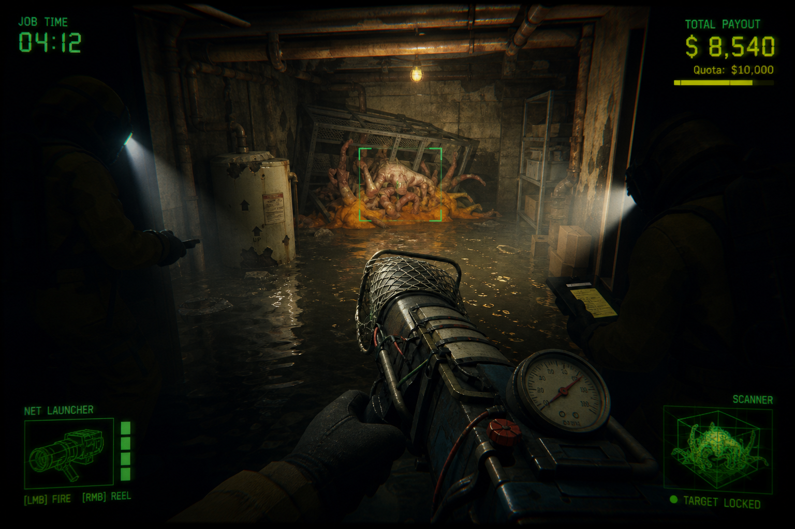

# Concept A — **MONSTER: Containment**

> *Pest control, but the pests are monsters and the client is watching their insurance premium.*



**Status: recommended primary concept.** See `README.md` §1 for the reasoning.

---

## 1. Pitch

You work for a monster-removal contractor. A client calls: something has moved into their
basement, their attic, their sewer junction, their meat-packing plant. You and up to three
colleagues arrive with a van full of equipment, and you have until dawn to get the thing out.

The job is not to kill it. Killing is a **failure grade**. The company sells live specimens,
and a dead one is worth a fraction of a live one. The job is also not to wreck the building:
every window you break, wall you punch through and pipe you rupture is deducted from the
payout at the end of the shift, itemised, line by line, on an invoice you have to watch
scroll past while your colleagues argue about whose fault it was.

So the loop is: find it, understand it, corner it, restrain it, carry it out — with four
people, ragdoll physics, a two-metre creature, and a one-metre doorway.

---

## 2. Why this concept, specifically

The research (`docs/research/steam-market-2026.md` §2.1) identifies a reproducible shape:
3D, first-person, four-player co-op, one repeating job loop, monsters, physics comedy,
proximity voice, low-poly art, sub-$10. Teams of one to five have produced repeated
breakouts in it: R.E.P.O. (136,779 reviews, 96%), PEAK (136,446, 95%), Content Warning
(34,932, 93%), and within a month of our data capture GRAIN ROT (954, 89%) and Machine Party
(1,198, 88%).

The same research warns the space is clone-saturated. The counter is a genuinely different
verb, and this concept has one:

| | Lethal Company / R.E.P.O. lineage | MONSTER: Containment |
| --- | --- | --- |
| What is valuable | Inanimate loot | **The monster itself** |
| What monsters are for | An obstacle to avoid | **The objective to approach** |
| Failure state | You die | **You succeed messily and get paid less** |
| Source of tension | Will it find me | **Can I hold onto it** |
| Source of comedy | Panic and betrayal | **Logistics** |

That inversion is not cosmetic. It changes the moment-to-moment: players spend the run
*moving toward* the threat rather than away from it, which produces a different kind of
footage, which matters because in this genre the store page GIF is the marketing.

---

## 3. Core loop

**One shift, 15–25 minutes.**

```
  Van (lobby)              →  Approach            →  Survey             →  Engage
  pick contract, buy gear     walk to the site       find it, ID it,      restrain, sedate,
  from the shared purse       in the dark            read its rules       bag it
        ↑                                                                     ↓
  Invoice                  ←  Extract            ←  Handle
  payout, damages,            get it to the van      four people, one heavy,
  reputation, upgrades        before the timer       thrashing object
```

**Timing targets.** Approach 1–2 min. Survey 3–6 min. Engage 2–5 min. Handle and Extract
5–10 min. Invoice 1 min. The Handle/Extract phase is the longest on purpose: it is the part
that is unique to this game and the part that produces clips.

### 3.1 Survey — the part that makes it a game and not a chase

Each monster species has a small set of **rules** that are consistent within a species and
must be *discovered* rather than read from a wiki on the first encounter. Examples:

- **Cellar Lurker** — blind. Tracks by sound. Standing water amplifies footsteps. Throwing
  something across the room reliably pulls it. Sedative works normally.
- **Attic Weeper** — reacts to light, not sound. Freezes completely while any torch beam is
  on it, and *accelerates* the instant every beam leaves. Requires two players with torches
  to move it safely, so it is the species that teaches co-ordination.
- **Pipe Grub** — harmless alone, but splits into two smaller grubs each time it takes blunt
  damage. Punishes the panic response. Correct play is a net, not a bat.
- **Meat Chorus** — a cluster of four small creatures that share one health pool and one
  panic state. Sedating three is worse than sedating none, because the survivor screams and
  brings the others out of sedation.

Players carry a **field scanner** that fills in one rule per successful scan, and the
company's **field manual** persists across runs, so the first run against a new species is
a fumbling disaster and the fifth is a clean professional operation. That progression —
*the player gets better, not the character* — is what generates long-tail reviews.

### 3.2 Handle — the signature system

The captured monster is a physics body with real mass, an offset centre of gravity, and
limbs that push against constraints. Concretely:

- **Mass classes.** Small (one player can carry, slowly), Medium (two players, one at each
  end, and their movement is coupled), Large (three or four, plus a wheeled trolley or a
  winch).
- **Coupled carrying.** When two players carry one creature, each player's movement applies
  force to the other through the object. Walking in different directions does not desync;
  it drags both players. This is the comedy engine, and it needs no scripted animation.
- **Struggle.** Sedation is a decaying value. As it decays the creature applies increasing
  impulse torque at random intervals. A struggle at the wrong moment on a staircase is the
  entire game in one second.
- **Damage accounting.** Every impact between the creature and the level, above an impulse
  threshold, is logged with the object type it hit. `Window x3`, `Drywall x7`,
  `Client's aquarium x1`. It is itemised on the invoice with a cost. It is also logged
  against *which player was carrying at the time*, which is deliberately antisocial.
- **Creature damage.** The creature also takes damage from those impacts. Its condition
  grade (Pristine / Bruised / Maimed / Dead) sets the payout multiplier. Pristine pays
  roughly triple Maimed.

### 3.3 Invoice — the retention hook

The end-of-run screen is diegetic: a printed invoice on the van's dashboard, printing line
by line with a dot-matrix sound. Gross fee, condition multiplier, itemised property damage,
equipment lost, medical costs for injured colleagues, net payout. Then the company's
reputation bar moves, which gates access to higher-tier contracts and better equipment.

This screen is where the run's story gets told back to the players, and it is cheap to
build: it is text, a sound, and a number that goes up.

---

## 4. Camera, perspective and visual references

**Camera: first person, 1.7 m eye height, 70° default FOV, head-bob on, no camera shake on
damage** (shake fights the physics readability that this game depends on). Hands and held
equipment rendered on a separate near-clip layer. **Third-person is explicitly rejected**:
the comedy of coupled carrying depends on not being able to see where your partner is
looking.

Steam titles to study for the specific thing named, all verified in the research capture:

| Reference | AppID | What to take from it | What to avoid |
| --- | --- | --- | --- |
| **R.E.P.O.** | 3241660 | The single most relevant reference. Physics-object handling as the entire game; two-player coupled carrying; how the camera stays readable while an object flails. | Its cartoon-eyeball character design; we want deadpan-industrial, not cute. |
| **Lethal Company** | 1966720 | Employment framing, the quota screen, proximity voice as a design pillar, and how far you can push deliberately low fidelity. | Its darkness level. We need to *see* the physics, so our sites are dim but legible. |
| **Content Warning** | 2881650 | Diegetic tool as the core verb (their camera, our net-launcher/scanner) and how a single held device organises the whole UI. | Its social-media framing. |
| **GRAIN ROT** | 4450620 | Recent proof that adding one systemic layer to the extraction loop still lands in 2026 (89% at 954 reviews six days in). | — |
| **Shift At Midnight** | 3722330 | Proof that "identify the thing under uncertainty" works as a co-op verb (94% at 3,464 reviews). | — |
| **Half-Life 2** (gravity gun) | 220 | Still the best reference for making a physics object feel like it has weight through camera and audio rather than animation. | — |

### 4.1 Art direction

Deliberately restrained, and chosen so that a software rasteriser can render it in real time:

- **Geometry.** Low-poly, hard-surface, boxy. Human-scale interiors built from a modular kit
  of walls, doors, stairs, pipes and props. Target under 40k triangles visible at once.
- **Texture.** 256×256 to 512×512, hand-painted, heavy on baked grime and value contrast, no
  PBR metal/roughness maps at first. Point filtering for the deliberate crunch.
- **Lighting.** One or two strong practical lights per room, mostly baked; player torches are
  real-time spotlights and are the only dynamic lights. No global illumination, no
  screen-space reflections, no ray tracing.
- **Palette.** Sickly institutional green, sodium amber, wet concrete grey. Monsters break
  the palette: they are the only source of saturated colour in a scene, so the eye finds
  them without a UI marker.
- **Post-processing.** Vignette, film grain, slight chromatic aberration, a colour LUT. All
  cheap, all doing the heavy lifting of making low-poly look intentional.
- **Monsters.** Pale, wet, asymmetric, wrong number of limbs, no faces. No faces is both an
  art-direction choice (uncanny) and a cost choice (no facial rigs, no lip sync).

---

## 5. Content plan

| Content type | Vertical slice | Early Access launch | 1.0 |
| --- | --- | --- | --- |
| Monster species | 1 (Cellar Lurker) | 5 | 10–12 |
| Site archetypes | 1 (suburban basement) | 4 (basement, attic, sewer, plant) | 7 |
| Procedural layouts per archetype | fixed hand-built | modular, ~8 rooms deep | modular, ~14 rooms deep |
| Equipment items | 4 | 14 | 24 |
| Company upgrade tiers | 0 | 5 | 10 |
| Cosmetics | 0 | 10 | 40+ |

**Procedural generation approach.** Not fully procedural. A hand-authored module kit
(rooms with tagged connection sockets) assembled by a seeded graph walk, with hand-authored
"anchor" rooms guaranteed to appear. This gives replayability without the
"everything-looks-the-same" failure of pure procgen, and — importantly for this project — a
seed makes a run **reproducible**, which is what lets the automated self-check compare
screenshots run to run.

---

## 6. Technical plan

| Area | Decision | Reason |
| --- | --- | --- |
| Engine | Unity 6000.5.8f1 | Installed and verified on the build machine. |
| Render pipeline | URP, Forward+ | Lowest-cost pipeline that still gives good post-processing; runs on llvmpipe. |
| Scripting backend | Mono for Linux-built dev/test artifacts; **IL2CPP for the Steam release, built on a Windows host** | IL2CPP for Windows cannot be cross-compiled from Linux. This is a release blocker and is tracked as such. |
| Networking | Unity Netcode for GameObjects, client-hosted, with a direct-IP transport for local testing and Steam relay/lobbies swapped in later behind an interface | Direct IP means the whole networking layer is testable headlessly today, with no Steam AppID. |
| Physics | Unity's built-in PhysX, with the creature as an articulated body (ConfigurableJoints) rather than a single rigidbody | Articulation is what makes carrying feel like carrying. Deterministic enough for our purposes because the host is authoritative. |
| Network model | Host-authoritative for creature physics; client-predicted for player movement only | Physics prediction on clients is a well-known trap. Do not attempt it. |
| Voice | Proximity voice via a pluggable interface; Steam Voice when an AppID exists, Dissonance or a raw Opus-over-transport fallback before then | Proximity voice is a design pillar, not a nice-to-have; the genre's word-of-mouth depends on it. |
| Save data | JSON under `%USERPROFILE%/AppData/LocalLow`, with a schema version field from day one | Migrations are cheap to plan for and expensive to retrofit. |
| Input | Unity Input System, with a synthetic input provider that the automated self-check can drive | This is how the game gets tested without a human. |

### 6.1 What makes this concept automatically self-testable

This is the reason A survives the constraints of the build machine, and it deserves to be
spelled out:

1. **Deterministic seeds.** A run is `(seed, species, site)`. The same triple produces the
   same layout.
2. **Headless host + headless clients.** Four instances launched with `-batchmode
   -nographics`, one host, three scripted clients. No renderer needed to test the loop.
3. **A scripted "ideal run" agent.** A simple behaviour script that navigates to the
   creature, restrains it, and carries it out. It is not AI; it is a recorded intent
   sequence replayed against a fixed seed. It answers "does the loop still complete?" on
   every commit.
4. **Screenshot checkpoints.** A separate, rendered run under Xvfb with the software
   rasteriser, pausing at fixed points (van, first sight of creature, restraint, doorway,
   invoice) to capture PNGs. Slow, but only needs to run once per milestone.
5. **Assertions with teeth.** Payout for a fixed seed with a fixed input sequence must equal
   a known value. Damage accounting must be exactly reproducible. If a physics change alters
   the outcome, the test goes red — which is the definition of a test that actually guards
   the logic.

---

## 7. Audio

Audio does more work than art in this genre, and it is cheap.

- **Proximity voice with occlusion and distortion.** Walls muffle. The van radio adds static.
  A player inside a sealed containment bag sounds like it.
- **Creature audio is the primary threat signal.** Every species has a distinct breathing
  loop, a movement layer tied to its physics velocity, and a struggle cue that plays
  *before* the impulse hits, so a good player can brace.
- **Material-aware impact audio.** The damage accounting system already knows what was hit;
  reuse the same event to pick the sound. Free fidelity.
- **Music: almost none.** A sting on arrival, a sting on extraction, silence in between.
  Silence makes proximity voice the soundtrack, which is exactly what you want when players
  are recording clips.

---

## 8. Commercial plan

- **Price: $8.99.** Sits inside the cluster's observed $3.99–$9.99 band, above PEAK's
  $3.99 and just under R.E.P.O.'s $9.99. Justified by the co-op tag's $9–10 median.
- **Early Access.** Standard for this genre and expected by its audience. Launch with 5
  species and 4 sites.
- **The store page must lead with the coupled-carry GIF.** Not the monsters, not the
  environment — four people getting a thrashing creature through a doorway. That image is
  the entire differentiation and it must be the first thing on the page.
- **Marketing hook**: "It's not trying to kill you. It's trying to get away. And you have to
  return it *undamaged*."
- **Wishlist strategy.** This genre's discovery is streamer-driven. The clip-generating
  moment must exist and be reliable *before* any outreach happens. A game in this space with
  no clip is invisible regardless of quality.

---

## 9. Risks, honestly

| Risk | Severity | Mitigation | Residual |
| --- | --- | --- | --- |
| **Clone fatigue.** Reviewers and players are tired of Lethal Company derivatives. | **High** | The capture-alive inversion has to be visible within the first 30 seconds of any video, not explained in text. If a viewer cannot tell us apart from R.E.P.O. in one GIF, we have failed regardless of quality. | Real. This is the concept's central bet. |
| **Physics carrying feels bad rather than funny.** The line between "chaotic and hilarious" and "unresponsive and frustrating" is thin and can only be found by feel. | **High** | Prototype the coupled carry *first*, before any content, and gate all further work on it being fun with two people. | Mitigated by ordering, not eliminated. Testing "fun" needs humans; the automated harness cannot do it. |
| **No GPU on the build machine** means we cannot judge how it actually looks at framerate. | Medium | Restrained art direction chosen specifically to be renderable in software; screenshot checkpoints; concept art as the comparison target. | Real but manageable. Final visual sign-off needs a real Windows machine. |
| **IL2CPP release build needs a Windows host.** | Medium | Mono builds all through development; a Windows build step before release, scheduled as a hard gate. | Fully understood, must not be forgotten. |
| **Networking bugs at 4 players.** | Medium | Host-authoritative physics; headless four-instance tests on every commit; no client-side physics prediction. | Low after mitigation. |
| **Steam Voice needs an AppID we do not have.** | Low | Interface with a non-Steam fallback implementation. | Low. |

**How this concept dies:** it ships as a competent Lethal Company clone, gets 60 reviews at
82% saying "fun with friends but we've played this before", and earns under $5,000. That
outcome is entirely determined by whether the capture-alive verb is *felt* or merely
*described*.

---

## 10. Milestones

Sequenced by technical dependency, not by calendar.

**M1 — Feel test (gate).** One room, two players over direct IP, one creature that is a box
with joints, coupled carrying, impact logging. Deliverable: a 30-second clip. **Gate: if two
people carrying a box through a door is not already funny, stop and switch to Concept E.**

**M2 — Vertical slice.** One site, one species with real rules, scanner, sedation, invoice,
full loop end to end, first-person hands and equipment, self-check harness green.

**M3 — Content pass.** Five species, four sites, modular generation, upgrade economy,
proximity voice.

**M4 — Production hardening.** Save migration, settings menu, rebindable input, four-player
soak tests, memory and frame-time budgets enforced by the harness.

**M5 — Release gate.** IL2CPP Windows build on a Windows host, Steamworks integration
against a real AppID, store page, trailer, EA launch.
