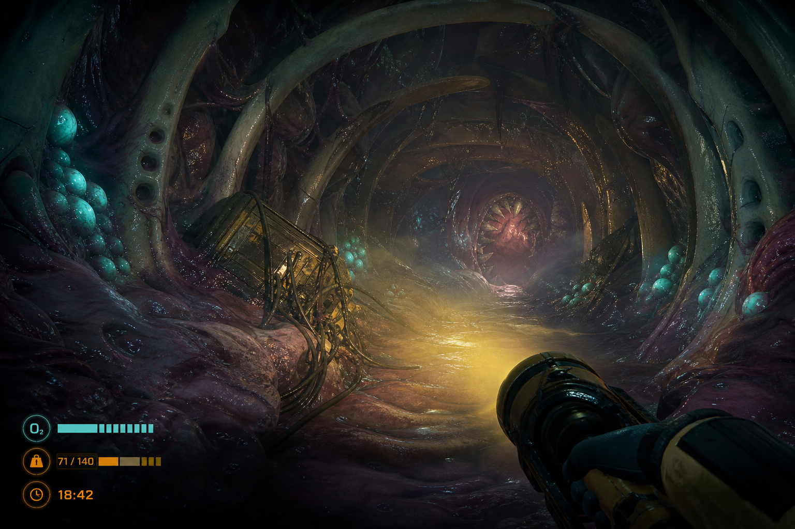

# Concept B — **MONSTER: Deep Nest**

> *The dungeon is alive. You are inside it. It has not noticed you yet.*



**Status: runner-up.** Strongest visual identity of the five; loses to Concept A only on
rendering cost given a GPU-less build machine.

---

## 1. Pitch

Something enormous died — or is dying, slowly, over centuries — and the world built an
industry on top of it. You are a harvest crew. You descend through an airlock cut into its
hide and go to work inside a body the size of a district, cutting out organs, tapping
glands, and hauling the material back to the surface before the corpse notices that it is
being robbed.

The twist is that the level is not a place, it is a **creature with a nervous system**.
Cut something and the surrounding tissue contracts. Make noise in the wrong chamber and a
sphincter three rooms back seals shut, cutting off your exit. The nest reacts, and it
remembers within a run.

---

## 2. Why this concept

Same market cluster as Concept A (`docs/research/steam-market-2026.md` §2.1) with the same
evidence behind it, but competing on **visual identity** rather than on a novel verb. The
research notes that a store page must be legible in a single image; a screenshot of a
ribbed, bioluminescent organic corridor is instantly distinguishable from the industrial
grey that every Lethal Company derivative shares. GRAIN ROT's recent success (89% at 954
reviews within six days) as a "horror co-op extraction builder" confirms that a strongly
themed extraction game still lands in 2026.

Its differentiator is that **the environment is the antagonist**. There is no roaming
monster AI in the conventional sense; the level itself is the threat, which is both a
distinctive design and a significant saving on enemy AI and animation.

---

## 3. Core loop

**One dive, 20–35 minutes.**

```
  Surface rig        →  Descent          →  Harvest            →  Reaction
  choose a dive site    airlock, pressure   cut, tap, extract,    the nest wakes:
  and load-out          equalisation        fill your rack        chambers seal,
        ↑                                                        fluids rise,
  Rendering plant    ←  Ascent          ←  ─────────────────────  antibodies swarm
  sell, upgrade,        route back with
  unlock deeper sites   a full load
```

### 3.1 The nest as a system

The level is a graph of **chambers** connected by **sphincters**, plus a global
**agitation** value.

- Every harvest action adds agitation. Loud tools add more. Cutting a nerve cluster adds a lot.
- At agitation thresholds the nest responds, escalating and irreversible within a run:
  1. Ambient — the walls breathe faster; audio cue only.
  2. Constriction — random sphincters close; some routes are gone.
  3. Flooding — a chamber begins to fill with digestive fluid on a timer.
  4. Antibodies — mobile hostile organisms spawn from wall pores and hunt by heat.
  5. Peristalsis — the whole tunnel network begins to move, physically pushing players
     toward the gut. This is the run's hard end.
- **The agitation meter is deliberately not shown as a number.** It is read from the
  environment: wall pulse rate, the pitch of the ambient drone, how wet the floor is. Players
  who learn to read the body can push further than players who cannot, which is the same
  "player skill, not character stats" progression that makes Concept A work.

### 3.2 Harvest

Materials are cut from the environment with tools, each with a distinct interaction:

- **Bone saw** — slow, loud, high yield. Structural: cutting the wrong rib collapses a route.
- **Gland tap** — quiet, needs a stable hand (a small timing minigame), spoils if jostled.
- **Nerve shears** — silent if the cut is clean, catastrophic if not.
- **Sample jar** — for live specimens, which pay the most and are the only cargo that fights
  back inside your own backpack.

Cargo has weight and volume. A full rack slows you down and changes what routes you can take.
The classic extraction tension — one more organ or leave now — is the whole risk system, and
it needs no enemy AI at all.

---

## 4. Camera, perspective and visual references

**Camera: first person, 1.7 m eye height, 75° FOV** (wider than Concept A because the
corridors are tighter and claustrophobia should be spatial, not a UI trick). Head-mounted
lamp is the primary light. No third person.

| Reference | AppID | What to take |
| --- | --- | --- |
| **GRAIN ROT** | 4450620 | The current best-in-class example of a strongly themed co-op extraction loop; how a wasteland aesthetic carries a familiar structure. |
| **R.E.P.O.** | 3241660 | Physics cargo handling; the weight/volume tension. |
| **Subnautica** | 264710 | The definitive reference for bioluminescence as the primary light source and for making an organic environment readable in near-darkness. |
| **Lethal Company** | 1966720 | The employment/quota frame and proximity voice. |
| **Barotrauma** | 602960 | How to make an environment that is itself the antagonist, and how systemic failure cascades read to players. |
| **Scorn** | 1512500 | Bio-architecture art direction. Take the ribbed-cartilage vocabulary; leave the pacing. |

### 4.1 Art direction

- **Palette.** Two colours doing all the work: cold teal-violet bioluminescence for the
  environment, hot amber for anything man-made (lamps, tools, the airlock). Players read
  "safe/mine" versus "alive/not mine" instantly by hue.
- **Geometry.** Tubular, ribbed, asymmetric. Built from a modular kit of curved tunnel
  segments, chamber shells and sphincter rings. Vertex-animated breathing on the walls —
  cheap, and it sells "alive" better than any texture could.
- **Surface.** Wet specular highlights are the single most important material property. A
  low-poly wet surface reads as organic; a low-poly dry one reads as unfinished.
- **Restraint on gore.** Strange and awe-inspiring, not disgusting. This is a commercial
  decision as much as an artistic one: it keeps the game streamable and out of regional
  content trouble.

**Rendering cost warning.** This is the concept's real weakness. Vertex animation on every
wall, wet specular, volumetric fog and many small dynamic bioluminescent lights are exactly
the things a software rasteriser is worst at. Deliverable on a real GPU; **painful to iterate
on this build machine.** If chosen, the first technical task is a rendering budget spike, not
a gameplay prototype.

---

## 5. Content plan

| Content type | Vertical slice | Early Access | 1.0 |
| --- | --- | --- | --- |
| Nest sites (each a distinct dead creature) | 1 | 3 | 6 |
| Chamber archetypes per site | 4 | 10 | 16 |
| Harvestable material types | 3 | 12 | 20 |
| Tools | 2 | 8 | 14 |
| Antibody organism types | 1 | 4 | 7 |
| Nest reaction stages | 3 | 5 | 5 + per-site variants |

---

## 6. Technical plan

Identical to Concept A (Unity 6000.5.8f1, URP Forward+, Netcode for GameObjects,
host-authoritative, Mono for dev / IL2CPP on Windows for release) with these differences:

- **Destructible/reactive geometry.** Cut surfaces need to change mesh state. Do *not*
  implement runtime boolean mesh cutting; use pre-authored damage states swapped at cut
  points. Runtime CSG is a well-known schedule killer.
- **Wall animation via shader.** Breathing is a vertex shader driven by a global agitation
  uniform, not by animated meshes or bones. One material property drives the whole level's
  behaviour, which also makes it trivially controllable from a test.
- **Fluid.** Rising digestive fluid is a moving plane with a trigger volume and a screen
  effect. Not a fluid simulation. Ever.
- **Self-testability.** Very good. The nest's state machine is pure data: agitation is a
  float, chambers are a graph, reactions are thresholds. All of it is unit-testable in edit
  mode with no rendering at all. The graph can be asserted for solvability (there is always
  at least one exit route at agitation stage ≤3), which is a real correctness property that
  a test can guard.

---

## 7. Audio

The most important audio design of the five concepts, because the agitation meter is
communicated through sound.

- A continuous **body drone**: heartbeat, fluid movement, distant peristalsis. Its tempo and
  pitch are driven directly by the agitation value. This one system does most of the game's
  tension work.
- Tools are loud and the loudness is mechanical: the bone saw's pitch drops as it bites.
- Proximity voice, occluded by tissue, which is thicker and muffles more than the concrete of
  Concept A. Being separated from the group should sound like being separated.

---

## 8. Commercial plan

- **Price: $9.99.** Top of the co-op cluster band, justified by the visual production value.
- **Early Access**, launching with one full nest site.
- **Store page leads with the environment**, not with a creature. The first screenshot is the
  ribbed corridor with the bioluminescence, because that image is the entire competitive
  advantage.
- **Hook:** "The dungeon is a corpse. It is not finished dying."

---

## 9. Risks

| Risk | Severity | Mitigation |
| --- | --- | --- |
| **Rendering cost on a GPU-less build machine.** | **High** | Budget spike before anything else; hard triangle and light-count budgets enforced by the self-check harness; be prepared to cut volumetrics entirely. |
| **Organic environments are hard to navigate.** Players get lost in tunnels that all look alike. | **High** | Landmark chambers with unique silhouettes; a "vein" of man-made amber cable running back toward the airlock as a diegetic breadcrumb. |
| **Body horror limits the audience** and can attract regional store issues. | Medium | Restraint as a stated art rule; a gore-reduction toggle from day one. |
| **No enemy AI is a saving that can become a weakness** — the level being the antagonist may read as "nothing happens". | Medium | Antibody organisms exist from stage 4 specifically to give the late run a visible, chaseable threat. |
| Same IL2CPP / Steam AppID blockers as Concept A. | Medium | Same mitigations. |

**How this concept dies:** it looks spectacular in screenshots, and plays as a slow walk down
brown tunnels picking up objects. The nest reaction system is the entire difference between
those two outcomes, and it must be prototyped before any art is made.
