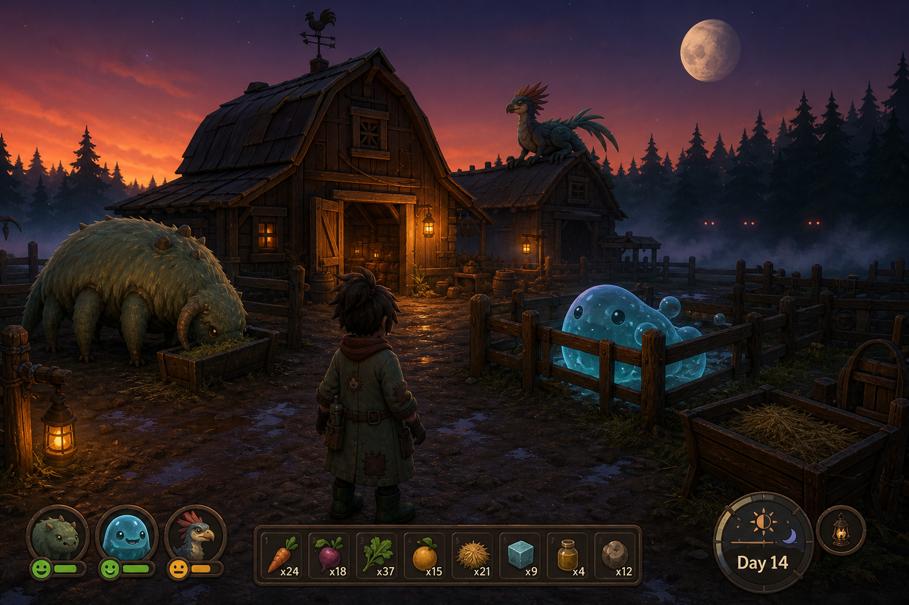

# Concept C — **MONSTER: The Pens**

> *You inherited a monster farm. The previous owner did not leave instructions, and something already got out.*



**Status: viable, not recommended as a first project.** Highest content cost of the three
realistic concepts; the cost driver is creature count and it scales badly.

---

## 1. Pitch

A rural valley where the local industry is raising monsters — for their milk, their venom,
their hides, their eggs. You inherit a failing operation: four pens, a leaking barn, a debt,
and a herd that has been feral for a year.

The days are cozy. You feed, you clean, you repair fences, you take the good stock to
market, you talk to three neighbours who each want something. The nights are not. The
things in the treeline are the same species as the things in your pens, except nobody fed
them and nobody bred the aggression out. Your fences are the only argument you have.

The tone is the whole product: **a farming sim where the animals could kill you and you love
them anyway.**

---

## 2. Why this concept

Two market signals support it, from `docs/research/steam-market-2026.md`:

- The cozy-3D cluster shows unusually healthy review scores at small scope: Cast n Chill 95%
  at 4,990 reviews, Leafy Corner 97% at 1,572, ReStory 96% at 2,434, Paralives 90% at 13,849.
  These audiences leave good reviews, and review score is the commercial variable that
  matters most.
- The creature-collector tag is anchored by Palworld (95% at 176,333 reviews), which proved
  that "cozy creature raising with an edge" has an enormous addressable audience.

Its differentiator against the cozy cluster is **danger**, and against the creature-collector
cluster is **husbandry rather than combat**: you never fight your monsters, you manage them.
The pleasure is in a well-run pen, not in a won battle.

It is also the only concept of the five with a natural **third-person over-shoulder camera**,
which matters because it is the only one where the player's own character and their farm are
things you want to look *at*.

---

## 3. Core loop

**A day is roughly 40 minutes of real time, in three phases.**

```
  Morning (cozy)      →  Afternoon (economy)   →  Night (threat)
  feed, clean, milk,     market, neighbours,      lock down, patrol,
  collect, heal,         buy stock, sell,         hold the fence line
  breed                  upgrade, contracts               |
        ↑                                                 ↓
        └──────────── Dawn: count what survived ──────────┘
```

### 3.1 Husbandry — the systemic core

Each creature is an entity with real state, not a decoration:

- **Needs** — hunger, thirst, cleanliness, space, temperature, social. Each drains at a
  species-specific rate and each has a species-specific satisfier. A Mire Ox needs mud; a
  Glass Moth needs total darkness for six hours; a Fen Adder needs live prey, which means
  you have to farm something to feed to it.
- **Mood** — a derived value from needs. Content creatures produce. Distressed creatures stop
  producing. Feral creatures test the fence, and a fence that gets tested enough breaks.
- **Products** — each species yields something on a cycle, gated by mood.
- **Breeding** — a simple, legible inheritance model (two visible traits, one hidden) so
  players can plan a breeding programme over a dozen days without a wiki.
- **Escape** — the failure state that makes it a game rather than a spreadsheet. A feral
  creature that breaks out is not gone; it is *in the valley*, and it will be at the treeline
  tonight, on your side of it.

### 3.2 Night — the pressure that makes the day matter

Night is a defence phase, but not a tower-defence phase. You do not shoot anything. You:

- close and bar gates in the right order,
- light lanterns, which repel some species and attract others,
- move vulnerable stock to the barn (which takes real time and the creatures resist),
- and, if something does get in, use tools that herd rather than kill — noise, light, food.

Killing a wild monster is possible with the right equipment and is always the wrong choice
economically. A live captured feral is next season's best breeding stock.

---

## 4. Camera, perspective and visual references

**Camera: third person, over the right shoulder, ~3.5 m behind and 1.8 m up, with a smooth
follow and a shoulder-swap.** Pulls back to a wider framing during the day (you are looking
at your farm) and tightens at night (you are looking at what is in front of you). That camera
distance change *is* the tonal shift, done for free.

| Reference | AppID | What to take |
| --- | --- | --- |
| **Palworld** | 1623730 | The tonal proof: cozy creature systems with a hard edge, and how to present many creature types without them feeling like a catalogue. |
| **Slime Rancher 2** | 1657630 | Corral/pen UX, the feeding-and-collecting rhythm, and how to make husbandry legible at a glance. |
| **Stardew Valley** | 413150 | Day structure, the neighbour/contract layer, and how to make an economy feel personal. Its 2D-ness is irrelevant; the structure is the reference. |
| **Cast n Chill** | 3483740 | Recent proof (95% at 4,990) that a small, calm 3D loop with a companion sells at $9.74. |
| **Grounded 2** | 2661300 | Third-person creature encounters at close range with readable telegraphs. |
| **My Singing Monsters** | 1419170 | Creature personality expressed through idle behaviour and sound rather than through animation quality. |

### 4.1 Art direction

- **Painterly-stylised, warm.** Soft gradients, thick simplified forms, minimal texture
  detail, a lot of work done by vertex colour and gradient ramps.
- **The warm/cold split is the whole look.** Interiors and lanterns are warm amber; everything
  outside their radius is deep blue. Night is not "the same scene, darker"; it is a different
  palette.
- **Creatures are designed silhouette-first** so they read at distance in one shape, and are
  built to be recoloured and re-scaled for variants — this is the main lever on content cost.
- **Weather and season** as cheap variety: fog, rain, and a three-season colour LUT swap give
  a lot of visual change for very little authoring.

---

## 5. Content plan and why it is expensive

| Content type | Vertical slice | Early Access | 1.0 |
| --- | --- | --- | --- |
| Creature species | 3 | 10 | 18 |
| Visual variants per species | 2 | 4 | 6 |
| Animation set per species | idle, walk, eat, sleep, panic (5) | + produce, breed, attack (8) | 8 |
| Buildings | 3 | 9 | 15 |
| Tools | 4 | 12 | 18 |
| Neighbours with dialogue | 1 | 4 | 7 |
| Days of content before repetition | 5 | 30 | 60+ |

**The problem, stated directly:** 18 species × 8 animations = 144 authored animation clips,
plus 18 rigs, plus 18 behaviour trees. That is the single largest content bill of any concept
here, it cannot be automated away, and it cannot be faked with physics the way Concept A's
creatures can. Procedural animation can reduce it, but procedural quadruped animation is
itself a research project.

---

## 6. Technical plan

- Unity 6000.5.8f1, URP Forward+, single-player, **no networking at all** — which removes an
  entire category of risk and is this concept's main technical advantage.
- **Creature AI: utility-based need satisfaction**, not behaviour trees. Each creature scores
  available actions against its current needs and picks the best. This produces emergent,
  legible behaviour from a small amount of code and is straightforward to unit-test: given a
  need vector, assert the chosen action.
- **Time and simulation.** The whole farm must simulate while the player is elsewhere,
  including at low fidelity while indoors. Design the creature state as plain serialisable
  data updated on a fixed tick, decoupled from the GameObject, so that simulation is
  testable headlessly and can run at 1000× speed in a test.
- **Save data is large and structural.** Every creature, every fence segment, every crop.
  Schema versioning and a migration test from day one, not later.
- **Self-testability: medium.** The simulation layer is excellent to test (run 100 in-game
  days headlessly in seconds and assert the economy neither collapses nor runaway-inflates —
  a genuinely valuable test). The *feel* layer — camera, animation, creature charm — is
  almost untestable automatically, and that is where this concept's quality actually lives.

---

## 7. Commercial plan

- **Price: $14.99.** Above the co-op cluster because single-player sims with depth sustain it
  (ReStory $17.99, IRON NEST $14.99, Chop Chop Inc. $12.99).
- **Early Access** is appropriate; this genre's audience accepts and even prefers it.
- **Store page leads with a creature close-up at dusk**, with pens and a barn behind. The
  "cozy but something is wrong" tension must be in the first image.
- **Hook:** "Every monster in the valley was born in a pen like yours."

---

## 8. Risks

| Risk | Severity | Mitigation |
| --- | --- | --- |
| **Creature content cost.** The dominant risk; it is linear in species count and each species is expensive. | **High** | Hard-cap Early Access at 10 species. Design species so variants are recolour + rescale + one behaviour change. Share skeletons aggressively across species. |
| **Tonal whiplash.** Cozy-by-day / horror-by-night can read as two unfinished games rather than one coherent one. | **High** | The night phase must never be a combat phase. If the player is shooting, the tone has broken. Herding tools only. |
| **Animation quality is the visible ceiling** and this is the concept most exposed to it. | **High** | Silhouette-led design, procedural secondary motion (tails, ears, breathing) layered on few base clips. |
| **Crowded cozy discovery space** with weak differentiation. | Medium | The danger layer *is* the differentiation and must be in the capsule art. |
| **No GPU** makes judging a painterly look almost impossible on the build machine. | Medium | Concept art as the target; screenshot comparison; accept that final art sign-off needs real hardware. |

**How this concept dies:** the cozy half is pleasant but thin next to Stardew Valley, the
horror half is toothless next to real horror, and it lands at 78% with reviews saying "nice
idea, not enough content". Content volume is the whole game, and content volume is exactly
what a small team does not have.
