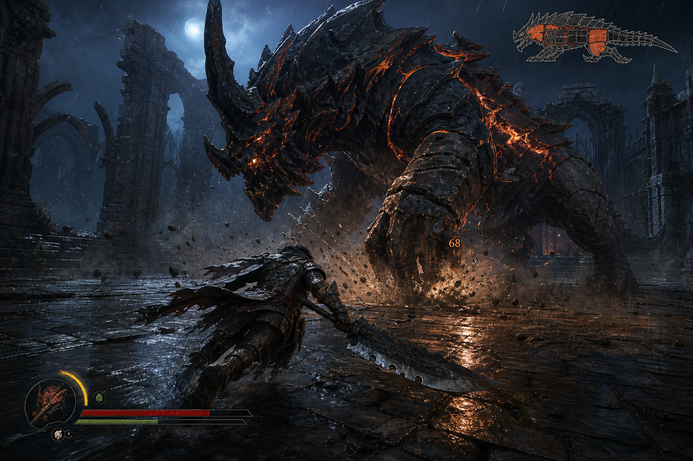

# Concept D — **MONSTER: The Hunt**

> *One hunter. One monster. One arena. No filler.*



**Status: documented for completeness, and actively argued against.** This is the concept I
recommend *not* building. The reasoning is in §8; it is not a matter of taste.

---

## 1. Pitch

A boss-rush hunting game stripped of everything that is not the fight. No open world, no
gathering, no long trek to the monster. You pick a contract, you load into an arena, and you
fight one enormous creature for eight to fifteen minutes. Win and you carve materials from
it and build better equipment. Lose and you go again with what you learned.

Each monster is a puzzle with a moveset. Learning it is the progression; the gear is just the
scorecard.

---

## 2. Why anyone would propose this

The appeal is real and worth stating fairly:

- **Scope looks small on paper.** No open world, no NPCs, no economy, no towns. Five arenas
  and eight monsters sounds smaller than eighteen farm species.
- **The Souls-like and monster-hunting audience is large and pays well.** From the research
  capture: Black Myth: Wukong 93% at 69,967 reviews, Elden Ring 94% at 432,992, Crimson
  Desert 86% at 60,187 at $69.99.
- **Boss-rush is a proven small-team structure** — Furi, Titan Souls, Shadow of the Colossus
  all demonstrated that a game can be nothing but bosses and still be complete.
- **The MONSTER codename fits it most literally of all five concepts.**

---

## 3. Core loop

**One hunt, 8–15 minutes.**

```
  Contract board  →  Load-out       →  The hunt        →  Carve
  choose monster,    weapon, armour,   3 phases, each     materials from the
  see known intel    consumables       with new moves     parts you broke
        ↑                                                       ↓
        └──────────────  Forge: craft, upgrade  ←───────────────┘
```

Three-phase fights: the monster's moveset expands at 66% and 33% health, and breakable parts
(horn, foreleg armour, tail) change its behaviour when destroyed — which is what makes the
fight a system rather than a damage race.

---

## 4. Camera and visual references

**Camera: third person, lock-on, positioned low and behind at ~2.5 m to exaggerate the
monster's scale.** Camera distance widens automatically during the monster's large attacks so
the telegraph stays on screen. Getting this camera right for a creature that is thirty times
the player's size is itself a substantial engineering problem.

| Reference | AppID | What to take |
| --- | --- | --- |
| **Monster Hunter Wilds / World** | — | Part-breaking, telegraph legibility, and the material-carve loop. |
| **Black Myth: Wukong** | 2358720 | Camera framing against very large enemies; 93% at 69,967 reviews shows the bar. |
| **ELDEN RING** | 1245620 | Attack-telegraph readability and the stamina economy. |
| **Shadow of the Colossus** | — | Scale contrast; how a single creature can be an entire game's content. |
| **Furi** | 423230 | The purest proof that boss-rush structure works as a complete product. |
| **Abyssus** | 1721110 | Recent small-team action game, 87% at 3,469 reviews — a realistic reference for what our scale can reach in the action space. |

### 4.1 Art direction

Stylised realism: strong silhouettes, limited palette, one hot light source (the monster's
molten fracture lines) against one cold ambient (moonlight). Wet stone, rain, and heavy
particulate to hide geometric simplicity.

**This is the most GPU-dependent art direction of the five, and the build machine has no GPU.**

---

## 5. Content plan, with the real cost exposed

| Content type | Vertical slice | Release |
| --- | --- | --- |
| Monsters | 1 | 8 |
| Attacks per monster | 8 | 18–24 |
| Animation clips per monster (attacks, telegraphs, reactions, staggers, part-break states, deaths) | ~30 | **~70** |
| Player weapon types | 1 | 5 |
| Animation clips per weapon (combo strings, dodges, hit reactions, sheathe) | ~25 | ~40 |
| Arenas | 1 | 5 |

**~560 monster animation clips plus ~200 player clips, all of which must be tuned against
each other at frame level.** This is the number that decides the concept.

---

## 6. Technical plan

- Unity 6000.5.8f1, URP, single-player, no networking.
- Combat requires a frame-accurate action system: animation-driven root motion, hitbox and
  hurtbox windows authored per clip, cancel windows, i-frames, hitstop, stagger accumulation.
  This is a genuine engine subsystem, and Unity does not provide it. It must be built.
- **Self-testability: poor, and this is disqualifying.** You can assert that a hitbox
  activates on frame 14. You cannot assert that a dodge *feels* like it has the right amount
  of give, and that is the entire quality of an action game. Every other concept here has its
  core quality in a system a test can reach. This one does not.

---

## 7. Commercial plan

- **Price: $19.99.** Action games are priced above sims, and this audience will not take a
  cheap-looking product seriously at any price.
- No Early Access. This genre's audience judges combat feel immediately and unforgivingly; a
  rough EA build gets a Mixed rating that never recovers.

---

## 8. Why this should not be chosen

Not risks to be mitigated. Structural reasons.

1. **The comparison set is AAA and the audience compares explicitly.** A player who buys a
   monster-hunting game has played Monster Hunter. Every review will be written relative to
   it. In every other concept here we are compared to games made by teams our size; here we
   are compared to games made by hundreds of people over years.
2. **The cost is in animation, which cannot be systematised.** Concept A replaces animation
   with physics. Concept B replaces enemy AI with an environment state machine. Concept E
   barely animates at all. This concept has no such lever: 560 clips is 560 clips, and each
   must be hand-tuned.
3. **The build machine cannot judge it.** Combat feel is a function of frame timing and
   visual response at 60 fps. On a software rasteriser we would be tuning frame-critical
   feel while watching a slideshow. This is not a limitation we can design around; it strikes
   at the one thing that determines whether the game is good.
4. **Automated self-checking, which is a stated requirement for this project, cannot cover
   the part that matters.** The harness would report green on a game that plays badly.
5. **Failure is expensive and near-total.** A mediocre co-op game still gets "fun with
   friends". A mediocre action game gets "the combat is stiff", which is the only review that
   matters and it is fatal.

**If it were built anyway**, the only defensible version is: one monster, one weapon, one
arena, sold at $6.99 as a deliberately tiny curiosity, with all effort on that single fight.
That is a real product. It is not what this concept is asking for.
