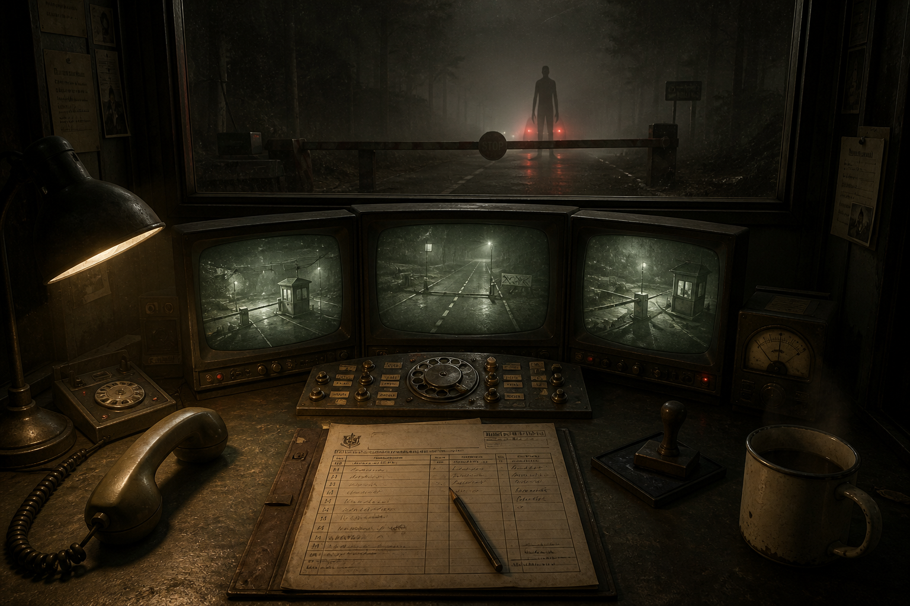

# Concept E — **MONSTER: Night Shift**

> *Man the checkpoint. Check the papers. Decide what is human.*



**Status: recommended as the first build target** — as the vertical slice that proves the
engine, pipeline and self-check harness, and as a genuinely shippable product in its own
right if Concept A does not survive its feel test.

---

## 1. Pitch

Highway checkpoint 14, somewhere rural, some time after the thing that happened. You work
nights in a concrete booth. Vehicles arrive. You check documents, ask questions, look at the
camera feeds, and raise or hold the barrier.

Most of them are people.

You have a manual with the current identification criteria. The criteria are revised by the
central office, sometimes weekly, sometimes mid-shift, and they are not always correct. You
have a phone that occasionally rings with instructions from someone who may or may not be
authorised to give them. You have a quota, a fuel allowance for the heater, and a family
whose letters arrive in the mail slot.

You never see a monster clearly. You see a reflection that is wrong, a shadow with too many
joints, a passenger who does not blink for the whole conversation.

---

## 2. Why this concept

It is backed by the second cluster in `docs/research/steam-market-2026.md` §2.2: small-scope
single-player 3D deep simulators, which reach *higher prices* than the co-op cluster with
*better review scores* and *no networking*.

The decisive data point is **IRON NEST: Heavy Turret Simulator** (AppID 2950790): two
developers, $14.99, **4,648 reviews at 98% positive** within a week of release, and the
entire game is one artillery piece in one emplacement. Alongside it: ReStory at 96% / 2,434,
Waterpark Simulator at 96% / 8,541, Schedule I (one developer) at 97% / 198,811.

There is also direct evidence for this specific verb. **Shift At Midnight** (AppID 3722330,
released 2026-07-22, $9.99, 3,464 reviews at 94%) is described by its own store page as "an
online co-op detective horror for up to 3 players… investigate your customers, as some are
only pretending to be human." That is the same core verb, validated in the market three
weeks before our data capture, and it is *co-op*. Our version is single-player, slower, and
built around bureaucratic doubt rather than group discussion — a real difference in
experience, not a reskin.

And the practical argument, which for this project is decisive:

**It is the only concept here that the build machine can fully judge.** One room, one camera
position, no locomotion, no dynamic lighting beyond a desk lamp, no crowds, no physics
spectacle. A software rasteriser renders this scene at a usable framerate. Every screenshot
the self-check harness produces is directly comparable to the concept art, because the camera
never moves.

---

## 3. Core loop

**One shift, 10–20 minutes. A campaign is roughly 30 shifts.**

```
  Shift briefing   →   Vehicle arrives   →   Inspect          →   Decide
  new criteria,        one at a time,        papers, cameras,     raise barrier
  quota, weather       a queue builds        questions, tools     or hold and call
        ↑                                                              ↓
  Morning report   ←   Consequences      ←────────────────────────────┘
  pay, errors,         some are immediate,
  letters home         some arrive three shifts later
```

### 3.1 Inspection — the systems on the desk

Every tool is a physical object on the desk, operated directly. No menus.

- **The document tray.** Transit papers, ID cards, work permits, medical clearances. Cross-check
  fields against each other and against the manual: mismatched dates, wrong issuing office,
  a serial number in a range that was recalled last week.
- **The manual.** A physical binder, page-turnable, amended by pages that arrive through the
  slot. Old pages are not removed, which means contradictory criteria coexist and the player
  must decide which is current. This is the game's real subject.
- **Three CRT feeds.** Under-vehicle, rear cabin, and the approach road. Grainy, green,
  low-resolution — and the resolution is doing double duty as art direction and as a
  gameplay mechanism, because ambiguity is the point.
- **The question panel.** Three or four questions per subject, selected from a pool. Responses
  are audio plus a subtitle. The tell is rarely in the words: it is in the pause before the
  answer, the second time they answer the same question identically, or a breath sound that
  does not match a human respiratory rate.
- **The classification dial.** Brass switches: PASS, HOLD, REFER, ALARM. Each has a different
  cost and a different failure mode. ALARM on a human is a career-ending error. PASS on a
  non-human is worse.
- **The telephone.** Rings sometimes. Sometimes it is the central office. Sometimes the caller
  knows things they should not. Answering is optional and the game never tells you whether it
  was the right call.

### 3.2 The central mechanic: uncertainty that is never fully resolved

The design commitment that makes this more than a Papers, Please variant: **the game
frequently does not tell you whether you were right.** Feedback is delayed, partial, and
sometimes contradicted later. A subject you refused turns up in a newspaper clipping as a
missing person. A subject you passed appears in a checkpoint bulletin two shifts later.

This is what makes it a horror game with no monster on screen. It is also, practically, very
cheap: the horror is authored text, delayed events and audio, not creatures.

### 3.3 Progression

Not upgrades. **Escalation.** The criteria get longer, more self-contradictory, and more
obviously wrong. Vehicles come faster. The heater fuel runs low, so the window fogs, so the
camera feeds matter more. By shift 25 the manual is forty pages of amendments and the player
is making judgement calls the game has stopped pretending to have answers to.

Multiple endings, determined by an accumulated error profile — not by a choice at the end.

---

## 4. Camera, perspective and visual references

**Camera: first person, seated, fixed position, free look within roughly a 160° arc, with
snap-focus onto desk objects when interacted with.** The player never walks. This is the
single largest scope saving in the entire project: no locomotion, no navmesh, no level
streaming, no character controller tuning, and one camera position to art-direct.

| Reference | AppID | What to take |
| --- | --- | --- |
| **IRON NEST: Heavy Turret Simulator** | 2950790 | The proof case. One machine, one position, deep analogue interaction, 98% at 4,648 reviews for two developers. Study how it makes a static viewpoint feel physical. |
| **Shift At Midnight** | 3722330 | Direct validation of the "some are only pretending to be human" verb, 94% at 3,464 reviews. Study its tells and its pacing; differentiate by being single-player and slower. |
| **Papers, Please** | 239030 | The structural template: document cross-checking, escalating rule complexity, moral cost, family consequences. |
| **ReStory: Chill Electronics Repairs** | 3812600 | 96% at 2,434 reviews at $17.99. Study how tactile object interaction alone sustains a whole game. |
| **Buckshot Roulette** | 2835570 | How a single table, a single interaction and strong audio produce dread cheaply. |
| **Signalis / Observation** | — | CRT-as-aesthetic and diegetic-only UI. |

### 4.1 Art direction

- **Diegetic UI only.** No HUD whatsoever. Quota is a number on a form. Time is a clock on the
  wall. Health is not a concept.
- **One warm desk lamp** as the key light, everything else falling to near-black. One dynamic
  light, one baked bounce. Trivially cheap to render and it looks deliberate.
- **Heavy grain, dust motes, chromatic aberration on the CRTs.** Post-processing carries the
  entire visual identity, which is exactly the right trade on a GPU-less machine: post is
  screen-space and cheap, geometry is not.
- **The window is the only view outward**, and 95% of the time there is nothing in it. When
  there is, it is a silhouette with proportions that are slightly wrong — long arms, high
  head. Never a clear look. Never a jumpscare.
- **Total unique asset count is small**: one booth interior, one desk set, one barrier, three
  vehicle models with variants, and a set of humanoid silhouettes. Perhaps 60 unique meshes
  for the entire game.

---

## 5. Content plan

| Content type | Vertical slice | Release |
| --- | --- | --- |
| Shifts | 3 | 30 |
| Document types | 3 | 9 |
| Identification criteria | 5 | 40+, with amendments and contradictions |
| Non-human "tells" | 4 | 20 |
| Question pool | 10 | 80 |
| Subject portraits/models | 4 | 25 (heavily recombined: head, coat, hat, posture) |
| Vehicle models | 1 | 3 + variants |
| Delayed-consequence events | 2 | 35 |
| Endings | — | 5 |

**This is the smallest content bill of the five concepts by a wide margin, and most of it is
text and audio rather than art.**

---

## 6. Technical plan

- Unity 6000.5.8f1, URP Forward+, single-player, no networking, no navmesh, no character
  controller.
- **Everything gameplay-relevant is data.** Criteria, documents, tells, questions, subjects
  and consequences are ScriptableObjects / JSON, authored as data and validated by tests.
- **The shift generator is deterministic from a seed.** Shift *n* with seed *s* always
  produces the same queue of subjects with the same documents. This is what makes the game
  testable, and it also makes bug reports reproducible from a seed string.
- **A rules engine, not hardcoded checks.** A subject is a set of attributes; a criterion is a
  predicate over attributes; the correct classification is the evaluation of the current
  criteria set. This means a test can generate ten thousand subjects and assert that the game
  never presents an unsolvable case, and never presents a case where two current criteria
  give contradictory *correct* answers unless that contradiction was authored deliberately.
- **Self-testability: the best of the five, by a distance.**
  - Edit-mode tests over the rules engine, running in seconds with no rendering.
  - Headless play-mode tests that run a full 30-shift campaign with a scripted decision
    policy and assert the economy, difficulty curve and ending selection behave.
  - Rendered screenshot checkpoints from a *fixed camera*, which means run-to-run image
    diffing is meaningful rather than noisy. This is the property that makes the
    "screenshot yourself and compare against the target" requirement actually work.

---

## 7. Audio

Audio is over half of this game's atmosphere and almost all of its threat.

- **Room tone**: fluorescent hum, wind against the window, the heater cycling on and off.
  When the heater dies, the room tone changes and the game becomes noticeably worse to sit in.
- **Every desk object has a physical sound.** Stamp, page turn, switch throw, phone cradle.
  These are the game's rhythm section and they must be excellent; they are also cheap.
- **Voices are processed and non-verbal.** Subjects answer in a filtered, gibberish-like
  language with subtitles, in the manner of Papers, Please. Removes all voice-acting and
  localisation cost, and makes the *timing* of an answer the tell rather than its content.
- **The non-human tell is often audio-only**: a breath at the wrong interval, a second voice
  under the first, a click before speech.

---

## 8. Commercial plan

- **Price: $12.99.** Between Chop Chop Inc. ($12.99) and IRON NEST ($14.99), below ReStory
  ($17.99). Defensible for a single-player narrative sim of this length.
- **No Early Access.** A narrative game with an ending should launch finished. This also
  suits the concept's small, closed scope.
- **Store page leads with the window shot**: the booth interior, warm lamp, and the too-tall
  silhouette in the fog outside. One image that states the entire premise.
- **Hook:** "Most of them are people."
- **A free demo of the first three shifts** is the correct marketing spend for this genre;
  Next Fest participation is the single highest-value action available.

---

## 9. Risks

| Risk | Severity | Mitigation |
| --- | --- | --- |
| **"Papers, Please but monsters" is an obvious pitch** and has been attempted before. | Medium | The differentiator is unresolved feedback and the manual's self-contradiction, not the setting. That must be present in the demo, not saved for later shifts. |
| **Writing quality is the ceiling.** This is a text-driven game and mediocre text kills it. | **High** | Accept it as the primary quality risk and budget accordingly. This is the one concept where writing, not code or art, is the critical path. |
| **A static camera can read as cheap** if the room is not dense and tactile. | Medium | Object interaction fidelity and audio carry it; look at how IRON NEST and ReStory achieve density in a small space. |
| **Pacing.** Thirty shifts of the same desk needs escalation that genuinely lands. | Medium | Escalate the *rules*, not the graphics; introduce one new desk tool roughly every five shifts. |
| **Shorter than players expect at $12.99.** | Medium | Target 4–6 hours for one playthrough with meaningful replay via different endings; be honest about length on the store page. |

**How this concept dies:** it is competent, atmospheric and forgettable, gets 300 reviews at
88% saying "good but I've played Papers, Please", and earns $40,000. Note that this failure
mode is *far better than the failure modes of the other four concepts* — which is precisely
the argument for building it first.
