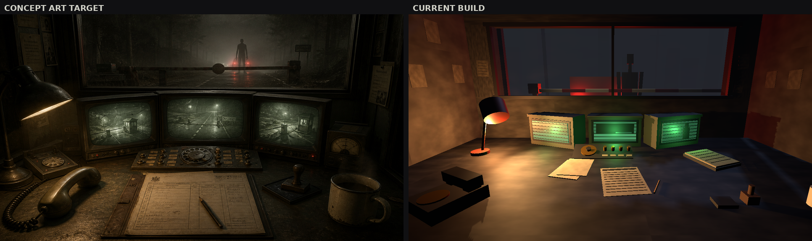
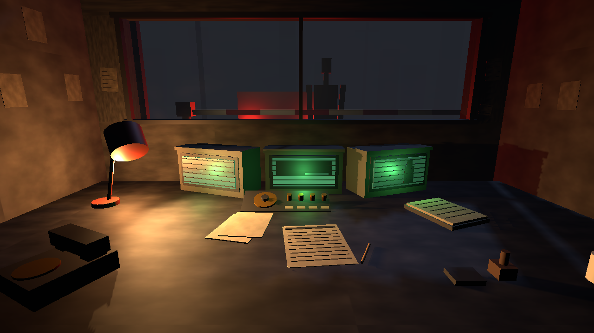
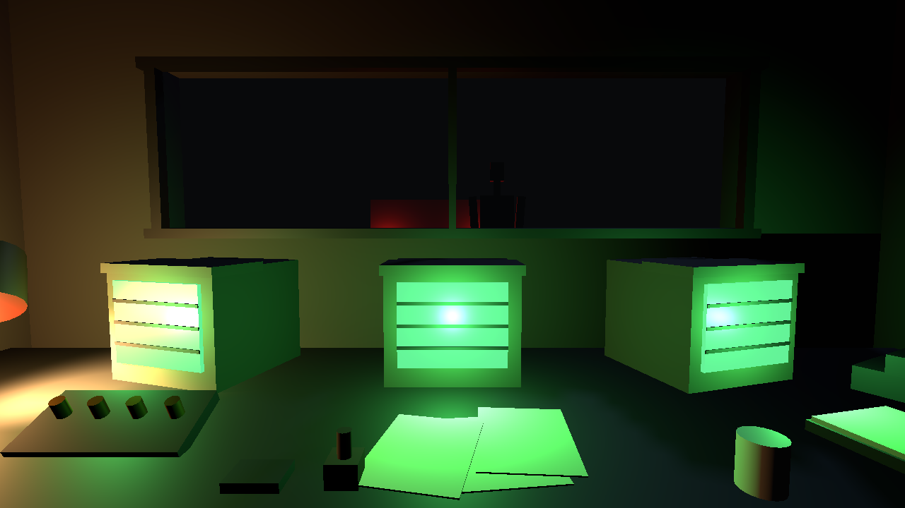

# Progress M1 — First playable-quality render of the Night Shift booth

**Date:** 2026-08-13
**Scene:** Concept E, checkpoint booth, `booth_idle` checkpoint
**Build:** Unity 6000.5.8f1, URP 17.5.0, Mono, rendered on Mesa llvmpipe under Xvfb

---

## Concept art target versus current build

Left is the target from `docs/concepts/art/concept_e_nightshift.png`. Right is the current
build, captured automatically by the self-check harness. Neither image was touched by hand.

## The build on its own

## Where it started

The first render, four iterations earlier. The CRT emission was set at 1.7 and flooded the
frame with green, drowning the desk lamp that was supposed to be the key light; the lamp sat
at the very edge of the frame and read as an orange smear rather than as a light source; and
the bottom of the frame was a black band where the camera looked past the desk edge.

---

## Measured gap against the concept art

Produced by `tools/selfcheck/compare.py`, which compares the properties art direction is
actually made of rather than doing a meaningless pixel diff between a painting and a render.

| Metric | Build | Concept | Reading |
| --- | --- | --- | --- |
| Mean luminance | 0.1750 | 0.1147 | The build is **53% brighter**. The concept sits in a much darker, narrower band. |
| Contrast (luma standard deviation) | 0.1536 | 0.1133 | The build is **36% more contrasty** — bright paper against near-black, where the concept keeps everything closer together. |
| Warm/cool balance (mean R − mean B) | 0.1096 | 0.0673 | The build is **warmer**. The concept has more cool desaturated presence sitting under the amber. |
| Light pool centroid (x, y) | (0.354, 0.641) | (0.418, 0.639) | Vertically almost exact; horizontally the build's light pool sits **6% of frame width to the left** of the target. |
| Value distribution distance | 1.872 | — | Down from 2.180 at the first render. |

**Interpretation.** The composition and the lighting *design* now match: single warm key from
the upper left, green secondary from the monitor bank, a lifted fog backdrop with a silhouette
in it, and the light pool landing at the same height in frame. What does not match is the
tonal *range*. The build is brighter, warmer and more contrasty than the target across the
board. That is one coordinated grade adjustment, not a structural problem.

## Measured performance

From `metrics.json`, captured in the same run:

| | |
| --- | --- |
| Frame time | 40.6 ms (24.6 fps) |
| Renderer | llvmpipe (LLVM 20.1.2, 256 bits), OpenGLCore, **software rasteriser, no GPU** |
| Resolution | 1280×720 |
| Visible renderers | 206 |
| Triangles | 3,764 |
| Active lights | 9 (2 shadow casting) |
| Reserved memory | 129 MB |
| Errors logged | 0 |

24.6 fps is a *software rendering* number on 4 CPU cores. It is not a prediction of
performance on a player's machine; it is a budget signal. The useful reading is the trend:
frame time went from 22.6 ms to 40.6 ms over this session as geometry, lights and
transparency were added, which is the cost that has to be watched.

---

## What changed, in order

Each of these came from looking at a screenshot and naming what was wrong with it.

1. **CRT emission cut from 1.7 to 0.18**, and the per-monitor glow lights from 0.55 to 0.13.
   The green was drowning everything.
2. **Desk lamp moved into frame and aimed explicitly** with `Quaternion.LookRotation` at the
   paperwork, instead of an angle guessed in Euler degrees that missed the desk entirely.
3. ~~**Bloom threshold raised from 0.85 to 1.15** and intensity cut from 0.55 to 0.34.~~
   **Correction, found in M2:** this had no effect. The post-process profile was being
   saved with zero components, so none of the grading in this milestone was ever applied.
   Every visual change listed here came from the scene, lighting and materials. See
   `docs/progress/m2/`.
4. **Fog colour lifted from 0.105 to 0.150 and a far haze backdrop added**, because a
   silhouette is only a silhouette when what is behind it is brighter than it is. Before this,
   the subject in the window was black on black and simply invisible.
5. **Procedural grunge maps generated in code** and multiplied into the wall, floor, desk,
   asphalt, paper and glass albedos. This is the change that stopped the scene reading as an
   untextured blockout. The first attempt used heavy vertical streaking and looked like wood
   grain, so the frequency went up and the streaking went down.
6. **Monitors rebuilt wide and shallow** in a tight arc instead of three deep separated boxes,
   matching the continuous band of screens in the concept.
7. **Window enlarged** from 2.30 × 0.65 m to 2.84 × 0.82 m.
8. **Grimy transparent glass added** to the window aperture.
9. **Treeline, utility poles and a checkpoint floodlight added outside.** The floodlight is
   what makes the barrier arm read as a striped barrier rather than a black bar.
10. **Desk extended forward to z = −0.16** so it reaches past the bottom of the frame. Twice
    the shot ended in a black band where the camera looked over the desk edge into the void.
11. **Camera moved back and up** to (−0.03, 1.44, −0.76) pitched 13° down, from a near-level
    framing that cropped the near objects.
12. **Wall notes added** around the window and on the side walls, at a dimmer paper value than
    the lit desk paperwork so they do not compete with it.
13. **Desk relaid out** to match the concept's composition: telephone anchoring the lower
    left, ruled form centre, classification dial centre under the monitors, binder and coffee
    to the right.
14. ~~**Exposure dropped from +0.15 to −0.40** and saturation from −14 to −20.~~
    **Correction, found in M2:** also had no effect, for the same reason as item 3.

---

## Gap list — what is still missing

Ordered by how much each one costs us. Nothing here is hidden or deferred silently.

| # | Gap | Severity | Note |
| --- | --- | --- | --- |
| 1 | **There is no game.** This is a static scene with a fixed camera and no interaction, input, state or logic. | Blocking | Everything above is the render target for a game that has not been written. |
| 2 | **No text anywhere.** The concept's forms, labels, dials and manual all carry printed text; ours are blank rectangles with ruled lines standing in for it. | High | Text is the subject matter of Concept E. Needs a font, a text rendering path onto surfaces, and authored content. |
| 3 | **Tonal grade is off**: 53% too bright, 36% too contrasty, too warm. | High | Measured above. One coordinated grade pass. |
| 4 | **Props have no surface detail.** Only the six large surfaces carry a grunge map; every prop is flat colour. No scratches, wear, edge damage or decals. | High | Needs per-prop UV treatment or a triplanar detail material. |
| 5 | **Monitors are flat quads.** The concept has curved CRT glass with screen-edge vignetting and a real image behind it. | Medium | A curved screen mesh plus a render-texture feed would close most of this. |
| 6 | **No volumetric light.** The concept's lamp throws a visible cone through dust. | Medium | Cheap fake: a translucent cone mesh. Real volumetrics are too expensive here. |
| 7 | **No dust motes.** | Low | One small particle system. |
| 8 | **Exterior lacks depth.** The treeline is a row of boxes and the fog is uniform. The concept has layered forest receding into haze. | Medium | More layers at more distances, and a height-graded fog. |
| 9 | **Film grain is present but reads faintly** at 1280×720 (measured high-pass energy 11.2/255 on a flat region). | Low | Verify at 1920×1080 before tuning further; it may already be correct at full resolution. |
| 10 | **No audio.** Room tone, heater cycle, switch and stamp sounds are all specified in the concept doc and none exist. | Medium | Audio is over half of this concept's atmosphere. |
| 11 | **The render is validated only on a software rasteriser.** Post-processing, shadow filtering and anti-aliasing will not look identical on a real GPU. | Known limitation | Cannot be resolved on this machine. Needs a Windows box for final visual sign-off. |

---

## The regression check earned its keep immediately

Worth recording, because it is the first evidence that the self-check is doing something
real rather than producing screenshots nobody reads.

After the generated assets were untracked from git and regenerated from a clean state, the
diff against the committed reference came back at **12.72/255 mean luminance difference**,
concentrated in the lower-left of the frame — with **no source change** that should have
affected the lighting.

The cause: the desk lamp's spot light sits inside its own shade geometry. The URP asset had
been carried over from an earlier run of the setup code with additional-light shadows
inactive; recreating it from scratch turned them on, and the shade immediately began
occluding its own light cone. The scene looked subtly worse and nothing in the source
explained why.

Two fixes, both in the commit:

1. The lamp fixture's meshes are excluded from shadow casting, which is what a lighting
   artist does with a light housing. Shadows on the key light stay enabled, because the
   shadows it throws from the desk props are wanted.
2. `MonsterSetup.ConfigureRenderPipeline` now deletes and recreates the URP asset every
   time instead of reusing an existing one. Reusing it meant the effective render
   configuration depended on which settings previous versions of that method happened to
   write, so a clean clone and a working tree could render differently from identical
   source. That class of bug is now gone.

After the fix the difference against the reference is **0.0075/255** — visually identical.

Two further measurements were taken while investigating, and both change how the check
should be read:

- **The capture is bit-exact.** Two consecutive runs of an identical build produced a mean
  absolute difference of **0.000000** with zero pixels above threshold. The harness fixes
  the frame rate and warmup frame count, so even the film grain lands on the same frame.
  Any non-zero regression result is therefore a real change. An earlier version of the
  comparison tool blurred the frames first on the assumption that grain would add noise;
  that was wrong and would have hidden small regressions, so it was removed.
- **The check has discriminating power.** Mutation-tested by setting the desk lamp's
  intensity to zero, rebuilding, and re-running: mean difference went from 0.0054 to 0.0445
  and changed pixels from 21% to 49%. The lamp was then restored and the numbers came back.

## Verification

Every claim on this page is backed by a file in this directory.

- `selfcheck_booth_idle.png` — captured by the player itself, not a screenshot of an editor.
- `metrics.json` — written by the same run that produced the image.
- `comparison.json` — the raw output of the comparison tool.
- `compare_vs_concept.png`, `compare_vs_previous.png`, `diff_vs_previous.png` — composites and
  the regression heatmap.

The full cycle — regenerate the scene from code, build the player, run it headless, capture,
compare — takes about 25 seconds and is a single command: `tools/build/iterate.sh`.
