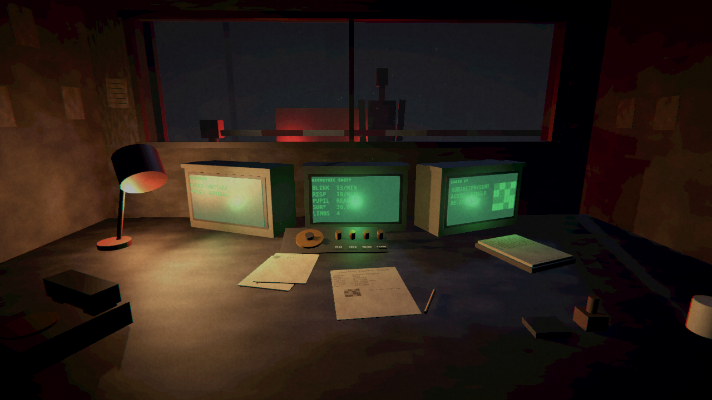
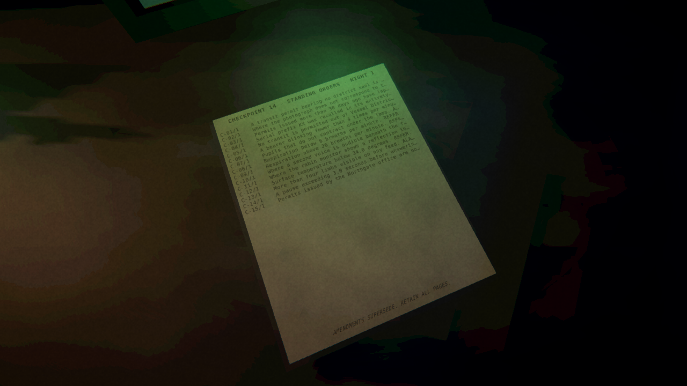
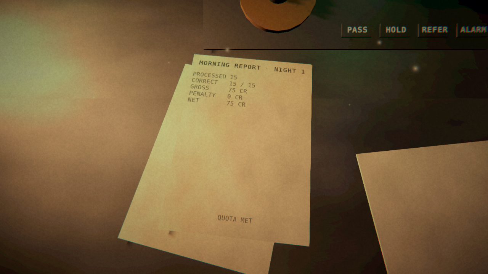

# Progress M2 — The booth is playable

**Date:** 2026-08-13
**Scene:** Concept E, checkpoint booth
**Build:** Unity 6000.5.8f1, URP 17.5.0, Mono, rendered on Mesa llvmpipe under Xvfb

At M1 this was a static room with a fixed camera. It is now a game: a night runs end to
end, fifteen vehicles arrive, each one's paperwork and readouts describe it, four brass
switches record a verdict, and the morning report prints the wage.

---

## Concept art target versus current build

## The permit, read by leaning over it

Every field a rule can test is printed somewhere the player can read it, and a test
enforces that. The block grid is the bearer's photograph: comparing it against the one on
the cabin monitor is how a photo mismatch is caught, and it costs no portrait art at all.

## The monitors

Underside scan, biometric sweep and rear cabin. The biometric strip prints blink rate,
respiration, pupil response, surface temperature and limb count in exactly the units the
manual's rules are written in, so the cross-reference is a reading task rather than an
arithmetic one.

## The manual

Every page ever issued, current and superseded, in the order it arrived. Nothing marks
which page is in force — working that out is the game. Amendments arrive on stated nights,
so this binder is fifteen rules on night one and nineteen contradictory ones by night
eighteen.

## The morning report

Printed by the self-check after it plays an entire night through the presenter, throwing
switches with no mouse attached.

---

## Measured gap against the concept art

| Metric | M1 | M2 | Concept | Reading |
| --- | --- | --- | --- | --- |
| Value distribution distance | 1.872 | **0.669** | — | 64% closer than M1. |
| Mean luminance | 0.1750 | **0.1347** | 0.1147 | 1.17× the target, down from 1.53×. |
| Contrast (luma σ) | 0.1536 | **0.1444** | 0.1133 | 1.27× the target, down from 1.36×. |
| Warm/cool balance | 0.1096 | **0.0760** | 0.0673 | 1.13× the target, down from 1.63×. |
| Light pool centroid distance | 0.0638 | **0.0651** | — | Unchanged; composition was already right. |

## Measured performance

| | |
| --- | --- |
| Frame time | 47–55 ms (18–21 fps) |
| Renderer | llvmpipe, OpenGLCore, **software, no GPU** |
| Resolution | 1280×720 |
| Visible renderers | 165 |
| Triangles | 3,270 |
| Errors logged | 0 |
| Full shift played | 15 processed, 15 correct, 75 credits |

Frame time went from 40 ms at M1 to about 52 ms. Most of that is post-processing, which was
switched on for the first time in this milestone; the rest is the text meshes and the
transparent atmospheric layer. These are software-rendering numbers on four CPU cores and
are a budget signal, not a prediction of performance on a player's machine.

## Test suite

48 edit-mode tests, all passing, running in 1.2 seconds.

| Area | Tests | What the important ones guard |
| --- | --- | --- |
| Rules engine | 20 | That a page's printed text names the verdict it actually demands; that no rule tests something the player cannot observe; that the generator and evaluator never disagree across 720 generated cases. |
| Documents | 9 | That every field a rule tests is printed somewhere on the desk; that a photo mismatch is visible but not obvious (one to four cells of sixteen). |
| Shift and economy | 11 | That perfect play is paid on all thirty nights; that passing everything and alarming everything both lose on all thirty, so no single switch is a strategy. |
| Audio | 8 | Level, clipping, DC offset, audibility, loop seams, determinism, attack transient. |

Mutation-tested rather than assumed. Resolving several fired criteria by taking the first
instead of the most severe, and letting the oldest revision of a rule win instead of the
newest, were both introduced deliberately: six tests went red across the two, and restoring
the code returned the suite to green.

---

## What went wrong, and what it cost

Six faults in this milestone, all of them silent — no error, no crash, just a thing that did
not happen. They are listed because the pattern is the point: on a machine with no GPU and
no eyes on it, the failure mode is never a red message.

1. **Post-processing had never run.** `VolumeProfile.Add` creates a component but does not
   attach it to the profile's asset file, so the profile shipped with zero components; and a
   `UniversalRendererData` created in code has a null `postProcessData`, which makes URP skip
   the entire stack. Every grading change made during M1 was a no-op and M1's report said
   otherwise. Those two entries are struck through and corrected in place.
2. **TextMeshPro's `fontSize` is not a world-space measurement.** Guessing produced 1.7 mm
   text on a 400 mm sheet — invisible rather than obviously wrong. Sizes are now written in
   millimetres and converted through a measured constant, and the build re-measures a known
   string and fails if it drifts.
3. **Text parented to a scaled primitive and rotated to lie flat is sheared**, because the
   parent's scale applies in the parent's axes after the child's rotation has permuted them.
   Compensating with an inverse scale moves the error rather than fixing it.
4. **Top-aligned text positioned by its rect centre** starts half a rect higher than the
   number suggests, which printed the permit's title across the second line of its body.
5. **C# event subscriptions do not survive serialisation**, so wiring the switches when the
   scene was generated left every control dead in the build. The self-check now plays a whole
   night through the presenter, which is what caught it.
6. **The self-check wrote screenshots to a directory named after the commit.** The moment a
   commit landed, anything reading the latest screenshots got the previous ones. A long
   detour went into diagnosing a light shaft that was rendering correctly the whole time.
   There is now a stable `latest` alias.

Two of these — the volume profile and the light shaft's blend mode — were found only because
a rendered screenshot was compared against something. That is the argument for the harness.

---

## Gap list

| # | Gap | Severity | Note |
| --- | --- | --- | --- |
| 1 | **No questioning phase.** Response delay and the second voice are printed on the cabin feed rather than heard during an interrogation. The concept's question panel does not exist. | High | This is the largest missing system. It is what turns reading a form into talking to someone. |
| 2 | **No delayed consequences.** The design pillar that the game often does not tell you whether you were right is not implemented; the morning report grades every decision immediately. | High | Without it this is a rules-checking game rather than a horror game. |
| 3 | **No vehicle arrival or departure.** The subject at the window never changes; the barrier never moves. | High | Currently the only sign a new subject arrived is that the paperwork changed. |
| 4 | **Audio has never been heard.** Synthesised and structurally tested, but this machine has no audio device. | Medium | Needs ears on hardware. |
| 5 | **Props still have no surface detail** beyond the six large grunge-mapped surfaces. | Medium | Needs per-prop UVs or a triplanar detail material. |
| 6 | **Monitors are flat quads.** No curved glass, no barrel distortion. | Low | The overlay's corner falloff covers most of the read. |
| 7 | **Exterior is a row of boxes in fog.** | Medium | Needs more layers at more distances. |
| 8 | **Interaction is untested by a human.** The look, hover and lean-in are exercised only by the scripted self-check. | Medium | Feel cannot be judged from a screenshot. |
| 9 | **Legacy input, not the Input System.** No rebinding. | Low | Behind an interface; the migration touches one class. |
| 10 | **Validated only on a software rasteriser.** Post-processing, shadow filtering and anti-aliasing will differ on a real GPU. | Known limitation | Needs a Windows machine with a GPU. |
| 11 | **No save/load.** A campaign cannot be resumed. | Medium | The shift state is already plain serialisable data. |

---

## Verification

Everything on this page is backed by a file in this directory: the screenshots were captured
by the game itself, `metrics.json` was written by the same run, and `comparison.json` is the
raw output of the comparison tool.

Reproduce with `tools/build/iterate.sh` (about 25 seconds) and `tools/build/test.sh`
(about 20 seconds).
