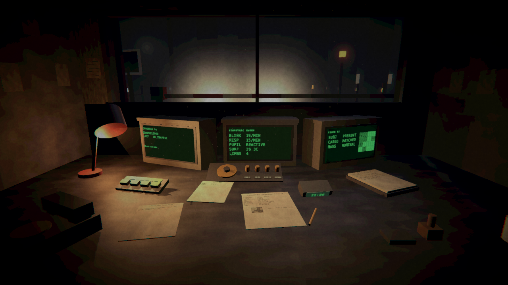
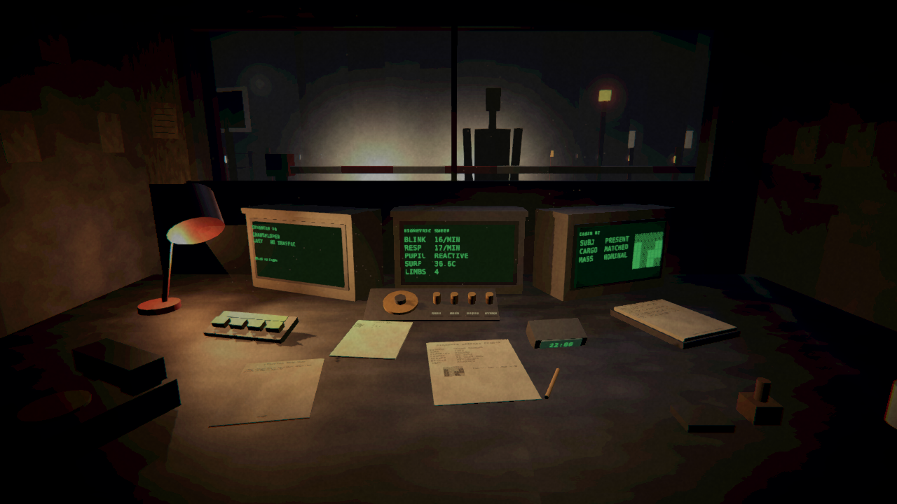
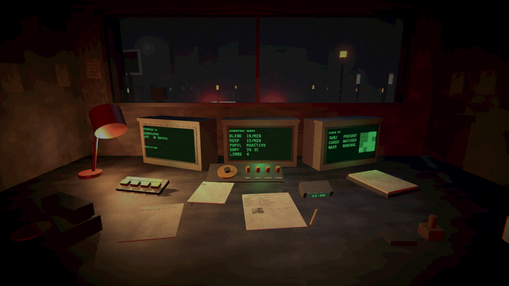
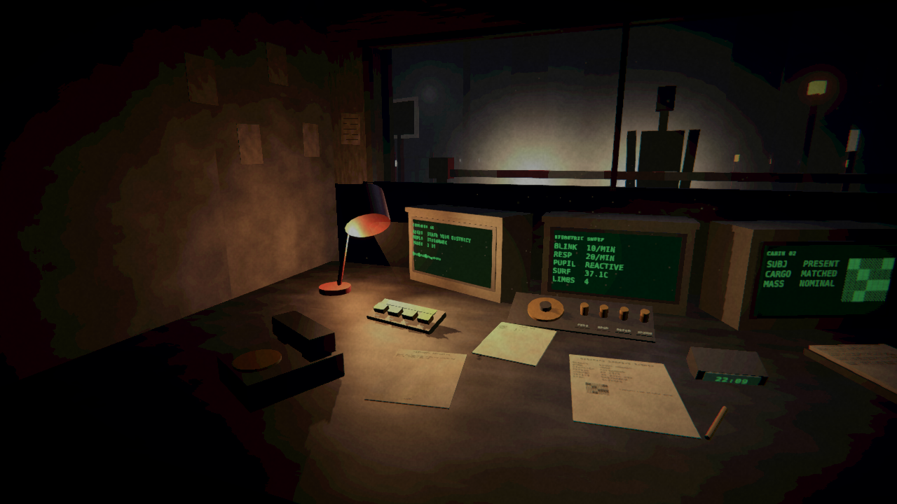
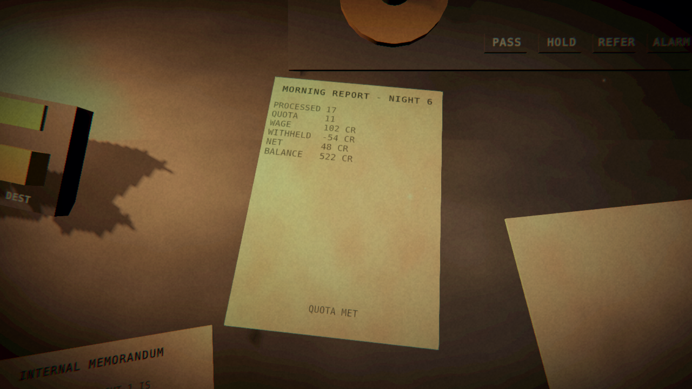
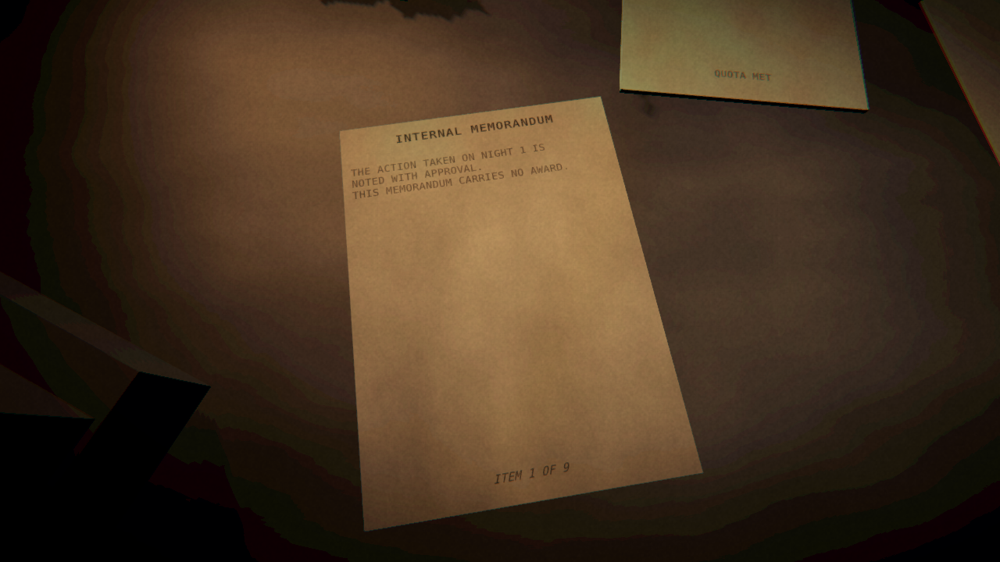
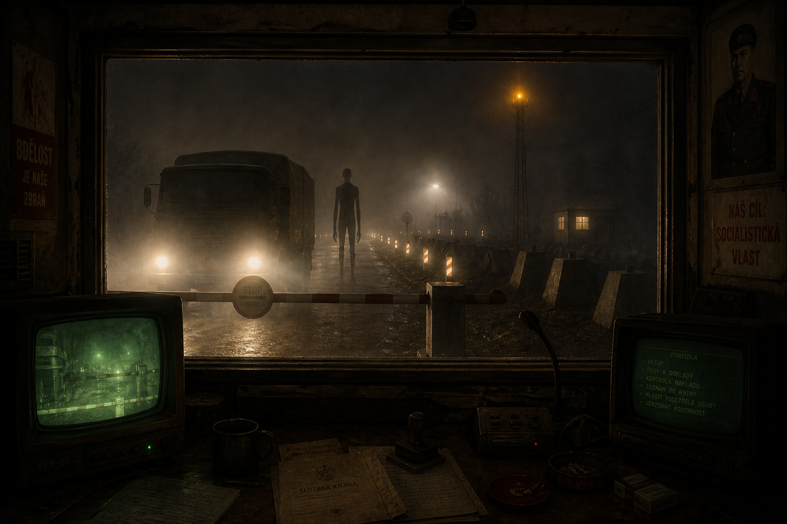
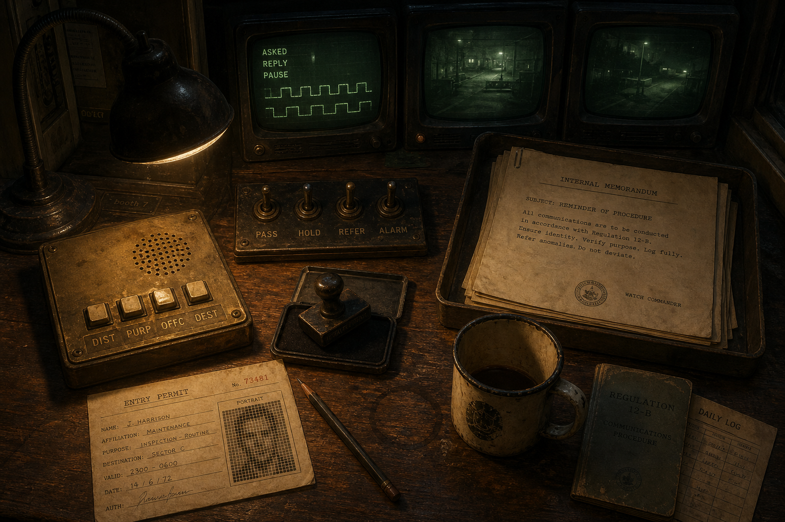
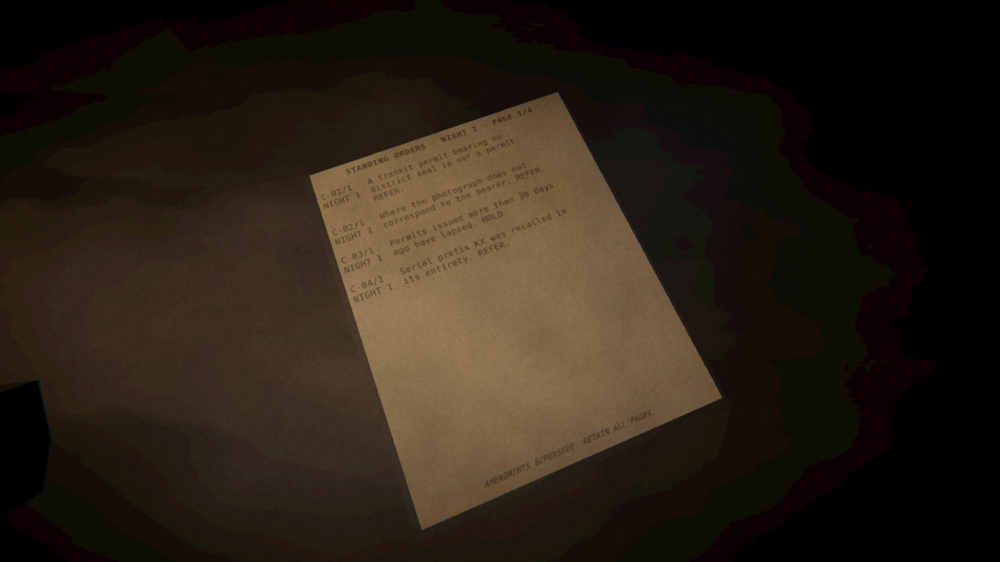

# M3 — the three things that were missing

M2 ended with a booth that looked right and a rules engine that was sound, and a
gap list that opened with three entries marked high severity. All three were the
same complaint in different words: the game was a form-filling exercise wearing a
checkpoint's clothes. Nothing arrived, nobody spoke, and the moment a shift ended
you were told exactly how you had done.

This milestone closes all three.

Everything below was produced by the automated self-check running the built Linux
player headlessly on a GPU-less VM. No screenshot here was staged by hand.

---

## 1. Vehicles arrive, wait, and leave

Until now the only sign that a new vehicle had pulled up was that the paperwork
on the desk changed.

The road outside is a state machine now. Headlights close through the fog, the
vehicle stops at the line and the subject steps out of the cab, and when a
decision is made the barrier either lifts and it drives through or it stays down
and the vehicle reverses back into the fog.

Refusing produces the same picture whether the player held, referred or alarmed.
The player is never shown which of their refusals was the right one.

| approaching | at the window | admitted |
|---|---|---|
|  |  |  |

Three things had to be fixed before any of that read on screen.

**The barrier could not lift.** It was eight loose arm segments at fixed
positions. The arm hangs off a pivot at the post now.

**The vehicle's lamps were on the wrong ends.** Headlamps and tail lamps were
both on the end facing the booth, which read as a car that had already driven
through and parked backwards. Headlamps face the barrier now and tail lamps face
away, so a vehicle driving through leads with its headlights and one reversing
away shows its tails.

**Unity's fog attenuates geometry but does not scatter light.** A headlamp in fog
was two hard pixels, not a glare. Additive halo billboards put the scattering in
by hand. The first attempt sized them at 2.6 m, almost all of which sat below the
window sill, leaving a barely visible arc; at 5 m enough of the halo clears the
sill to read as oncoming headlights — and the subject at the window is now
silhouetted against them, which is the single biggest improvement to the hero
shot this milestone.

## 2. The interrogation

Two of the manual's criteria were free. The pause before a subject answers and a
second voice underneath the first were printed on the cabin monitor as finished
readings, so the player got them without doing anything.

They are obtained by asking now. Four keys on the desk put a question through the
glass, and the reply lands after however long this particular bearer takes to
start answering — waited out in real time as well as printed. Asking costs time
the player is short of, which turns "check everything" from a routine into a
decision.

The keys sit across the desk from the verdict switches on purpose. One row asks a
question and the other ends someone's night; mixing them on one plate would
invite the wrong one being thrown under pressure.

The interrogation also had to be load-bearing rather than decorative, so it
carries a criterion of its own:

> **C-17** — Where the district a bearer names aloud is not the district on the
> permit. REFER.

Asking is the only way to find that out. C-17 went in through every guard the
rules engine already had: a new observable attribute, a generator violation, and
the fairness test that no criterion may test something the desk does not show.

The second voice is drawn as a two-row block trace as well as being audible.
Audio alone cannot be verified on a machine with no sound card, and more to the
point it cannot be relied on by a player with the volume down.

## 3. The game stops telling you whether you were right

This is the concept's central pillar and until now it was a line in a design
document. The morning report graded every decision the moment the shift ended.

It cannot be honoured one shift at a time, so there is a campaign: thirty nights,
a flat wage of six credits per vehicle processed, and errors that come back later
as notices of deduction.

| the morning report | what the post brought |
|---|---|
|  |  |

Note what the report does not say. Processed, quota, wage, withheld, net,
balance — and nothing about accuracy. Because the wage is flat, accuracy cannot
be reverse-engineered from the money either. The 54 credits withheld on night six
are not attributed to any decision; they refer to a night.

What comes back depends on the mistake:

| mistake | arrives | as |
|---|---|---|
| admitted something that was not a person | 3 nights later | an incident at a place down the road |
| turned away someone who was a person | 2 nights later | the missing persons column, by name |
| any error at all | 4 nights later | a notice of deduction naming the night |
| a correct alarm | 5 nights later | a memorandum that explicitly carries no award |

Roughly two nights in five also bring a district circular about heater fuel or
stationery requisitions, referring to nothing at all. That is load-bearing:
without post that means nothing, an envelope on the mat is itself a verdict and
the whole delay becomes decoration.

A night can bring nine items, so desk objects can be leafed through — clicking
something you are already leaning over turns the page instead of sitting back.

---

## The road outside

The view through the window was a barrier and a silhouette pasted on a flat grey
wall. The treeline meant to fix that sat between seventeen and twenty-three
metres, where this fog leaves six percent of the geometry showing.

Distance was not the only problem. **Everything unlit converges on the fog's own
colour.** A black tree at twenty metres is not a dark shape against grey, it is
grey. Dark geometry cannot give fog depth past about ten metres.

So the depth out there is built from lamps: an amber beacon at ten metres, a work
light at fifteen whose halo is all that reaches the booth, and a hut at eighteen
that is nothing but two lit windows. Plus a chicane, a kerb, a fence the fog cuts
off rather than ends, and delineator posts whose reflector tips are emissive —
a retroreflector returns light to its source, which no material in a rasteriser
does, so it is faked. When a vehicle comes down the road they light in sequence.

The posts also had to grow. The window sill hides everything below a line falling
from 0.95 m at six metres to 0.5 m at twelve; they were 0.88 m and never cleared
it.

## Grading against the concept

The self-check measures the render against the concept art rather than trusting
an opinion about it. Before this milestone's grade pass, and after:

| metric | before | after | concept |
|---|---|---|---|
| mean luma | 0.1264 | 0.0912 | 0.0957 |
| contrast (σ) | 0.1380 | 0.1203 | 0.1170 |
| warm/cool balance | 0.0730 | 0.0526 | 0.0533 |
| left third | 0.1019 | 0.0661 | 0.0708 |
| right third | 0.1288 | 0.0947 | 0.0473 |

Post exposure went from −0.30 to −0.62, contrast from 5 to 9, vignette from 0.36
to 0.46. Luma, contrast and colour balance are now within five percent of the
target. The right third is still twice as bright as the concept's, which is
partly a real difference — the concept's composition does not run the desk to
the right edge of frame — and partly the cabin monitor, which cannot be dimmed
without making it unreadable.

## Concept art for this milestone

| the arrival | the desk |
|---|---|
|  |  |

---

## Saving, and the clock

Two more things went in after the three gaps closed, because each was the thing
standing between a system and its point.

### A campaign can be put down and picked up

A thirty-night campaign that cannot be resumed makes the length theoretical.

The save holds the seed and the verdicts and nothing else. Who turned up, what
the manual said, which notices are queued and when they land — all of it is
derived by replaying, because all of it is already deterministic from the seed.
Serialising the notices themselves would tie every save to the exact wording of
the post, so editing one line of a district circular would invalidate every save
in existence. A full thirty nights is under 24 kB of small integers.

Quitting five vehicles into a shift keeps those five. A save whose verdicts no
longer line up with the queues its seed produces is refused rather than replayed,
because it would silently resume a different game; one this build cannot read at
all is renamed rather than deleted.

The test worth naming is
`ConsequencesQueuedBeforeTheSaveStillArriveAfterIt`. Consequences are queued by
one night and delivered several later, so a save restoring only visible state
would resume into a campaign with no future in it — the player would walk away
from every mistake they had already made. It was checked by mutation: clearing
the pending queue on restore turns it red at exactly the night the deduction was
due, and reverting turns it green.

### The binder was not readable

Found by looking at the screenshot rather than by any test. Each criterion was
printed as one line truncated at forty-six characters, so a player could not read
the rule they were about to be judged against — and the entire game is deciding
whether a subject matches a written criterion.

Five criteria to a page now, in full, wrapped at word boundaries with the wrapped
lines alongside the criterion number rather than under it so a page of rules
stays a list. Clicking the binder while leaning over it turns the page, which is
what the leafing interaction was always for.

| page 1 | page 2 |
|---|---|
|  |  |

Two mistakes had to be walked back. The line width was guessed from an assumed
advance of 0.51 em and every line ran off the paper; DejaVu Sans Mono advances
0.602 em, so at 10 mm on a 272 mm page the budget is 42 characters. And the
binder was too dark to read at all — fallout from narrowing the desk lamp earlier
in this milestone to keep it off the nearest monitor's face. The monitors are
unlit now and cannot be washed out by anything, so that reason had already
evaporated. The cone is wider than it ever was, and post exposure drops from
−0.62 to −0.76 to keep the frame at the concept's level.

### A clock, so that asking costs something

Moving the pause and the layered voice off the monitors was supposed to make
checking them a decision. It did not, quite. With nothing to spend, the four
intercom keys were four keys you press on every vehicle because there is no
reason not to.

A night is eight hours. A vehicle takes eighteen minutes and a question takes
nine. The squeeze tightens across the campaign rather than being uniform:

| | queue | minutes left after clearing it | questions that buys |
|---|---|---|---|
| night 1 | 15 | 210 | 23 |
| night 30 | 26 | 12 | 1 |

Clearing the queue is always possible if you ask nothing, so the clock is a
budget rather than a punishment — a test asserts that for all thirty nights.

That puts a price on a question. Nine minutes is half a vehicle is three credits;
an error costs nine credits four nights later. Asking is worth it whenever it is
more than about a third likely to change the answer. That is the decision the
interrogation was built to create, and it did not exist until the clock did.

Two of the eight new tests state the curve as arithmetic rather than as a
sentence, because it is a claim that will quietly stop being true the first time
anyone edits the quota curve.

## Somebody played it

The gap list has said "nobody has played it" since M2, filed as unclosable on a
machine with no GPU. That turned out to be wrong: this VM runs a TigerVNC display
at 1920x1200, so the built player can be launched in a window and driven with
real mouse input.

It could not be played at all.

Every build ever produced shipped with looking and clicking completely dead. Not
unreliable — dead. `DeskInteractor` takes its input through a plain C# property,
the scene generator assigned a `LegacyInputSource` to it at edit time, and
properties are not serialised, so by the time the player ran there was a
`NullInputSource` returning a zero look delta and false for every button.

It survived three milestones because nothing ever went through it. The self-check
drives the camera with `SnapLookAt` and the shift with `Submit`, reaching straight
past the input layer, so every checkpoint passed and every screenshot looked
right while the game itself was inert. This is the same class of bug as the dead
switches in M2 — state assigned at edit time that does not survive serialisation
— and having fixed that one, I did not go looking for siblings.

Measured before and after, on the running player, as the mean per-pixel
difference between two captures:

| | idle to idle (film grain only) | across a large mouse movement |
|---|---|---|
| before | 0.73 | 0.78 |
| after | 0.74 | 29.68 |

`DeskInteractor` builds its own input source in `Awake` now, and the self-check
installs a scripted one and asserts the two things that were silently broken: a
look delta turns the camera, and a click reaches what it is aimed at. It reports
`camera_turned_degrees: 18.7` and `click_reached_target: true`.

The pointer is also locked and hidden. Without that the operating system's arrow
sits on top of the booth and a player assumes it is what they are aiming with,
when the ray comes from the centre of the view. Hiding it is what makes that
discoverable, and it is the only reason the booth needs no crosshair.

A recorded session confirms, independently reviewed: the camera pans smoothly
with no jumps, objects passing the centre of the view take a white highlight,
clicking leans in and the text becomes readable — the reviewer transcribed
DISTRICT CIRCULAR / LAMP REPLACEMENT SCHEDULE SUSPENDED UNTIL FURTHER NOTICE. /
FILED off the screen — and right mouse sits back. No stutter, tearing,
flickering, stuck highlights or camera clipping.

Two things the play session turned up on the way:

**Un-hovering set an object's emission to black** rather than restoring what its
material emits. Nothing visible today is both emissive and interactable, but a
lit key or a screen would have gone permanently dark the first time a player
looked at it and away again.

**The intercom keypad was the brightest object in the booth**, brighter than any
of the paperwork. That was the desk lamp: widening it to reach the binder two
metres away meant blowing out a keypad seventy centimetres away, because a point
source falls off with the square of distance and one lamp cannot serve both
ranges. A dim wide fill over the desk does the reach now and the lamp goes back
to being a lamp. Keypad and permit read at 52 and 47 against a frame mean of 25.

## Bugs this milestone surfaced

Five, all of which had been shipping silently.

**Portrait faces could come out as near-solid blocks.** Mismatched photographs
were made by flipping three cells of the sixteen-cell grid, which changed how
many cells were lit and pushed some patterns to thirteen of sixteen — nothing to
compare against. Mismatches swap lit cells for unlit ones now, which moves the
pattern without changing its density. The first attempt at that picked each swap
from the pattern as it changed, so a second swap could undo the first and a
"mismatched" face came out identical to the permit; the cells are chosen up front
now, all distinct.

**The density balancer only ever visited six of the sixteen cells**, because it
stepped by three. A pattern too dense in the other ten could not be thinned. It
walks every cell now, in a fixed order so results stay deterministic.

**The monitors were Lit materials.** The desk lamp fell across the nearest one
and washed its face from green to pale yellow, which no CRT has ever done. They
are unlit now — a phosphor screen emits and does not reflect — and the lamp's
cone was narrowed and re-aimed at the paperwork it is supposed to light.

**Regenerating the phosphor overlay texture without regenerating the material
that referenced it left the reference dangling.** URP sampled white, the overlay
became an opaque black rectangle, and every monitor in the booth went blank with
no error anywhere. The atmosphere materials are always recreated now, and a
missing texture is logged rather than silently rendered as a solid quad.

**One test was wrong rather than the code.** A flawless campaign earns the same
total whatever the seed, because the wage is flat and the queue lengths are
fixed — that is what the flat wage is for. The test fingerprints the post
instead, which does differ by seed.

## Tests

48 → 84. The thirty-six new ones cover the interrogation (8), the campaign and
its consequences (11), saving and resuming (9) and the clock (8).

Three of them exist specifically to protect the design pillar, because it is easy
to break by accident:

- `TheMorningReportNeverRevealsHowManyWereCorrect` — a flawless night and a night
  spent waving everything through must produce an identical first statement.
- `NoNoticeEverStatesWhetherADecisionWasRight` — no notice may contain the words
  correct, incorrect, wrong, right, mistake or error.
- `SomeMailRefersToNothingAtAll` — a flawless campaign must still get plenty of
  post, or any envelope at all is a verdict.

And `CareIsPaidBetterThanCarelessnessAcrossACampaign` asserts what the per-night
report deliberately hides: across thirty nights, reading the manual pays better
than not.

The self-check now plays six nights rather than one — correctly on the first and
carelessly after — because a consequence that arrives three nights later cannot
be photographed in a single night. Last run: 96 vehicles processed, 54 credits
withheld, 0 errors logged.

## Where it stands

| | |
|---|---|
| frame time | 60 ms (16.7 fps) on Mesa llvmpipe, no GPU |
| renderers | 259 |
| triangles | 4,178 |
| edit-mode tests | 84 passing |
| self-check errors | 0 |
| self-check run | 6 nights, 96 vehicles, 54 credits withheld, save resumed |
| Windows player | 103 MB, PE32+ x86-64, cross-compiled from Linux |
| Linux player | 99 MB |

`tools/build/build.sh` produces both. Windows is Mono rather than IL2CPP, which
is not a choice: IL2CPP for a Windows target needs a Windows host, and this
machine is Linux. That has to change before release.

## What is still missing

Reassessed from M2's list.

1. **Only one person has played it, and only for a minute.** Looking, hovering,
   leaning in and backing out are confirmed by hand on a real display. Throwing a
   switch and watching a vehicle leave is not — aiming by script is unreliable
   once the pointer is locked, and every click in the recorded session landed on
   the post tray. That path is covered by the self-check and by the `admitted`
   screenshot, but no human has done it. *Medium.*
2. **Audio has never been heard.** Synthesised, structurally tested, and now
   wired to the intercom as well — but this machine has no audio device.
   *Medium.*
3. **No shift-end screen and no campaign end.** Night thirty finishes and the
   thirty-first simply does not start. *Medium.*
4. **Props still have no surface detail** beyond the grunge-mapped large
   surfaces. *Medium.*
5. **The binder shows every page including superseded ones, but does not mark
   which are in force.** A player has to infer it from the revision number.
   *Medium.*
6. **The monitors are flat quads.** No curved glass, no barrel distortion. *Low.*
7. **Legacy input, not the Input System.** No rebinding. *Low.*
8. **Validated only on a software rasteriser.** Post-processing, shadow filtering
   and anti-aliasing will differ on a real GPU, and the grade above was tuned
   against llvmpipe output. *Known limitation.*
