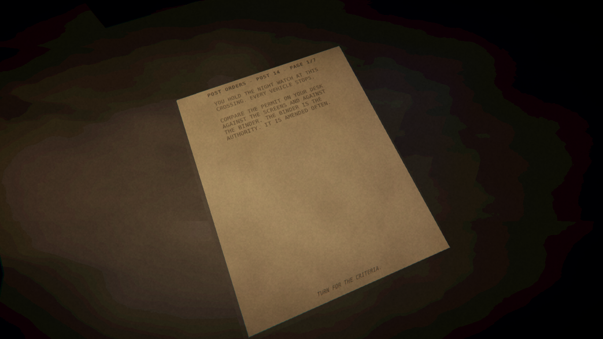
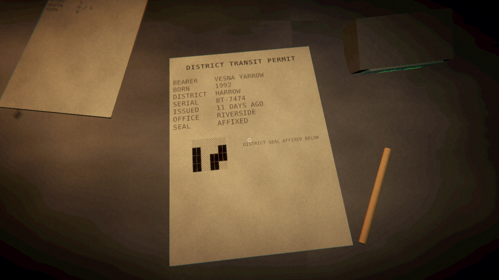
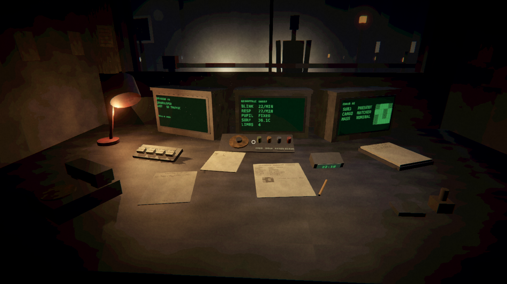
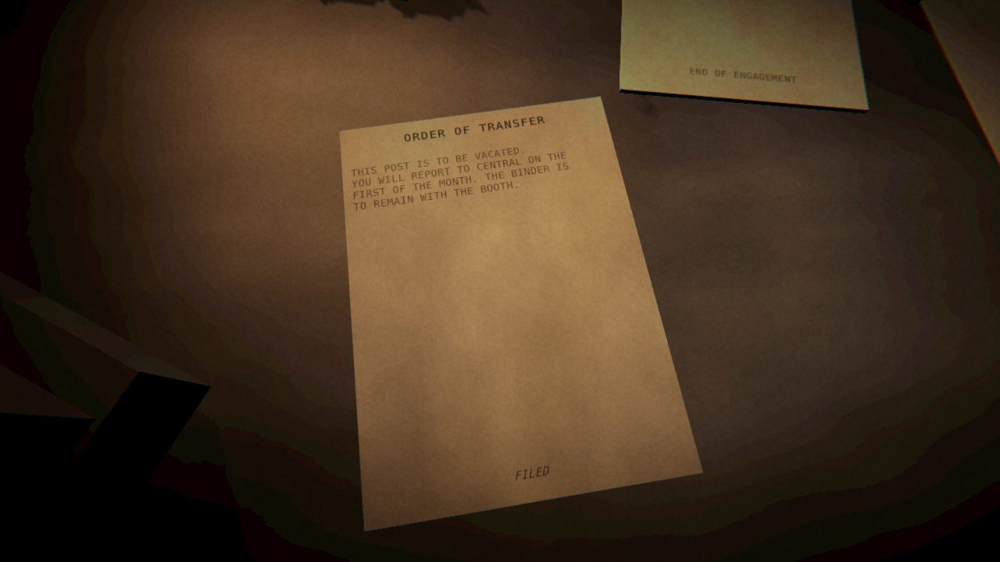
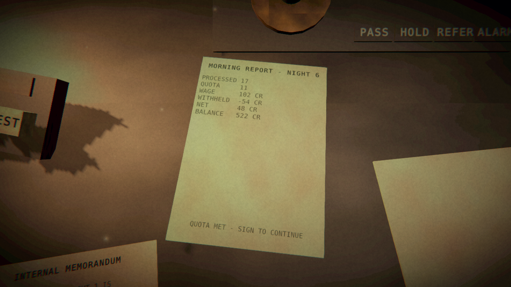
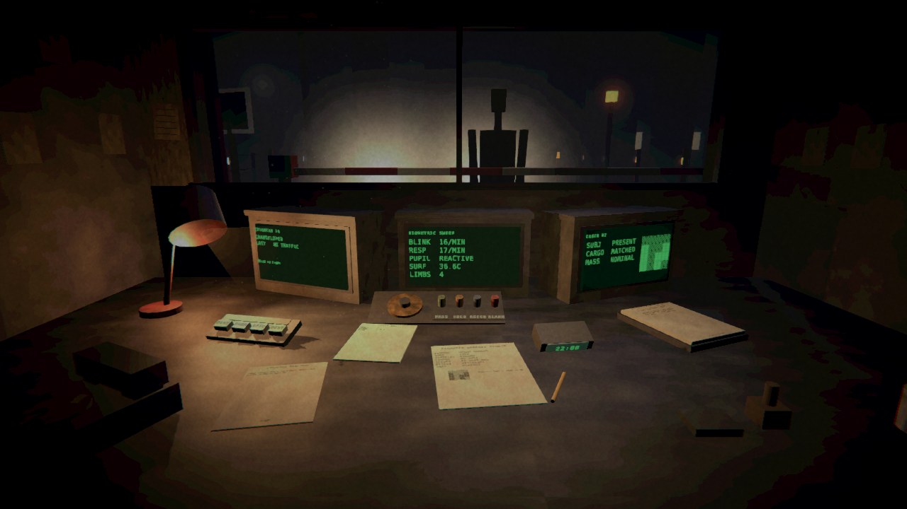
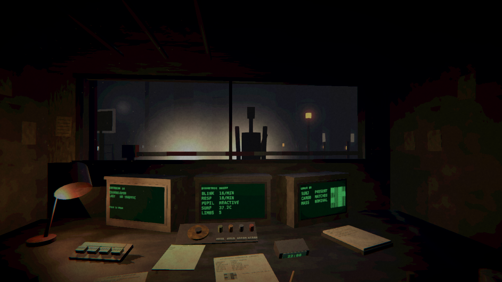

# M4 — A game somebody else could sit down at

The vertical slice worked, in the sense that its parts worked. What this milestone
found is that working parts and a playable game are different things, and that the
difference is only visible when somebody actually sits down and plays it.

Everything below was driven by two things: reading the render against the concept
art with a measurement rather than an impression, and running the built player
under a virtual display and driving it with synthetic keystrokes, one vehicle at a
time, the way a person would.

## What a new player now sees

The first frame of a new game:



Before this milestone, the first frame was the desk, and nothing on it explained
itself. The switches are unlabelled to somebody who has not read the source, the
binder does not announce that it is the binder, the intercom keys are four letters
each, and there is no prompt, no tutorial and no cursor. The honest description is
that the game was unplayable by anyone who had not built it.

The post orders are the binder's front matter now — a binder of standing orders
opens with the standing orders — and the binder is open at page one when a first
night begins. Three sheets: what the post does and that the binder is the
authority; the four dispositions and what each one means; that questions cost time,
that the post closes at 06:00 regardless, and that the log is signed to close a
shift. They are dropped after night one.

They say where to look and never what to find. A test enforces it: the briefing
must name every verdict and every control, and must not contain a conditional,
because a rule stated on an order sheet is a rule the binder can no longer amend.

## What the play session found

Picking up the first document failed. Aiming was a hairline ray with no crosshair,
and pressing the interact key eighty pixels from the permit produced nothing at
all — no highlight, no sound, no refusal. That does not read as a miss. It reads as
a broken game, and it is what happened on the first attempt.

The cast is forgiving now: the exact ray first, then a swept sphere three quarters
of an inch across, so overlapping props still resolve to whatever is actually being
pointed at. And there is a dot at the centre of the view, four pixels and nearly
transparent when there is nothing to touch, opening into a ring when there is.

The code used to argue the booth needed no crosshair, on the theory that hiding the
system pointer made the centre ray discoverable. Playing it says otherwise. The
comment now says so too.

With that fixed, the loop plays:





Read the binder, back out, aim at the permit, read it, back out, throw a switch.
The barrier lifts, the vehicle pulls away with its taillights receding down the
road, the clock moves from 22:00 to 22:12, and the next set of readings comes up on
the biometric screen. Verified by hand, in the built player, not in the editor.

Leafing the binder also could not wrap: `LeafThroughManual` incremented and
`RefreshManual` clamped, so the binder stuck on its last page with no way back to
the first except ending the night. The comment above it had claimed it wrapped since
the day it was written.

## An end to a night, and an end to a run

Night thirty finished and the thirty-first did not start. The booth sat there with a
stale morning report on the desk, which made the campaign length as theoretical as
being unable to resume one did.

A night is closed by signing the log; the morning report's footer says so. A run
ends with a letter, and which letter depends on how much the office withheld per
night — an order of transfer, a notice of release, or an end of engagement that
records no change in your file.



None of the three says how the player did, because nothing else in this game does
either. A test checks that no ending contains the words correct, incorrect, wrong,
right, mistake, error, well done, failed, score or accuracy: an ending that grades
the player undoes thirty nights of not telling them. Another checks the ending reads
the deductions that actually arrived rather than the ones still in the post, since
the office is four nights slow and a run can finish owing more than it was ever
shown.

## A whole night, by hand

Played through in the built player: night one opens on the post orders, the queue
works down vehicle by vehicle, the clock advances eighteen minutes a car, the queue
empties in the small hours, and the morning report lands on the log.



It reports what you were paid and what was taken off, and says nothing whatever
about whether you were right. Signing it starts night two: clock back to 22:00,
screens live, a fresh permit on the desk, and a new set of headlights on the road.

Two things came out of doing this rather than trusting the self-check.

When a night ended the screens went dark, the window emptied and the booth just sat
there looking broken. The one sheet that said what had happened, and what to do
next, was face-up on the desk and too far away to read. The report is put in front
of the player now, the same way the binder is on a first night.

And signing the log left the player still staring at it, now showing a fresh and
empty duty log for a night that had already started behind their head. Opening a
shift releases whatever was being read, because it belonged to the night before.

## The picture



Measured against the concept art rather than eyeballed:

| | before M4 | after M4 | concept |
|---|---|---|---|
| mean luma | 0.1005 | 0.1128 | 0.1147 |
| value distribution distance | 0.7181 | 0.4442 | — |
| light pool centroid distance | 0.0386 | 0.0326 | — |
| contrast (std dev) | 0.1239 | 0.1289 | 0.1133 |
| warm/cool balance | 0.0587 | 0.0590 | 0.0673 |

The comparison said the light pool was too tight rather than the frame too dark:
the left third was 26 percent short of the concept, the right third 13 percent, and
the middle 15 percent over. Widening and lifting the desk fill rather than raising
the exposure closed it.

Contrast stays 14 percent above the concept, and easing the tonemapper from 9 to 5.5
did not move it, which means it comes from the scene — lit monitors against dark
corners — and not from grading. Flattening it further would cost the look, so it
stands.

### Props

Only the six large surfaces carried a wear map. Every prop was a flat colour, which
reads as toys on a table: the eye sees surface variation on the big planes, sees its
absence on the small objects, and concludes the small objects are not real.

The first attempt used fine noise and measured as nothing — 1.86 of local detail
against a flat 2.13, inside the noise floor. Fifty pixels of a 256-pixel map tiled
three times is one flat patch, and worn paint is not fine noise anyway; it is a few
large areas where the finish has gone. Coarse and high-contrast reads: the monitor
housings measure 14.2 against the desk's 11.2, where before they measured nothing.

The lamp base still measures 1.0, flat. It is a cylinder, and Unity collapses a
cylinder's cap UVs into a small disc, so no texture can show there whatever its
contrast. Fixing it means replacing the mesh, which is not worth it for a
sixty-pixel ellipse.

### Controls you can read

Four identical brass cylinders sat on the panel with engraving eight pixels tall
from the seat. The caps are dull green, amber, grey-blue and red now, and the plates
are large enough to read from the home position rather than only when leaning in.

The intercom keypad had no visible labels at all — they were on the lip in front of
the keys, which from the seat is a two-millimetre strip seen edge-on. They are on
the key faces now. The keys and their grille were brass at 0.7 metallic, and a rough
metal with no environment to reflect comes out of a software rasteriser as pale
yellow-green; both are bone bakelite and dull olive now.

## The shape in the fog



The subject was one fixed figure for everybody. The biometric screen could report
five limbs and the thing in the window would still have four, which means looking up
from the desk told the player nothing — the window was decoration in a game whose
whole subject is looking at someone and deciding whether they are still a person.

The silhouette is built from the attributes now. Past four limbs an extra arm
appears, set behind the shoulder and canted so the fog gives up an outline that does
not resolve rather than a clearly drawn extra arm. Reach, stoop and how high the head
sits vary per bearer, seeded off the permit serial so the same person stands the same
way every time a night is replayed. The variation is small on purpose: a figure that
is obviously deformed answers the question the player is meant to answer with
paperwork, and one that is obviously normal makes the window pointless.

Fixing this found a bug in it. A box scales about its centre, so a neck stretched by
a factor rises half as far as the head it is meant to reach, and past about a hand's
worth of lift the head came off and floated. A bug that looks like art direction,
which is the kind that survives. The neck is computed to reach wherever the head
ended up, and a test walks four hundred bearers checking it still touches.

## Verification

```
114/114 edit-mode tests passed, 0 failed, 0 skipped
self-check: 10 checkpoints, 61 ms/frame (16.5 fps), 259 renderers, 4178 triangles,
            12 lights, 0 errors, 4.6 MB managed heap
input:      camera turned 18.7 degrees, 4 interactables hovered,
            click reached target, switch thrown by click
campaign:   6 nights played, 96 vehicles processed, 54 credits withheld,
            save resumed, campaign ended
players:    MONSTER.exe 103M, MONSTER.x86_64 100M
```

The frame time is software rasterisation on a GPU-less VM and says nothing about a
machine with a graphics card. It is tracked because a regression in it is still a
regression.

The aim dot does not appear in the self-check screenshots: an overlay canvas is not
captured when a camera renders to a texture. That keeps the art-direction comparison
measuring the frame rather than the interface, but it does mean the artifact shots
are half a pixel-hair different from what a player sees.

## Gaps

- **No night has been played out under the clock.** A full night has now been played
  by hand, but its queue emptied in the small hours. A night that runs to 06:00 with
  vehicles still waiting has only ever happened in the scripted self-check.
- **Monitors are flat quads.** No curvature, no glass, no reflection of the room.
- **The lamp base cannot take a texture.** Cylinder cap UVs; see above.
- **Legacy input, not the Input System.** Works, but rebinding is not possible and
  gamepads are unhandled.
- **Software rasteriser only.** Nothing here has been seen on a GPU.
