# 视觉进度与目标差距

每一轮构建都从真实运行的播放器里截图，与 `docs/target/` 的概念稿逐项对照。这份文档记录每一轮的实际状态和尚未追平的差距。

---

## v019（当前）：体积、屋顶与作物

v018 把地块和色调修到位之后，两张图的差距集中到了三件事上：镇子里没有任何东西有真正的厚度，屋顶清一色是茅草，围起来的地块里什么也不长。

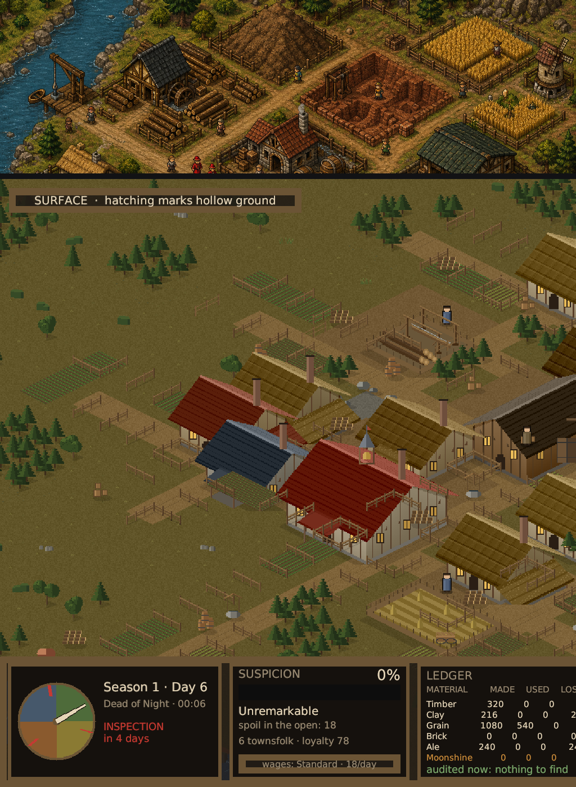

### 一、两处生产设施是平的

黏土坑是一块中间越来越暗的红色方块，锯木场是一片踩秃的土上躺着三根木头。在参照物里这两处恰好是全图仅有的、有真实高差的地方，隔着半张地图就能靠形状认出来。

黏土坑现在按台阶挖下去。把一个平面往中心压暗只会得到一块污渍，不会得到一个坑——没有台阶给光打上去，也没有任何东西投影。**只画每级台阶的北面和西面**：这个俯角下，坑的近侧内壁背对观察者，被它前面的地面挡住，四面都画会让坑翻过来变成土堆。

锯木场立起了锯架——两根跨在坑上的立柱、一根顶梁、斜撑，还有正在锯的那根木头和嵌在里面的锯条。立柱是三像素宽的：一像素在这个尺寸上读作划痕，第一版做出来整个是「一排栏杆顶着一根飘着的横梁」。木料改成分层码垛，每层比下层少一根，锯断的端面朝向观察者。端面是关键——它是圆木身上唯一能说明「这是伐倒后横切的」而不是「长在这儿的」的部分。端面画成椭圆而不是方条，因为圆木沿东轴摆放，它的端面在投影下是被压扁的圆。

两者都挪到了中间几个街区。它们原本在南北两端，取景裁切和 HUD 各吃掉一个。裁切本身也放宽了：一个靠切掉自己的地标来填满自己的取景，不是更好的取景。

### 二、屋顶

参照物里同屏没有两片同色的屋顶——石板、陶瓦、木板、茅草在相邻几块地里同时出现。屋顶是画面里最大的一批平面，也是最接近正面朝向观察者的一批，所以除了地面之外它们承载的颜色比任何东西都多；一整条街同色的屋顶，读起来就是同一栋建筑复制了很多遍，不管下面的墙有多不一样。

农舍从四个变体扩到八个，其中两个不铺茅草，改石板和陶瓦。八分之六仍是茅草：第一版给了对半的份额，结果整条街反过来了——几乎看不到草顶，一排蓝配红读起来像另一个国家的镇子。

茅草的画法也重做了。原来是一片随机明暗像素，在这个尺寸上读作屋顶上长了苔藓。真茅草从檐口往上一层层铺，每层压住下一层，所以坡面上是平行于屋脊的横带，每层末端有一道阴影，檐口那层切平并探出墙面。逐像素的毛糙保留了一部分，免得横带变成尺子画的直线——草是梳出来的，不是机器压出来的。

### 三、地块里什么也不长

农舍后面围起来的方块是三丛草的草坪。参照物里凡是房子视线内的围地都种着东西，而且是成行的，正是这些行让聚落那部分不至于读成「一批建筑扔在一片田上」。围起来却什么都不种，说的是「这块地没人用」，与栅栏本身要说的话正相反。

菜畦是叠在地表贴图上的覆盖层，不是新的地块类型。它在模拟层里没有任何含义：底下仍是可通行的草地，寻路、建造、稽核看到的东西和之前完全一样。

垄沿网格轴走而不是斜穿过去，屏幕上表现为「横走两格、竖走一格」，所以行号是 `x/2 + y` 而不是 `x + y`。撒点按 2×2 的粗格成团决定，让菜畦连成片而不是散成一格一格的土块，再用细一级的散列把边缘打碎，免得成片变成方块。只有草地入选，而且必须紧邻巷子一格：踩秃的土是作业院子，铺装是通路，而放宽到两格时菜畦会越过最外一道栅栏长到野地里去，一行没有地块包着的垄读作「没人认领的田」而不是「谁家的菜园」。

### 地表与地下

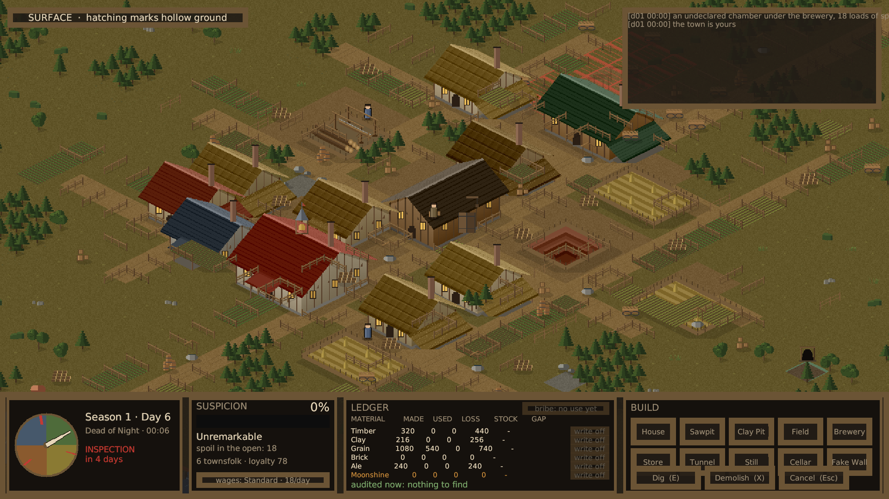

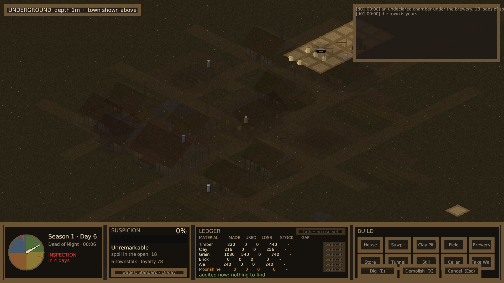

### 色调

画面均值从 (96, 85, 44) 降到 (95, 80, 41)，目标是 (75, 64, 37)。这一轮压的是巷子、院子和作物——它们合起来占的面积比建筑还大，而巷子当时在 (150, 118, 70)，参照物的巷子接近 `#69521d`。草地同时把红绿分开了：参照物采样的草在 `#5f5218` 到 `#785c2e` 之间，红高于绿，我们原本接近中性。

### 仍未追平的差距

- **每屏格数**。参照物一格约 32 像素，我们是 64。同样的屏幕上它能放下四倍的格子，这是「密度」差异的真正来源。追平要么重画全部美术，要么拉远相机让贴图非整数倍缩放糊掉——两条都不划算，暂时接受。
- **地形起伏**。参照物有高差、护坡、石砌水岸。当前地面完全是平的；这需要给地图加高程，是模拟层的改动。黏土坑的台阶是第一次在这张图上出现真实高差，但它是画出来的，不是地形。
- **建筑平面**。有了偏厦、门廊、八种农舍变体和两种非茅草屋顶，但主体仍是矩形。
- **风车与水车**。参照物有这两个高耸独特的地标。当前最高的仍是镇政厅的钟楼，加磨坊要动经济链（粮到面粉），属于模拟层改动。
- **镇子在画幅里的占比**（部分解决）。等距投影下任何矩形格子区域的屏幕宽高比恒为 2:1，与该区域自身长宽比无关，所以 16:9 画幅两侧必然留白。真正的解法是让镇子布局沿屏幕水平方向延伸——格坐标里的西北—东南对角。

---

## v018：地块、色调与地景

v017 把视角改对了，但两张图放在一起仍然不像同一款游戏。这一轮找到了三个原因，其中第三个的影响大于前两个之和。

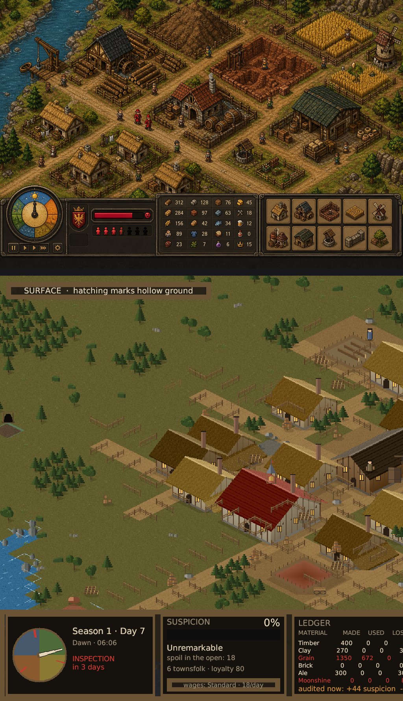

### 一、参照物里的聚落不是「站在空地上的一批建筑」

它是一张窄巷网格，巷子之间的每一块地都被木栅栏围起来。视线先读到的是地块，然后才是地块里有什么。之前的做法把路铺成两到三格宽的带子，又在每栋房子周围踩出一圈裸土，结果整个镇子站在一整片连续的泥地上；参照物的地面是草与作物，路只是画在它们之间的细线。

巷子现在一格宽，数量更多。栅栏不是手工摆的，而是推导出来的：凡是被围地块与巷子相接的边就有栅栏，按四条边的组合烘成每格一张贴图，全图共十六张。推导而非手摆的理由是玩家可以在运行时铺路和建造，手摆的栅栏会和布局脱节。

栅栏立起来之后暴露了两处必须解决的问题。**建筑占用的格子也被围了**——建筑不改变脚下的地块类型，于是栅栏横穿墙面从屋顶上钻出来。**栅栏太高**——一格在屏幕上只有 32 像素，栅栏做到一半高就会埋掉它后面每一面墙的下半截。现在栅栏压低了，公共建筑也从巷边退开一格，让门脸和栅栏之间留出院子。

建筑另外可选一间偏厦（靠东墙、单坡、立柱支撑）和一处门廊（南墙门上、小坡屋顶、两根立柱）。除此之外每栋建筑都是一个盒子，而一排盒子正是让这地方看起来像零件拼装而非建造起来的原因。偏厦改的是平面，门廊改的是正脸，两者都需要，因为一排相同的正脸和一排相同的屋顶同样露馅。

门廊第一次画出来跑到了房子背面。原因是 sprite 内部的 `v` 轴与世界的 `y` 轴反向——投影取的是两者之和的负值——所以南墙在 `v` 最大的一侧，不是最小的一侧。

### 二、河是一块蓝色，镇外是一片空绿

水面现在有深浅斑驳和断续高光，与陆地相接处生成河岸：沿边的白色浪花，以及立在其中的礁石。河岸和栅栏用同一套推导机制，按格子的哪几条边朝向陆地来选贴图。

两个细节比画本身更重要。浪花是**故意断开**的——沿边一条连续白线会把格子边界画出来，而那正是开阔水面唯一不能显示的东西。另外三分之一的变体完全不带石头：每一格都有一块礁石，和一块都没有一样规整，只是更吵。

镇外撒了灌木、野草、碎石和树。树是**装饰而非地图**：Forest 地块不可通行，为了填满画面去种真森林会切断寻路依赖的通路，而视觉改动不允许挪动模拟层。这些树站在普通草地上，于是野外读作疏林，同时保持可穿行。针叶树也大了很多——原先一棵只覆盖所在格子的四分之一，所以一片林子看起来像撒了点的绿地——并且新增了阔叶树，由重叠的团块而非圆锥构成。

林地地面现在与草地完全同色。哪怕只暗几档，它都会在地图上画出自己的菱形，一片林子就变成一串地块；树下的落叶改用散点表现，散点不跟随格子边界，也就不会把边界暴露出来。

### 三、色调（影响最大的一项）

前两项做完，两张图仍然一眼就能分辨。原因不在细节，在颜色。

对概念稿采样：读作草地的区域实际落在 `#5f5218` 到 `#785c2e`，是**橄榄棕，红分量高于绿**；整幅画面均值 (75, 64, 37)。当时游戏的地面是 `#7b8642` 的亮黄绿，画面均值 (118, 121, 62)——亮了三分之二，而且站在红绿关系的反面。地面占屏幕的绝大部分，所以它的色相就是答案的绝大部分。不管往细节里投多少工，这个差异都不会被抵消。

顺着调下去：地面重新取色，茅草与灰泥压暗（参照物的茅草约在 `#534b15`，我们原本是奶油色麦秆配近白色墙面，十栋并排足以把整幅画面拉亮），树叶的绿降一档，实土在地下层压暗以便和地表轮廓拉开。均值现在是 (94, 87, 44)。

同时按用途重铺地面。两个极端都不对：每栋房子围一圈裸土会把镇子变成泥滩，只踩出门口那一格又让整个镇子全是草。现在货物进出的地方（仓库、酒坊、锯坑、黏土坑、镇政厅）整块院子踩成裸土，住宅只有一条到门口的小径。小径铺成**路**而不是土——栅栏是从「被围地块与巷子相接」推导的，一个只以裸土为出口的院子会被栅栏封死门口。

### 地表与地下

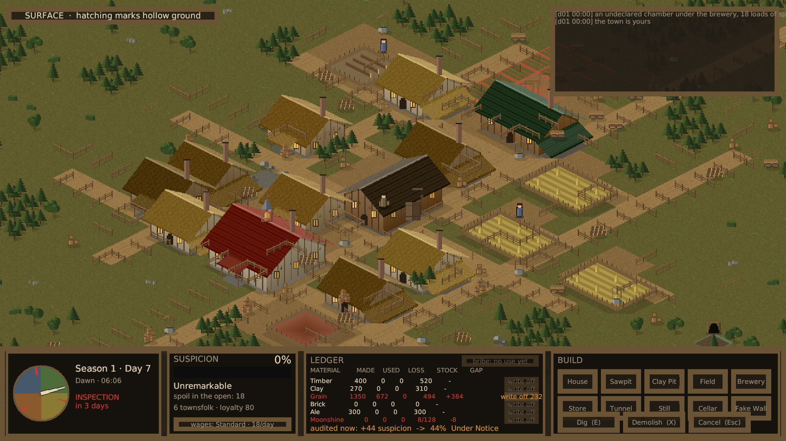

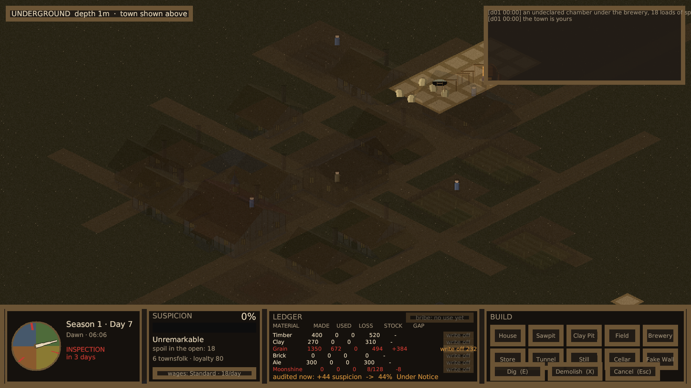

截图工具新增 `-autoshotDepth`：headless 运行没有键盘可按切层键，地下状态此前无法从自动截图里拿到。

### 仍未追平的差距

- **建筑轮廓的多样性**。参照物里几乎没有两栋建筑是同一个平面。当前有偏厦、门廊和四种农舍变体，但主体仍是矩形。
- **生产设施缺少地标**。参照物有风车和水车，高耸且形状独特。当前最高的是镇政厅的钟楼。
- **地形起伏**。参照物有高差、护坡、石砌水岸。当前地面完全是平的；这需要给地图加高程，是模拟层的改动。
- **镇子在画幅里的占比**（部分解决）。等距投影下任何矩形格子区域的屏幕宽高比恒为 2:1，与该区域自身的长宽比无关，所以在 16:9 的画幅里两侧必然留白，拉近镜头也消不掉。真正的解法是让镇子的布局沿屏幕水平方向延伸——在格坐标里就是西北—东南对角——而不是像现在这样占一块方形区域。折中办法是允许取景裁切：南北两边可以略微超出视口，换来更近的视距，代价只是玩家需要滚动才能看到边缘。现在的构图已经接近参照物，但底层的形状约束仍在。

---

## v017：视角重做

上一版和概念稿是两个东西。概念稿画的是 2:1 等距视角，游戏画的是纯俯视方格。我此前给这个差异找的理由——方格网便于上下两层对齐——不是设计判断，是给「更好写的那个做法」找的说辞。整个表现层按等距重写。

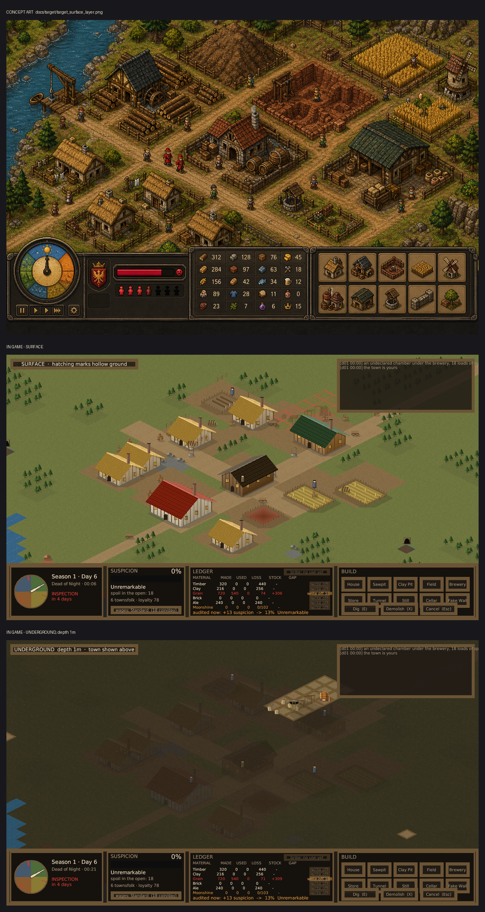

模拟层一行没动。`Undertown.Core` 不引用 `UnityEngine`，只处理格坐标，对投影方式没有意见——这正是当初把两层分开的目的。83 项测试原样通过。

### 重写了什么

| 文件 | 作用 |
| --- | --- |
| `Iso.cs` | 投影本身：64×32 菱形，64 像素每单位 |
| `IsoTileArt.cs` | 地块从方格变菱形 |
| `IsoBuildingArt.cs` | 建筑变成实体：两面受光墙、带屋脊和瓦楞的双坡屋顶、出檐、山墙、门窗、烟囱 |
| `IsoPropArt.cs` + `PropRenderer.cs` | 树、岩石、黏土堆、矿口、井、木堆、货箱、酒桶、板车 |
| `IsoAgentArt.cs` | 四分之三视角站立人形，带接地阴影 |

正俯视下的建筑是一个带花纹的矩形；等距下它有轮廓，而轮廓承担了「这是个镇子」的绝大部分识别工作。

### 画之外必须解决的三件事

**绘制顺序与坐标方向相反。** 到视点的距离是 x+y，和越大离得越远，必须越早画。搞反了不是细微问题：近处的景物会被本该在它后面的东西盖住，树会被北边一格的空地削掉树冠。

**建筑按最近角排序，不是最远角。** 按最远角排，站在它覆盖格子上的人会画在它上面——工人看起来站在作坊屋顶上。

**地块是裸菱形。** 原本在每块菱形下方挂一条土壁表示厚度。平地上这做法行不通：每一格的土壁都落在它前面那一格上，整张地图被划满深色横条。

### 布局也得跟着改

等距下 +x 朝右下、+y 朝右上，所以沿一条东西向道路排开的建筑在屏幕上是一条斜带，两侧全是空草地。同样这批建筑摊在 x 和 y 跨度相当的方形区域里，就成了紧凑的菱形街区。这是投影对布局提的要求，而旧布局比投影早。

相机的 HUD 补偿方向也是反的。HUD 遮住视口底部五分之一，可见区中心在相机中心之上，相机要**下移**才能把镇子放进看得见的地方。原本是上移，把镇政厅推到了 HUD 底下。

### 地下层

地下建筑原本沿用地上房子的画法——地道里长出带屋顶的房子，既不合理，又挡住了玩家切层就是为了看的东西。现在地下画的是设备：铜蒸馏罐带炉火、麻袋堆、支撑木架、竖井梯子、假砖墙。

地下配色反着来：实土暗，挖开的地方亮。物理上不对（土里的洞比土更暗），屏幕上对——玩家要一眼找到隧道走向。

### 密度、配色与重复

初始镇子从十二栋加到十七栋，路网多铺了两条横巷，杂物出现率从九分之一提到五分之一，地面配色整体调暖调亮一档。

八栋一模一样的茅草房是「这是生成的，不是建起来的」最明显的破绽，所以 `House` 现在有四套配色：墙面抹灰深浅、茅草新旧、檐口高度、屋脊坡度各不相同，按原点坐标选取，同一栋房子每次重绘、每次同种子运行都长一个样。

### 加房子暴露的一个平衡问题

税原本按「所有地上建筑」逐栋计征。多加四栋茅屋，季税从 300 涨到 375，开局第一季的合法收入就不够交税，得动黑钱——测试 `ContrabandSellsForFarMoreThanAleAndNeverReachesTheBooks` 立刻红了，期望 900 实得 825。

一次纯视觉的改动，悄悄改掉了开局难度。改法不是把测试数字调过去，是把税制改对：**帝国征的是产出，住房不算产出**。这条同时有玩法上的理由——住房是玩家买忠诚的手段，忠诚是村民不向巡查员开口的唯一屏障，对它征税等于对「加固自己唯一的防线」这个动作收费。茅屋又是最便宜的建筑，按栋计税会让一个只是看起来像村子的聚落交不起税。

基础税从 120 提到 180 作为补偿，旧镇 285、新镇 300，与改动前的 300 基本持平。两条新测试守着这条规则：加四间茅屋税额不变，加一座锯木坑税额上升。都做过变异验证——去掉那行 `House` 跳过，两条测试立刻转红。

### 仍未追平的差距

- **建筑细节层级**。概念稿有外露木梁、栏杆、门廊、屋顶附属结构、风车塔楼这类垂直地标。当前只做到木构架竖柱、窗棂、烟囱。
- **建筑种类**。概念稿每栋楼形状都不同。当前只有八种，靠配色变体拉开差异。
- **地形起伏**。概念稿有高差、护坡、石砌水岸。当前地面完全是平的。

前两项继续做能补上。第三项要给地图加高程，属于模拟层改动，不在这一轮范围内。

---

## v014

账目对抗手段接通了。GDD 里列的四种手段，现在有三种可以真正操作。

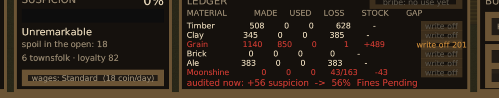

这一帧里同时能看到几件事：

- **Grain 行红着显示 GAP +489**：私酿吃掉了将近五百单位谷物，账上没有对应去向。右边的按钮亮着 `write off 201`——201 是这个地区的正常损耗率还能解释的最大额度，超过这个数写下去就换来另一项指控。
- **Moonshine 库存显示 `43/163`**：手上 163 单位，地窖只装得下 120，多出来的 43 必须放在巡查员会经过的地方，所以 GAP 是 -43（货架上有账上没有的东西）。
- **底部 `audited now: +56 suspicion -> 56% Fines Pending`**：现在被查会扣 56 分，总分到 56%，落进「罚款」档。
- **右上角 `bribe: no use yet` 是灰的**：现任巡查员只有 1 级，贿赂降不了更低，所以按钮不可点。

### 三种手段各自的代价

- **虚报损耗**（每行的写off按钮）：关掉库存缺口，但损耗率必须像这个地区的正常年景。写超了，「库存对不上」变成「损耗率离谱」，换汤不换药。
- **贿赂验收员**（220 币）：下一次审计按低一级的标准读账。只买一次，用完就没。用合法钱付不留痕，用黑钱付——验收员知道自己收的是什么，当场加 5 点怀疑。
- **洗料**：不是按钮，是涌现的。合法酒厂的谷物消耗量决定了私酿能藏在多大的变动区间里。

### 这一轮从实际运行里发现的一个设计缺陷

单项怀疑度原本硬截断在 25 分。结果是：玩家写掉 60 单位损耗，屏幕上的暴露度**纹丝不动**——因为改善前后都撞在上限上。一个真正有效的操作看起来完全没用，玩家会认为这个功能是坏的。

改成软压缩：25 分以内按原样计，超出部分按四分之一斜率继续增长，硬上限 40 分。这样既保住了「单项不能一击致命」，又让任何程度的改善都能在屏幕上看见。加了一条单调性测试守着：把缺口从 380 逐步减到 60，每一步的判罚都必须比上一步低。

---

## v013

镇民需求接通了，忠诚度开始真正流动。

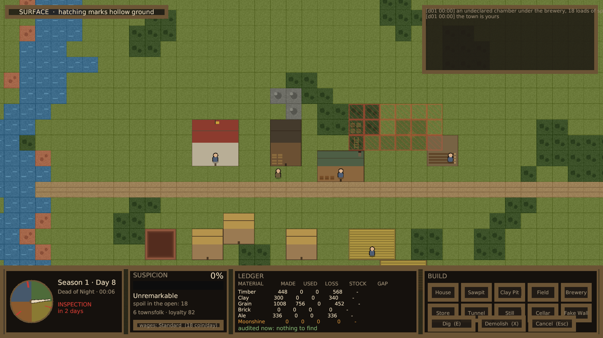

怀疑度面板下方多了两行：

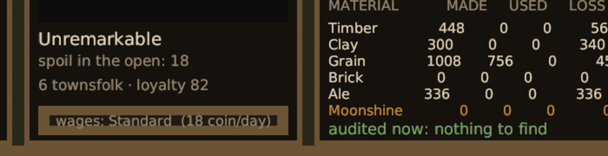

`6 townsfolk · loyalty 82` —— 开局是 70，吃饱住好过了七天涨到 82。下面是可点击的工资档位按钮，显示当前档位与每日开销。

### 为什么忠诚度要和怀疑度放在一起

它们是同一件事的两端。审计员的问题是从镇民的不满里得到答案的：一个吃饱住好拿足工资的人什么都不会说，一个饿了三天的人会把地窖在哪都告诉他。把两个数字并排放，玩家才会把它们当成一件事来权衡。

### 这一轮的核心咬合

谷物同时是口粮、麦酒的原料和私酿的原料。工资从合法收入里出，而合法收入正是交税的来源。于是：

- 私酿开得越猛，口粮越紧张，镇民越容易开口
- 为了做平账目而压低工资，省下的钱换来的是一个愿意跟审计员聊天的工人
- 挨饿时床铺和工资的正面效果全部失效——饿着肚子的人不会因为有张床就感激你，但「又饿又没发工资」比「只是饿着」更糟

GDD 里写的验收标准是「断粮 3 日后忠诚度下降可在 UI 观察到」。实测：第一天 70 降到 64，第二天降到 52，第三天降到 34，跨过 35 的招供阈值。饥饿是累进的，第三天的代价比第一天重两倍。

### 仍未追平目标的差距

- **地下照明**。URP 的 Light2D 还没接。
- **账目对抗手段只实现了洗料这一条**。虚报损耗、贿赂验收员、雇会计三种都还没有玩家界面。
- **巡查员的敲墙位置偏随机**，一整季有时一次都没敲到密室，命中率需要调。
- **地表细节单薄、贴图重复、美术全是程序生成的占位。**

---

## v012

游戏可以玩了。玩家能建造、能挖掘、能拆除、能开停作坊，一个季度会走到结算。

同一天（第 1 季第 6 天）的两种状态，差别只在于玩家有没有点开那台蒸馏器：

**蒸馏器停着**

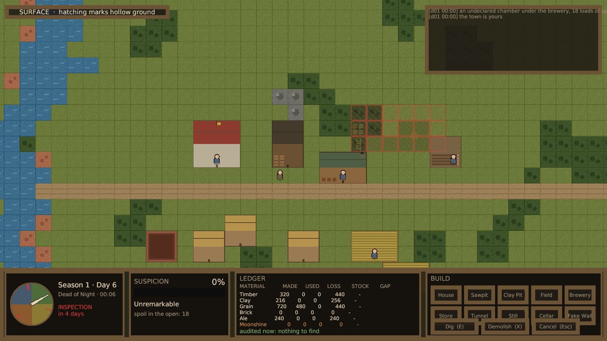

账本 GAP 一列全是横杠，底部写着 `audited now: nothing to find`。

**蒸馏器开着**

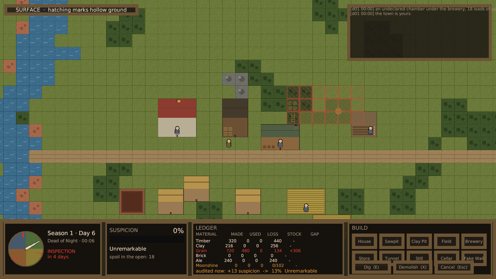

Grain 整行变红，GAP 显示 `+306`，底部变成 `audited now: +13 suspicion -> 13% Unremarkable`。谷物凭空少了 306 单位，而这些谷物变成了地窖里的私酿。

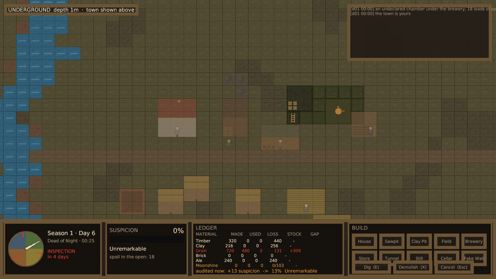

私酿那一行库存显示 `0/103`：手上有 103 单位，巡查员能数到的是 0，因为地窖容量还兜得住。地下视图能看到蒸馏器（铜色）、地窖、梯子和隧道。

### 这一轮新增

- **玩家操作全部接通**。建造菜单可点，鼠标下有预览（合法绿色、非法红色），拖拽框选下挖掘令，拆除返还一半材料，点击作坊开停工。挖掘工人会通过竖井在地表和地下之间往返。
- **季末结算**。第 30 天审计员走后结算：卖货、交税、按怀疑度分档承担后果（警告、罚款、没收、接管），账本翻页，怀疑度结转三分之一。
- **审计预警**。这是最关键的一项。GDD 里把「查账机制的可理解性」列为全案最大设计风险——审计对玩家而言天然抽象。现在账本每一行都显示缺口，底部实时显示「现在被查会扣多少分、总分会到哪一档」。玩家不再需要等到巡查员上门才知道自己有没有事。
- **事件日志**。屏幕右上角滚动显示发生了什么，包括审计员每一步的动作和结算的每一笔账。

### 这一轮从实际运行里发现并修掉的三个问题

1. **季末结算跑在了审计员之前**。日志一眼就看出来：结算发生在第 30 天 00:06，而当天的审计员 08:06 才到。结果是审计员查出的 45 点怀疑度被算到了下一季头上，玩家会看到怀疑度先归零再莫名其妙涨回去。现在结算要等当天的审计员离开。
2. **继承来的蒸馏器一开局就自己运转**，玩家什么都不做也会在第一季末被帝国接管。学会审计规则不应该以先输一局为代价。现在违禁作坊默认停工，开不开是玩家的决定，两边的后果都有测试守着。
3. **审计预警和账本自相矛盾**。账本那一行明明显示缺口 +306，底部却说「没什么可查的」——因为预警是按 0.5 秒定时重算的，截图正好落在过期值上。这种矛盾比不显示更糟，玩家不知道该信哪个。改成跟着账本和库存的版本号走，只要数字变了就重算。

### 仍未追平目标的差距

- **地下照明**。URP 的 Light2D 还没接，目标图那种冷灰岩层配暖橙火光的对比还没有。
- **地表细节单薄**。只有一条主路，没有路网、栅栏和杂物。
- **贴图重复**。每种地块一张贴图，成片出现时图案完全一样。
- **美术全部是程序生成的占位**。
- **镇民需求系统**。忠诚度目前只有初始值，不会因为断粮、缺房或欠薪而变动，所以「盘问」机制还缺一半。

---

## v009

第 1 季第 11 天，第一次巡查已经结束。

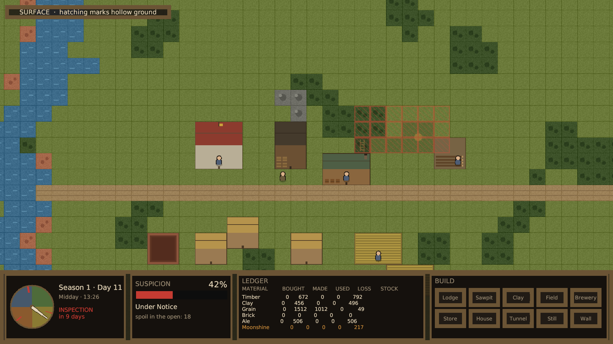

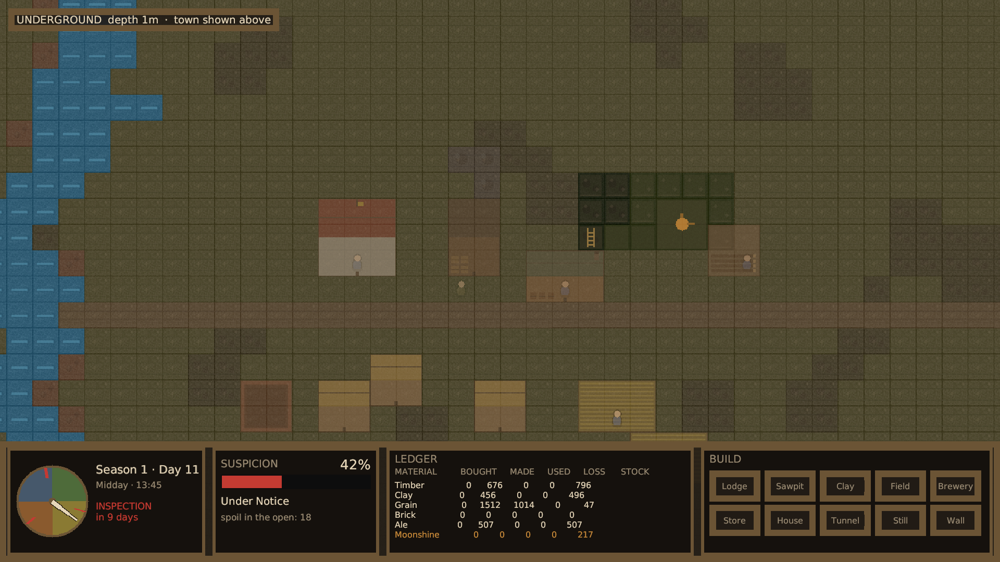

### 这一轮新增

- **镇民与巡查员**。六名镇民各自走到对应的工坊；巡查员穿帝国红，在暖色地表上一眼可见。
- **完整的巡查流程跑通了**：从地图边缘进镇 → 沿路巡逻六站 → 敲墙八次 → 查账 → 盘问最不满的那个人 → 离镇。
- **账本活了**。截图里的数字全部来自真实模拟：木材产出 672、黏土 456、谷物产出 1512 消耗 1012、麦酒 506。私酿那一行 `Moonshine` 是橙色的，采购、产出、消耗、损耗四列**全是 0**，只有库存 217——这正是设计意图，私酿完全不在账上，但它吃掉的谷物在库存里留下了洞。
- **截图工具支持时间快进**。巡查日在第 10 天，实时要跑几小时；`-autoshotWarmupMinutes` 让一次运行就能记录到巡查后的状态。

### 这一轮从实际运行里发现并修掉的三个设计缺陷

跑通一整季之后，怀疑度直接打满 100（当场被帝国接管）。逐项查下来是三个独立的问题：

1. **敲墙对同一间密室反复计分**。八次敲击全部命中同一间六乘三的地窖，每次记 18 点。现在按连通区域去重：第一次发现记 18 点，之后每次只记 5 点的「至今未填」。
2. **库存差额的分母不对**。原本用账目活动总量（采购加产出加消耗加售出）做分母，导致账目越忙、能藏住的绝对差额越大——和审计员看同样两个数字会得出的结论正好相反。改用入库总量。
3. **巡查员数到了他根本进不去的地窖**。私酿 217 单位在账上完全没有流水，被算成「凭空出现的货」，分母退化成 1，一项就爆表。现在审计只清点巡查员能走到的地方：地窖容量以内的违禁品他数不到，超出容量的部分必须放在他会经过的地方——**地窖容量因此成了私酿产量的硬上限**，而不只是一个便利设施。另外给单项加了 25 点的上限，避免任何单一发现直接判死刑。

修完之后同一局的结果是怀疑度 42，落在「Under Notice」档：下一季巡查员等级加一，玩家有真实压力但游戏继续。这是正确的区间。

---

## v005

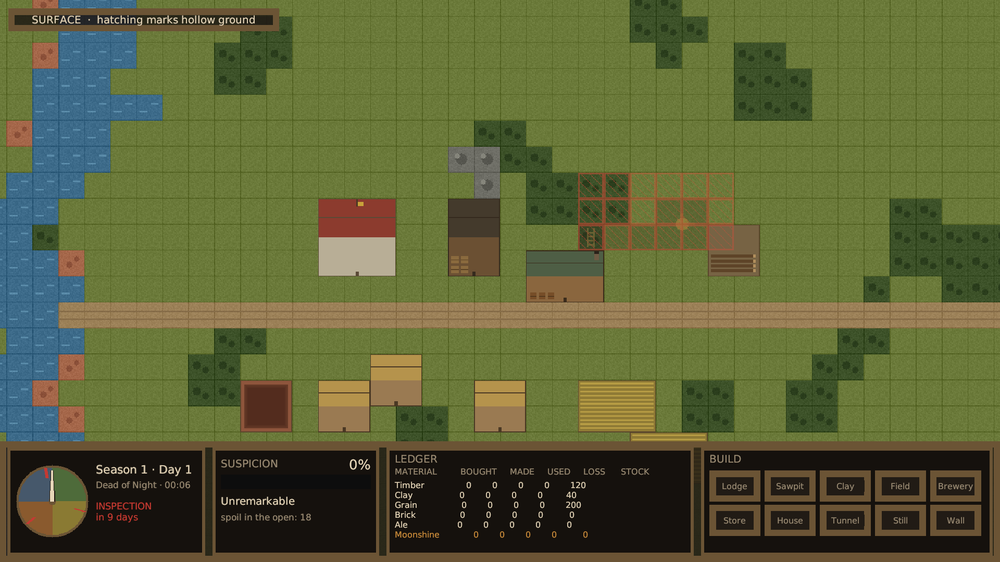

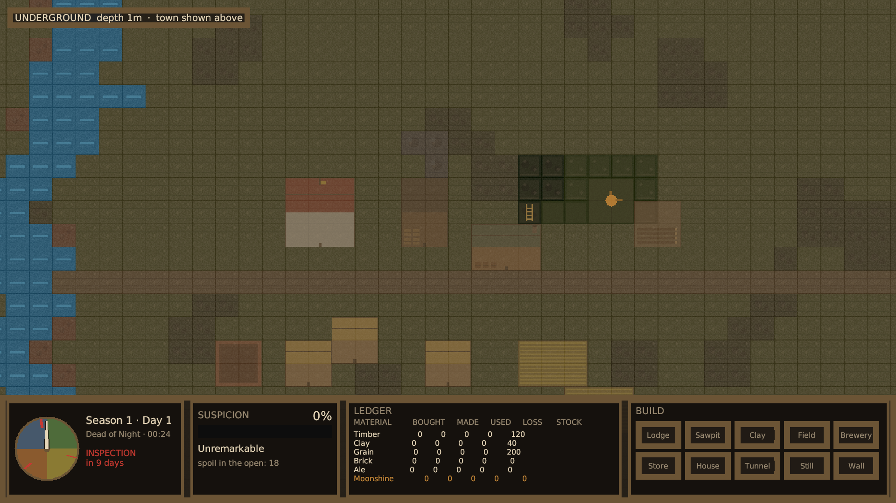

### 已经追平目标的部分

- **HUD 四区布局**：季节时钟表盘（含三个巡查日的红色刻度与随时间旋转的指针）、怀疑度条、账本表格、建造菜单。与 `target_under_layer.png` 的布局一致。
- **建筑轮廓可辨**：红瓦镇政厅、深色仓库、绿顶带酒桶的酒厂、原木堆锯木场、红棕黏土坑、金色麦田、茅草顶住房，不看标签也能区分。
- **双层视图与对齐**：地表视图上，红色边框影线标出正下方有未申报空腔的地块；切到地下视图，能看到实际的密室、梯子和蒸馏器，同时地表以 14% 透明度淡淡叠加，提供定位参照。这是「把密室挖在巡查路线之外」这个核心决策的信息前提，现在成立了。
- **土方压力已上屏**：怀疑度面板显示 `spoil in the open: 18`，即开局继承的那间密室挖出来还没处理的土方。
- **构图自适应**：相机测量建筑包围盒并补偿 HUD 遮挡的高度，不依赖手调偏移，换随机种子也不会把镇子框到画外。

### 仍未追平的差距

- **没有角色**。目标图有走动的镇民和高饱和红色制服的巡查员。这是当前与目标最明显的落差，也是下一步要做的。
- **地下空腔偏绿**。暗色地板叠加地表草地的绿色后偏色，应当更接近目标图那种冷灰岩层配暖橙火光的对比。地下照明（URP 的 Light2D）尚未接入。
- **地表细节单薄**。目标图有路网、栅栏、零散杂物；当前只有一条主路和成片的树。
- **建筑排布偏散**。路南的农田与住房离镇中心偏远，缺少目标图里那种紧凑的街区感。
- **贴图重复感**。每种地块只有一张贴图，成片出现时图案完全重复。

### 与目标图的一处刻意偏离

目标概念稿是 45 度伪等距，实现采用的是纯俯视正方格。这不是妥协而是设计决定：

- 用户点名的参考作品 The Escapists 2 本身就是纯俯视。
- 本作的核心决策是「这间密室在地表哪栋建筑底下、离巡查路线多远」，需要地表与地下的 X/Y 坐标严格对齐。伪等距会让其中一个水平维度产生透视位移，上下层对照的读图成本显著上升。
- 纯俯视的贴图、排序与 UI 对齐成本都低一个量级，在没有专职美术的前提下能把预算投到别处。

---

## v004

建筑与隐藏空腔标记首次出现，但相机构图有问题：路南的农田与住房被 HUD 挡住，地下视图被地表叠加层压过导致几乎看不出是在看地下。这两项在 v005 修复。

## v003

HUD 首次成型，分辨率修正到 1920×1080。发现三处文字截断（图层徽标、季节文字、账本最后一行被面板裁掉），在 v004 修复。

## v002

HUD 首次接入，但截图分辨率是 1024×576 而非 1920×1080，原因是播放器窗口尺寸由窗口管理器决定，需要在截图工具里显式调用 `Screen.SetResolution`。

## v001

只有地形：草地、河流、森林、黏土矿、岩石、道路、废矿井，以及地下的岩层与河床下的含水层。无建筑、无 HUD、无角色。
